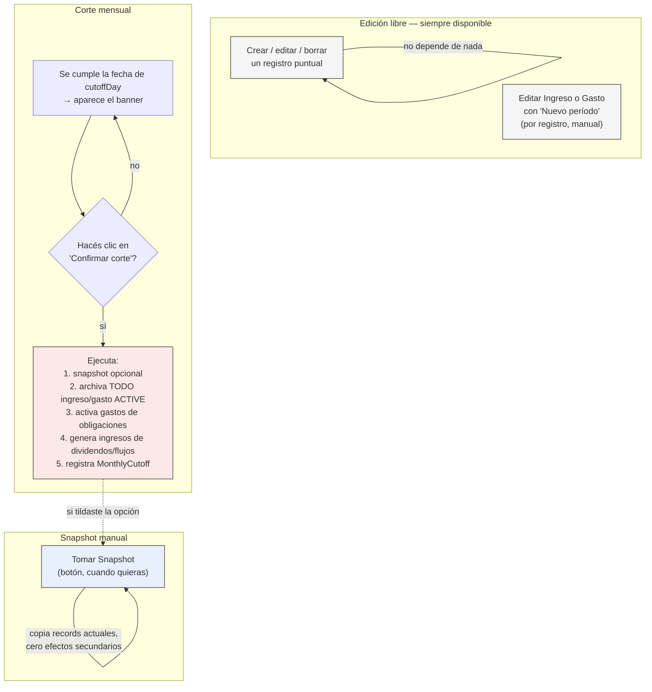

# CORTE_Y_SNAPSHOTS.md — Cómo se relacionan hoy: edición libre, snapshot y corte mensual

---
Versión: 1.0.0
Última actualización: 2026-08-26
Autor: Abel Cejas (explicación asistida)
Estado: Activo
---

> Documento explicativo, no propuesta. Todo lo que sigue está verificado leyendo `lib/cutoff.ts`, `lib/cutoff-actions.ts`, `lib/versioning-actions.ts` y `components/finance-store.tsx` — no es una descripción de intención, es lo que el código hace hoy, literal.

## 1. Resumen en una tabla

Hoy conviven **tres mecanismos independientes**, y es fácil pensar que son uno solo porque comparten pantalla. No lo son:

| Mecanismo | ¿Quién lo dispara? | ¿Qué toca? | ¿Tiene efecto en la DB más allá de "guardar una foto"? |
|---|---|---|---|
| **Edición libre** (crear/editar/borrar un registro) | Vos, en cualquier momento | El registro puntual que tocás | Sí — es la operación normal, sin restricciones |
| **Snapshot manual** ("Tomar Snapshot") | Vos, cuando quieras | Nada — es de solo lectura | No. Es una copia congelada, cero efectos secundarios |
| **Corte mensual** ("Realizar corte de mes") | Vos, con un clic — la app solo te recuerda que está disponible | Ingresos y Gastos activos (y solo esos) | Sí — archiva, genera y registra el corte |

La confusión que describís es entendible porque **el corte mensual, cuando se ejecuta, también puede tomar un snapshot automáticamente como parte del mismo paso** (si dejás tildada la opción "Guardar snapshot del mes que sale"). Pero son dos cosas separadas: el snapshot que se dispara ahí es exactamente el mismo mecanismo del botón manual — solo que la app lo llama por vos, en el momento justo antes de archivar.

## 2. Edición libre — no depende de nada

Esto ya lo intuís bien: podés crear, editar o borrar un ingreso, gasto, activo o pasivo en cualquier momento, sin que ningún snapshot ni corte lo condicione. `finance-store.tsx` escribe directo a la DB en cuanto confirmás el cambio. No hay "ventana cerrada" ni bloqueo — el dashboard siempre muestra el estado *actual*, y vos podés tocarlo cuando quieras.

**Dato importante que probablemente no sabías**: los registros **no tienen una fecha de transacción que la app use para agruparlos en meses**. El tipo `FinancialRecord` (`lib/finance.ts`) no tiene un campo "fecha del gasto" que la app consulte para decidir a qué período pertenece — tiene `createdAt` (cuándo se creó la fila, metadata) y `effectiveDate` (metadata de versionado, ver sección 4), pero ninguno de los dos filtra nada en el dashboard ni en el corte. **Un ingreso o gasto pertenece al período que esté "activo" en el momento en que hagas el corte — punto.** No importa cuándo lo creaste ni qué fecha le pusiste. Esto es clave para lo que preguntás más abajo.

## 3. Snapshot manual — una foto, nada más

Botón "Tomar Snapshot" en el Dashboard. Lo que hace, literal (`takeSnapshot()` en `finance-store.tsx`):

```ts
const snapshot = {
  id, name, period, createdAt,
  records: records.map(r => ({ ...r })), // copia profunda de TODOS los records actuales
}
```

- Copia **todos** los records tal como están en ese instante — no filtra por tipo, ni por fecha, ni por nada. (El diálogo te pide fecha inicio/fin, pero eso solo arma el texto del nombre del período — no filtra qué entra a la foto. Ya lo señalé como un defecto de UI en `PRODUCT_REVIEW.md`, mencionalo si te confundió a vos también.)
- **No modifica nada.** No archiva, no borra, no cambia estados. Es de solo lectura sobre el momento en que se toma.
- Podés tomar cuantos snapshots quieras, cuando quieras, sin relación con el corte. Sirven para comparar "cómo estaba todo el 15 de marzo" más adelante — pero no participan en el flujo de archivado.

## 4. Corte mensual — la única operación que realmente "cierra" algo

Acá está el mecanismo que sí tiene lógica de período, y es más específico de lo que probablemente asumís.

### 4.1 El período se define por fecha de calendario, no por vos

`lib/cutoff.ts` calcula el período según `cutoffDay` (el día del mes que elegiste en Configuración, 1-28) y la fecha de hoy — es puro cálculo de calendario, sin tocar la DB:

```
Período P = [día `cutoffDay` del mes P, día `cutoffDay` del mes P+1)
```

Ejemplo con `cutoffDay = 1`: el período "Agosto 2026" va del 1/8 al 31/8. A partir del 1/9, ese período queda **disponible para cortar** — pero nada se ejecuta solo.

### 4.2 Nada se ejecuta automáticamente — vos confirmás siempre

Esto es lo que quiero aclarar con precisión porque tu mensaje sugiere que pensás que hay cortes automáticos, y **no los hay**:

- Lo único "automático" es que el `CutoffBanner` **aparece** en el Dashboard cuando el período pendiente ya se puede cortar (es una fecha de calendario que se cumplió, nada más).
- El corte en sí — `executeCutoff()` — **solo corre cuando vos hacés clic en "Confirmar corte"** dentro del diálogo. No hay ningún cron, ningún trigger de DB, ninguna tarea programada. Si nunca hacés clic, nunca se ejecuta, aunque hayan pasado 6 meses.

Entonces: el recordatorio es automático (basado en fecha), la ejecución es 100% manual (un clic tuyo).

### 4.3 Qué toca el corte cuando lo confirmás — y qué NO toca

Verificado en `executeCutoff()`, en este orden exacto:

1. **(Opcional) Snapshot del estado previo** — si tildaste la opción, guarda una foto completa ANTES de archivar nada. Es tu red de seguridad si te arrepentís.
2. **Archiva Ingresos y Gastos activos** — busca *todos* los `ingreso`/`gasto` con `status: "ACTIVE"` (sin importar fecha, sin importar cuándo se crearon) y los pasa a `status: "HISTORICAL"`. Dejan de aparecer en el Dashboard en vivo, pero siguen consultables desde `/ingresos` y `/gastos` con el filtro "Históricos", y en `/historial`.
   - Si algún registro tiene una etiqueta puesta y tildaste "Mantener los ingresos y gastos con etiqueta", ese se salva del archivado — sigue activo.
3. **Activa los gastos de Obligaciones del período que arranca** — las cuotas/pagos ya pre-generados en estado `PENDING` pasan a `ACTIVE` y aparecen como gasto real en el nuevo período.
4. **Genera los ingresos del período que arranca** — dividendos pendientes y ocurrencias de reglas de ingreso (alquileres, sueldos con flujos definidos) se activan como ingreso real.
5. **(Opcional) Limpia etiquetas** de activos y obligaciones, si lo tildaste — las de ingresos/gastos NO se tocan acá (ver nota abajo).
6. **Registra el corte** en una tabla propia (`MonthlyCutoff`, con `@@unique([userId, period])`) — esto es lo que impide cortar el mismo período dos veces.

**Lo que el corte NUNCA toca: Activos y Pasivos/Obligaciones.** No se archivan, no se resetean, no tienen "período" — persisten tal cual, mes tras mes, corte tras corte. Tiene sentido: una casa o una deuda no "termina" al cerrar el mes; un ingreso o un gasto puntual, conceptualmente, sí.

## 5. El otro mecanismo que quizás estás confundiendo: "nuevo período" por registro

Hay una tercera pieza, totalmente separada del corte mensual, que capaz es la que te generó la duda: **`editOrVersionRecord()`** (`lib/versioning-actions.ts`), disponible al editar un ingreso o gasto puntual desde `/ingresos` o `/gastos`.

Cuando editás un registro, te da a elegir entre dos modos:

- **"Editar"**: cambia el registro existente in-place. Se pierde el valor anterior (queda solo en el audit log de texto).
- **"Nuevo período"**: el registro viejo pasa a `HISTORICAL`, se crea uno nuevo `ACTIVE` con `previousVersionId` apuntando al anterior — así podés ver la cadena completa de versiones (ej: alquiler $500 → $550 → $600, cada uno con su propia fila).

Esto es **manual, por registro, en cualquier momento** — no tiene nada que ver con el corte mensual global. Podés usarlo para "este mes el alquiler subió" sin necesidad de esperar ni disparar un corte de todo el dashboard.

## 6. Cómo se relacionan, todo junto



Los tres círculos casi no se tocan entre sí. El único punto de contacto real es que el corte, si vos lo pedís, dispara un snapshot como parte de su secuencia — pero el snapshot en sí es el mismo mecanismo simple de siempre.

## 7. Tu pregunta concreta: ¿registros con fecha propia, o "todo lo activo se corta junto"?

Dijiste que te gusta más que el corte dispare todos los eventos del mes de una, en vez de que cada registro tenga su propia fecha — y preguntás si es mala idea. Te doy una opinión directa, no evasiva:

**El modelo actual ya hace exactamente lo que preferís, y no es mala idea — pero tiene un solo punto débil real, y es específico a tu forma de usarlo.**

El punto débil: como el corte no filtra por fecha, sino por "lo que esté `ACTIVE` en este instante", **el corte no sabe si pasaron 30 días o 90 días desde el último**. Si te salteás un corte (dijiste "podría hacer uno cada mes" — o sea, no está garantizado que lo hagas todos los meses), el próximo corte va a archivar de una sola vez todo lo que se acumuló en esos 2-3 meses, mezclado, como si fuera un solo período. No hay forma de, más adelante, separar retroactivamente "esto fue de junio" de "esto fue de julio" — porque esa información (la fecha real de cada gasto) nunca se guardó como algo que la app usa.

Con registros con fecha propia, ese problema desaparece — pero a cambio te obliga a poner la fecha correcta en cada entrada, todo el tiempo, que es justo lo que decís que te resulta menos ordenado.

**Mi recomendación**: quedate con el modelo actual **si sos disciplinado con el corte** (lo hacés cerca de la fecha que configuraste, no lo dejás acumular meses). Si en la práctica te vas a saltear cortes seguido, ahí sí el modelo actual te va a jugar en contra — no porque esté mal diseñado, sino porque tu uso real no calza con la premisa de la que depende (corte puntual y regular). No hace falta rediseñar todo para eso — alcanzaría con una alerta cuando el corte pendiente lleva más de un período de atraso, para que sepas que estás por mezclar dos meses sin darte cuenta. Eso sí lo puedo armar si te sirve, pero es una mejora quirúrgica, no un cambio de arquitectura.
