# 10 — Documentación de Producto

> **Qué es este documento**: la vista de producto del sistema. Describe **qué hace**, **con qué entidades trabaja** y **cómo se relacionan entre sí**, en lenguaje de dominio y no de implementación.
>
> Para la vista técnica ver: [01-Arquitectura.md](01-Arquitectura.md) (stack y componentes), [03-Modelo-de-Datos.md](03-Modelo-de-Datos.md) (tablas y columnas), [06-API.md](06-API.md) (Server Actions), [modules/](modules/) (detalle funcional por módulo).

---

## Índice

1. [Propuesta de producto](#1-propuesta-de-producto)
2. [Mapa de capacidades](#2-mapa-de-capacidades)
3. [Modelo de entidades](#3-modelo-de-entidades)
4. [Relaciones entre entidades](#4-relaciones-entre-entidades)
5. [Ciclos de vida](#5-ciclos-de-vida)
6. [Catálogo de funcionalidades](#6-catálogo-de-funcionalidades)
7. [Recorridos de usuario](#7-recorridos-de-usuario)
8. [Las tres capas de registro](#8-las-tres-capas-de-registro)
9. [Reglas transversales de producto](#9-reglas-transversales-de-producto)
10. [Matriz entidad × módulo](#10-matriz-entidad--módulo)
11. [Límites conocidos](#11-límites-conocidos)

---

## 1. Propuesta de producto

**Cash Flow** es un sistema de gestión financiera personal que reemplaza la planilla de cálculo cuando el patrimonio deja de ser simple: múltiples monedas, instrumentos de inversión heterogéneos, deudas con cronograma, y necesidad de trazabilidad histórica.

### Las cuatro promesas del producto

| Promesa | Cómo se cumple |
|---|---|
| **Ver todo en un solo lugar** | Dashboard con Estado de Resultados (ingresos − gastos = flujo de caja) y Balance (activos vs. obligaciones), consolidando 5 monedas |
| **Registrar sin perder el porqué** | Cada gasto e ingreso conserva su origen (obligación, activo o libre), sus vínculos y su cadena de versiones |
| **No perder el pasado** | Nada se borra: snapshots congelan el estado, el historial audita cada cambio, y los registros reemplazados quedan como `HISTORICAL` |
| **Cuadrar como contabilidad** | Toda operación financiera genera un asiento de doble entrada en el Libro Contable |

### Perfil de usuario

Individuo con inversiones diversificadas en contexto latinoamericano (ARS / USD / USDT), que gestiona simultáneamente acciones con dividendos, crypto, plazos fijos, bots automáticos, y obligaciones periódicas o en cuotas. **No** es un producto para empresas ni para contadores profesionales: la contabilidad de doble entrada es una garantía de consistencia interna, no un libro fiscal.

### Multiusuario con aislamiento total

Cada usuario ve exclusivamente sus propios datos. Todas las consultas filtran por el ID de sesión — no hay compartición, roles ni vistas cruzadas entre usuarios.

---

## 2. Mapa de capacidades

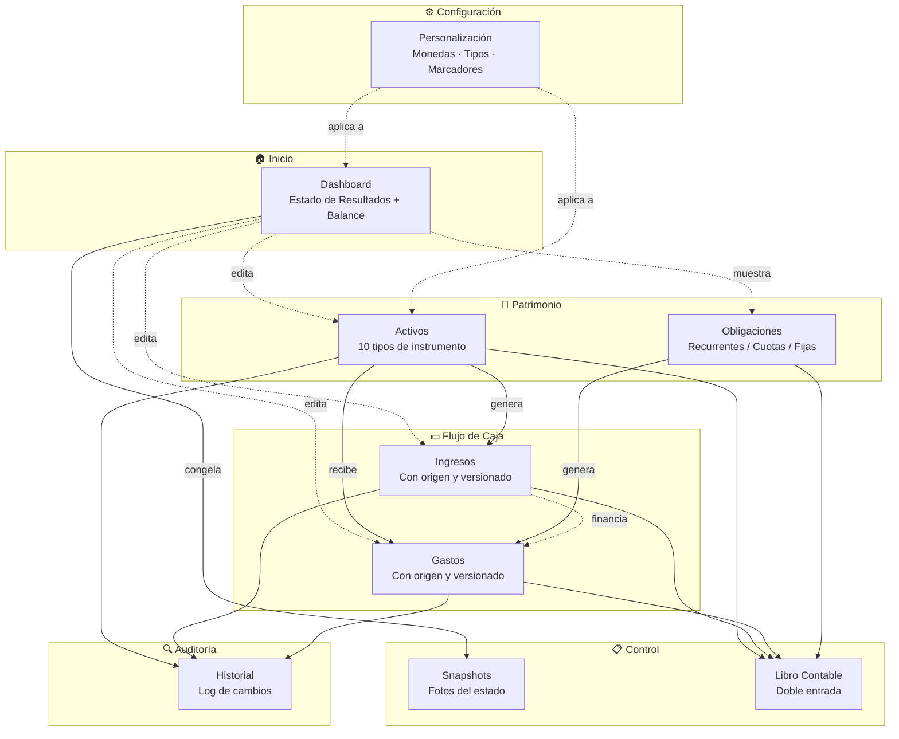

### Rutas del producto

| Sección | Ruta | Qué resuelve |
|---|---|---|
| Dashboard | `/` | Vista única del estado financiero, editable en línea |
| Activos | `/activos`, `/activos/[id]` | Portafolio de inversiones con paneles por tipo y tableros |
| Obligaciones | `/obligaciones`, `/obligaciones/[id]` | Deudas y compromisos con cronograma de pagos |
| Ingresos | `/ingresos`, `/ingresos/[id]` | Registro de entradas con origen, agrupación y versionado |
| Gastos | `/gastos`, `/gastos/[id]` | Registro de salidas con origen, agrupación y versionado |
| Snapshots | `/snapshots`, `/snapshots/[id]` | Comparación entre períodos |
| Libro Contable | `/libro-contable` | Asientos de doble entrada y saldos por cuenta |
| Historial | `/historial` | Auditoría paginada y filtrable de todos los cambios |
| Personalización | `/configuracion` | Monedas, tipos de activo, marcadores |

> `/movimientos` existe como vista legacy del log de auditoría (no está en la navegación lateral; `/historial` es su reemplazo con paginación server-side).

---

## 3. Modelo de entidades

### 3.1 Resumen

| Entidad | Qué representa | Quién la crea |
|---|---|---|
| **Usuario** | Titular de los datos; frontera de aislamiento | Registro público |
| **Registro** | Unidad económica base. Cuatro tipos: **Ingreso**, **Gasto**, **Activo**, **Pasivo** | Usuario o el sistema (efectos secundarios) |
| **Activo** | Registro con instrumento financiero: tipo, ticker, cantidad, precio promedio | Usuario desde `/activos` o desde un gasto |
| **Grupo de Activos** | Activo especial (`GROUP`) que organiza otros activos como hijos | Usuario desde `/activos` (modo "Agrupar") |
| **Movimiento de Activo** | Operación sobre un activo: compra, venta, depósito, extracción, ajuste, dividendo, comisión, cobro | Sistema al operar sobre el activo |
| **Tablero** | Panel opcional dentro de un activo: **Dividendos** o **Personalizado** | Usuario desde el detalle del activo |
| **Dividendo** | Entrada de un tablero de dividendos: mes, %, ganancia estimada y real | Usuario; puede autogenerarse en series recurrentes |
| **Grupo de Flujo** | Agrupación visual de ingresos o de gastos (`INCOME` / `EXPENSE`) | Usuario desde `/ingresos` o `/gastos` |
| **Vínculo Gasto↔Ingreso** | Declara qué ingreso financió qué gasto, y por cuánto | Usuario desde el panel de vínculos |
| **Obligación** | Compromiso de pago: recurrente, en cuotas o de monto fijo | Usuario desde `/obligaciones` |
| **Regla de Obligación** | Patrón de recurrencia de una obligación (mensual/trimestral/semestral/anual) | Usuario al configurar una obligación recurrente |
| **Cuota** | Vencimiento numerado de una obligación en cuotas | Sistema al crear la obligación |
| **Pago de Obligación** | Vencimiento esperado de una regla recurrente, aceptable o rechazable | Sistema, en ventana móvil de 12 meses |
| **Asiento Contable** | Par débito/crédito que registra un evento financiero | Sistema, en cada operación financiera |
| **Snapshot** | Copia congelada del dashboard en un momento dado | Usuario desde el dashboard |
| **Registro de Auditoría** | Traza de creación/edición/eliminación con comentario editable | Sistema, en cada mutación |
| **Marcador** | Etiqueta de color definida por el usuario | Usuario desde `/configuracion` o desde una fila |
| **Configuración** | Moneda base, tasas de cambio, tipos de activo visibles y propios | Usuario desde `/configuracion` |

### 3.2 Diagrama de entidades

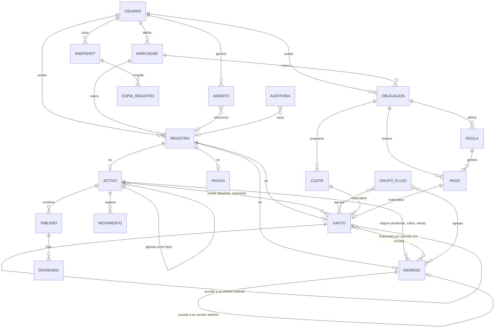

### 3.3 Detalle por entidad

#### Registro — la unidad económica base

Todo en el sistema gira alrededor de un único concepto con cuatro caras:

| Tipo | Rol en el producto | Dónde vive |
|---|---|---|
| **Ingreso** | Entrada de dinero | Estado de Resultados + `/ingresos` |
| **Gasto** | Salida de dinero | Estado de Resultados + `/gastos` |
| **Activo** | Valor patrimonial | Balance + `/activos` |
| **Pasivo** | Obligación con valor puntual en el Balance | Balance (columna Obligaciones) |

Todos comparten: nombre, monto, moneda, fecha de operación, estado y marcador. Los activos suman: tipo de instrumento, ticker, cantidad, precio promedio, descripción rica, movimientos y tableros.

> **Pasivo vs. Obligación**: son cosas distintas. Un **Pasivo** es una fila manual del Balance con un monto. Una **Obligación** es una entidad con cronograma que aparece en el Balance como fila derivada (calculada de sus reglas o cuotas pendientes) y que genera gastos al pagarse. El dashboard muestra ambos en la misma columna "Obligaciones".

#### Activo — instrumentos soportados

| Tipo | Qué aporta el panel dedicado |
|---|---|
| **STOCK** — Acciones | Dividendos estimados vs. reales, con series recurrentes |
| **CRYPTO** | Cantidad y precio promedio ponderado |
| **FUTURES** — Futuros | Posición LONG/SHORT por movimiento; liquidación |
| **OPTIONS** — Opciones | Cantidad y precio |
| **FIXED_TERM** — Plazo Fijo | Tasa anual, fechas de inicio/fin, retorno proyectado, cobro |
| **BOND** — Bonos | Cronograma de desembolsos con seguimiento de cobros |
| **TRADING** | Monto invertido vs. obtenido |
| **TRADING_BOT** | Agregados de ganado / perdido / extraído + ROI |
| **REBALANCE_BOT** | Sub-activos con distribución proporcional de aportes y extracciones |
| **GROUP** | Organizador: agrupa hijos y totaliza (nunca aparece en los selectores de tipo) |

Además, el usuario puede **ocultar tipos del sistema** y **definir tipos propios** desde `/configuracion`.

#### Obligación — tres modelos de compromiso

| Tipo | Cómo se paga | Entidades que usa |
|---|---|---|
| **RECURRING** — Recurrente | Reglas de recurrencia generan pagos esperados en ventana móvil de 12 meses; se aceptan o rechazan uno a uno | Regla + Pago |
| **INSTALLMENT** — Por cuotas | Al crearla se generan las N cuotas con sus gastos en estado pendiente | Cuota |
| **FIXED** — Monto fijo | Monto único sin cronograma | — |

Aceptar un pago o una cuota **activa el gasto** correspondiente; rechazarlo lo **cancela**.

---

## 4. Relaciones entre entidades

Existen **siete tipos de relación** en el producto. Entenderlas es entender el sistema.

### 4.1 Jerárquica — Grupo de Activos → Activos hijos

Un activo de tipo `GROUP` contiene otros activos. El grupo no tiene valor propio: **se calcula sumando sus hijos**. Si los hijos están en distintas monedas, el grupo muestra un desglose por moneda o un total convertido, según la configuración.

- Colapsable tanto en `/activos` como en el Dashboard.
- Los hijos son editables individualmente; el grupo no.
- Eliminar el grupo **desvincula** a los hijos, no los borra.

### 4.2 De origen — Activo ↔ Ingreso / Gasto

La relación más importante del producto: **de dónde vino el dinero y a dónde fue**.

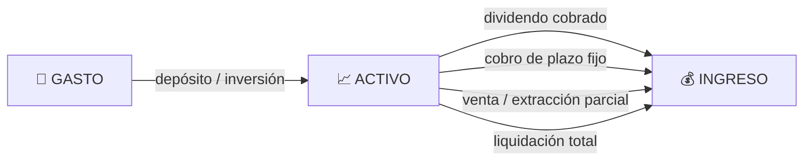

Cada ingreso y cada gasto declara su **fuente**, resuelta automáticamente al listarlo:

| Fuente de un **Gasto** | Significado |
|---|---|
| Desde Obligación | Es el pago de una cuota o vencimiento |
| Desde Activo | Es un depósito o inversión en un activo |
| Libre | Gasto autónomo |

| Fuente de un **Ingreso** | Significado |
|---|---|
| Dividendo | Cobro de dividendos de una acción |
| Plazo fijo | Cobro al vencimiento |
| Liquidación | Cierre total del activo |
| Extracción | Venta o retiro parcial |
| Manual | Ingreso autónomo |

### 4.3 De atribución — Gasto ↔ Ingreso (N:M con monto)

Responde a "¿con qué plata pagué esto?". Un gasto puede haber sido financiado por varios ingresos, y un ingreso puede financiar varios gastos. Cada vínculo lleva un **monto atribuido** propio.

- El monto atribuido debe ser mayor a cero.
- La suma de atribuciones **no tiene por qué igualar** el monto del gasto: el resto puede venir de fuentes no registradas. La validación de sobre-atribución **advierte pero no bloquea**.
- Los vínculos **sobreviven a los cambios de estado**: un gasto histórico conserva sus vínculos.
- Un mismo par gasto/ingreso solo puede vincularse una vez; re-vincularlo ajusta el monto.

### 4.4 De versionado — Ingreso/Gasto → su versión anterior

Los gastos e ingresos suelen repetirse con distinto monto cada período (alquiler, salario, servicios). En lugar de sobrescribir, el producto ofrece dos caminos al editar:

| Acción | Efecto |
|---|---|
| **Editar** | Corrige el registro en su lugar. Se usa para arreglar errores. |
| **Nuevo período** | Crea un registro nuevo activo, marca el anterior como histórico, y los enlaza. Se usa cuando el monto cambió de verdad. |

Esto construye una **cadena navegable**: desde cualquier versión histórica se llega a la actual, y desde la actual a la anterior.

### 4.5 De agrupación visual — Grupo de Flujo ↔ Ingresos/Gastos

Independiente de la relación de origen. Sirve para organizar la lectura ("Servicios", "Vivienda", "Sueldos"). Un grupo pertenece a un solo dominio (ingresos **o** gastos) y aparece colapsado tanto en su módulo como en el Dashboard, con nombre editable en línea, total y cantidad de miembros.

Eliminar un grupo **no elimina sus miembros**.

### 4.6 De marcado — Marcador ↔ Registro / Obligación

Etiquetas de color transversales. Reglas de producto:

- **Un marcador por entidad a la vez** — asignar uno nuevo reemplaza al anterior.
- Se aplican a activos, ingresos, gastos y obligaciones.
- La fila marcada se pinta con un borde de color y un fondo tenue.
- Se pueden crear al vuelo desde cualquier fila, sin ir a configuración.
- Quitar un marcador de una entidad **nunca** implica borrar la entidad.

### 4.7 Contable — Asiento ↔ operación

Cada evento financiero produce un asiento con cuenta debitada y acreditada. Las seis cuentas del producto son: **activos, pasivos, ingresos, gastos, efectivo, obligaciones**. La cuenta `efectivo` es virtual — representa la caja del usuario, sin registro asociado.

| Operación del producto | Débito | Crédito |
|---|---|---|
| Gasto libre | gastos | efectivo |
| Ingreso libre | efectivo | ingresos |
| Gasto que deposita en un activo | gastos + activos | efectivo (x2) |
| Extracción de activo hacia ingreso | efectivo | activos |
| Cobro de dividendo | efectivo | ingresos |
| Cobro de plazo fijo | efectivo | ingresos |
| Liquidación de activo | efectivo | activos |
| Pago de obligación aceptado | gastos | efectivo |
| Nuevo período (ingreso / gasto) | efectivo / gastos | ingresos / efectivo |

---

## 5. Ciclos de vida

### 5.1 Ingreso y Gasto

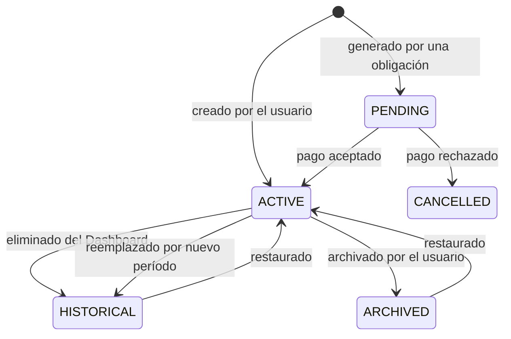

| Estado | Significado de producto | ¿Suma en el Dashboard? |
|---|---|---|
| `ACTIVE` | Vigente | Sí |
| `PENDING` | Cuota o vencimiento aún no confirmado | No |
| `CANCELLED` | Vencimiento rechazado | No |
| `HISTORICAL` | Reemplazado por una versión nueva, o quitado del Dashboard | No |
| `ARCHIVED` | Guardado deliberadamente fuera de la vista | No |

> **Regla de producto**: un ingreso o gasto **nunca se elimina físicamente**. Sale de la vista cambiando de estado, y siempre puede restaurarse.

### 5.2 Activo

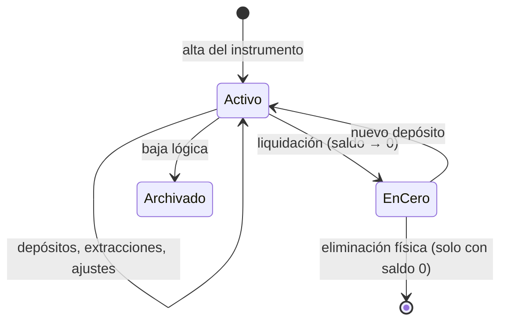

- **Liquidar** pone el saldo en cero, deja un movimiento de extracción y —opcionalmente— genera el ingreso correspondiente. El activo sigue existiendo con su historial completo.
- La **eliminación física** solo está permitida si el saldo es cero, y borra sus movimientos.
- La **baja lógica** conserva el registro pero lo saca de todas las vistas.

### 5.3 Obligación

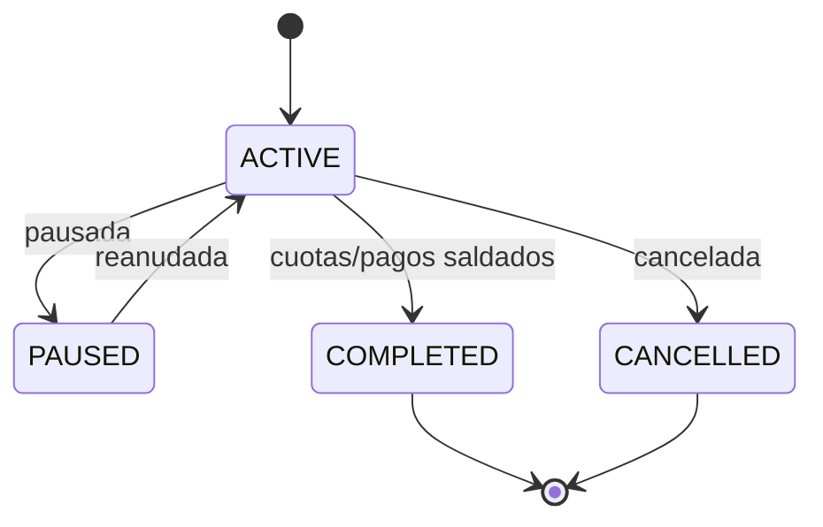

### 5.4 Cuota y Pago esperado

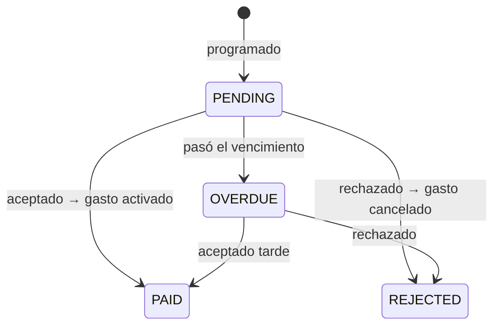

### 5.5 Dividendo

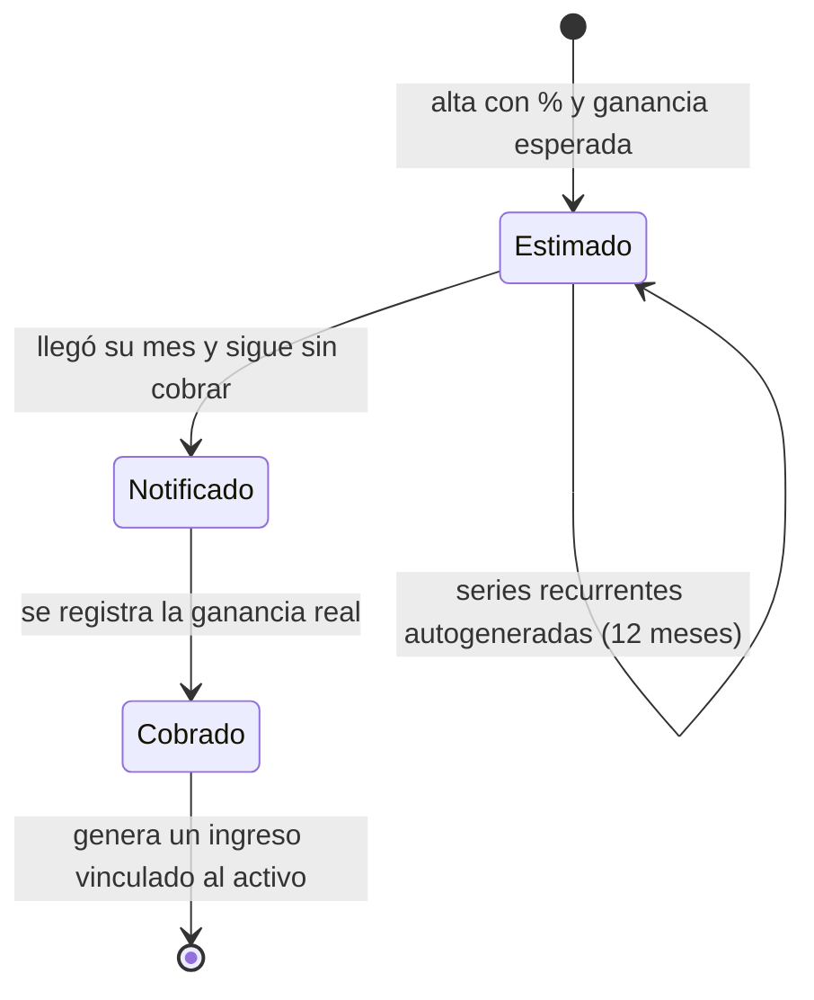

---

## 6. Catálogo de funcionalidades

### Dashboard `/`

| # | Funcionalidad |
|---|---|
| 1 | Estado de Resultados: ingresos, gastos y flujo de caja mensual |
| 2 | Balance: activos y obligaciones lado a lado |
| 3 | Edición en línea de cualquier fila (nombre, monto, moneda) |
| 4 | Alta rápida de ingresos, gastos, activos y obligaciones |
| 5 | Diálogo de edición de activo: ajuste o depósito, con opción de crear el gasto asociado |
| 6 | Diálogo de eliminación de activo: pone en cero, con opción de crear el ingreso asociado |
| 7 | Grupos de activos colapsables con desglose por moneda |
| 8 | Grupos de ingresos y gastos colapsables con total y cantidad |
| 9 | Filas de obligaciones derivadas: costo anual proyectado (recurrentes) o pendiente (cuotas) |
| 10 | Consolidación multi-moneda con conversión opcional a moneda base |
| 11 | Marcadores de color por fila |
| 12 | Acceso al detalle de cualquier activo, ingreso o gasto |
| 13 | Tomar snapshot del estado actual |

### Activos `/activos`

| # | Funcionalidad |
|---|---|
| 1 | Listado con filtro multi-selección por tipo de instrumento |
| 2 | Alta con validación cruzada: cantidad × precio debe coincidir con el monto |
| 3 | Detalle con edición campo por campo (sin modo edición global) |
| 4 | Descripción con editor de texto enriquecido |
| 5 | Panel especializado según el tipo de instrumento |
| 6 | Historial de movimientos, con edición en línea de tipo y comentario |
| 7 | Tableros opcionales: Dividendos y Personalizado |
| 8 | Dividendos con series recurrentes (mensual a anual), ventana de 12 meses |
| 9 | Cobro de dividendo → genera ingreso automáticamente |
| 10 | Cobro de plazo fijo al vencimiento |
| 11 | Modo "Agrupar": crear grupo nuevo o asignar a uno existente |
| 12 | Desagrupar, quitar del grupo, eliminar grupo |
| 13 | Liquidación y eliminación física con guarda de saldo cero |

### Ingresos `/ingresos` y Gastos `/gastos`

| # | Funcionalidad |
|---|---|
| 1 | Listado agrupado por fuente (obligación / activo / libre) |
| 2 | Filtro por estado: Activos · Históricos · Archivados |
| 3 | Editar o crear nuevo período, desde un único diálogo |
| 4 | Archivar y restaurar |
| 5 | Navegación de la cadena de versiones en ambos sentidos |
| 6 | Agrupación visual: crear, renombrar, asignar, quitar, eliminar grupos |
| 7 | Panel de vínculos gasto↔ingreso con monto atribuido |
| 8 | Marcadores por fila, creables al vuelo |
| 9 | Página de detalle con información, fuente, versiones y vínculos |

### Obligaciones `/obligaciones`

| # | Funcionalidad |
|---|---|
| 1 | Alta de los tres tipos: recurrente, por cuotas, monto fijo |
| 2 | Reglas de recurrencia: alta, pausa, reanudación, baja |
| 3 | Generación automática de vencimientos en ventana móvil de 12 meses |
| 4 | Aceptar un vencimiento → activa el gasto |
| 5 | Rechazar un vencimiento → cancela el gasto |
| 6 | Registro de pago manual fuera de cronograma |
| 7 | Pagos por tipo: pago, interés, comisión |
| 8 | Costo anual proyectado por moneda |
| 9 | Total pendiente de cuotas |
| 10 | Cambio de estado y finalización de la obligación |

### Libro Contable `/libro-contable`

| # | Funcionalidad |
|---|---|
| 1 | Listado de asientos con débito, crédito, monto y descripción |
| 2 | Filtros por rango de fechas, cuenta y moneda |
| 3 | Saldos por cuenta y por moneda |
| 4 | Saldos a una fecha de corte |
| 5 | Inicialización de saldos de apertura desde los registros existentes |

### Snapshots `/snapshots`

| # | Funcionalidad |
|---|---|
| 1 | Captura del dashboard con nombre y período |
| 2 | Vista de solo lectura idéntica al dashboard vivo |
| 3 | Saldos de cuentas contables asociados al snapshot |
| 4 | Listado histórico de todas las capturas |

### Historial `/historial`

| # | Funcionalidad |
|---|---|
| 1 | Log de creaciones, ediciones y eliminaciones |
| 2 | Filtros por acción, tipo de registro, búsqueda de texto y rango de fechas |
| 3 | Paginación en servidor con tamaños de 10 / 25 / 50 / 100 |
| 4 | Filtros y página sincronizados con la URL (compartible y navegable) |
| 5 | Comentario editable por entrada |

### Personalización `/configuracion`

| # | Funcionalidad |
|---|---|
| 1 | Moneda base y activación de la conversión |
| 2 | Tasas de cambio manuales o actualizadas desde API externa |
| 3 | Ocultar tipos de activo del sistema |
| 4 | Definir tipos de activo propios |
| 5 | Gestión de marcadores: nombre, color, orden |

### Transversales

| # | Funcionalidad |
|---|---|
| 1 | Registro e inicio de sesión con email y contraseña |
| 2 | Notificaciones: dividendos pendientes del mes, y obligaciones que vencen dentro de 3 días o ya vencidas |
| 3 | Estado de lectura de notificaciones persistente |
| 4 | Entradas numéricas con calculadora: escribir `=1000*10%` guarda `100` |
| 5 | Actualización optimista: la vista responde de inmediato y avisa si la escritura falla |
| 6 | Barra lateral colapsable con estado recordado |
| 7 | Navegación inferior en móvil |

---

## 7. Recorridos de usuario

### 7.1 Invertir: el gasto que se convierte en activo

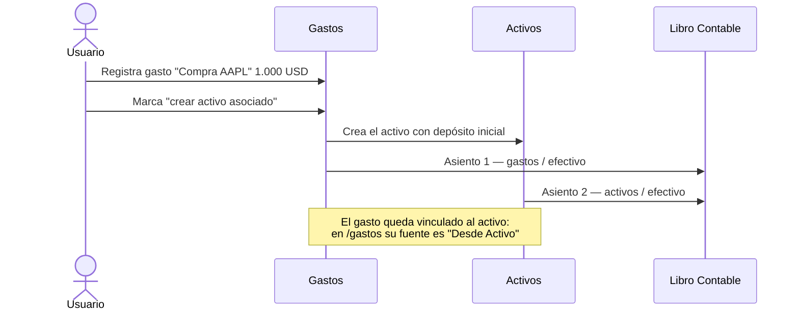

### 7.2 Cosechar: el activo que genera ingreso

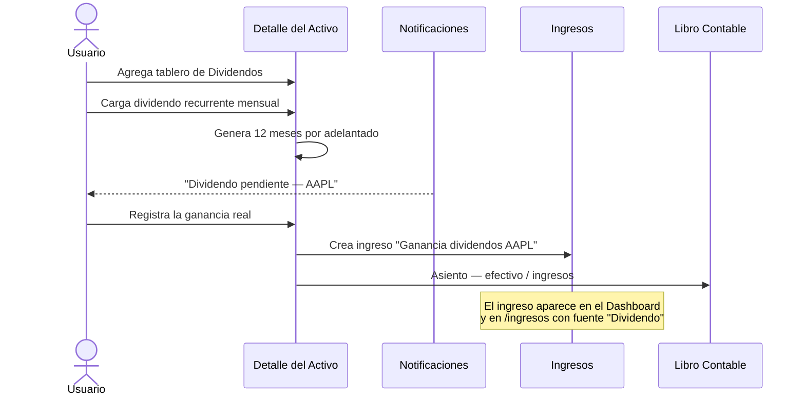

### 7.3 Pagar: la obligación que se vuelve gasto

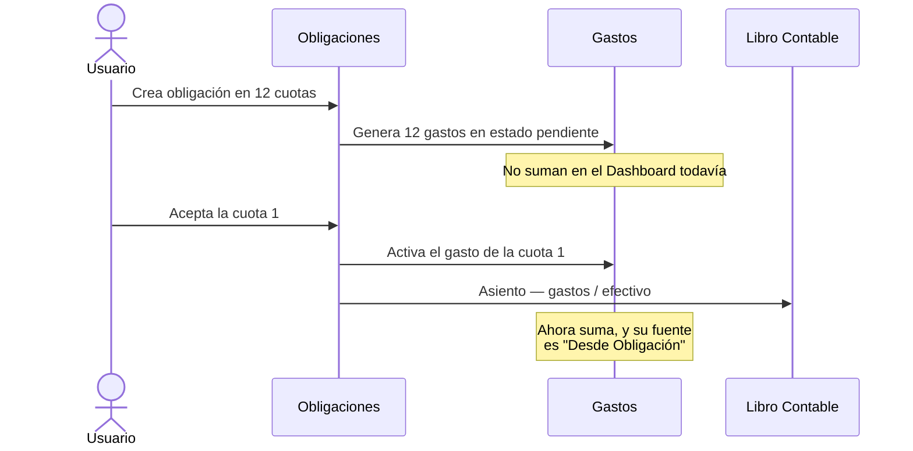

### 7.4 Cambiar de período sin perder el pasado

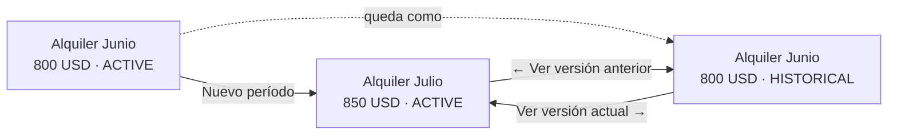

### 7.5 Atribuir: con qué ingreso pagué qué

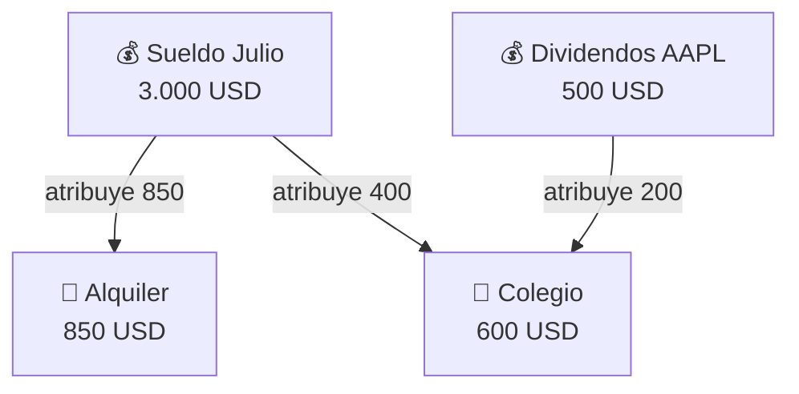

El colegio se pagó con dos fuentes. Nada obliga a que las atribuciones cubran el 100 % del gasto: los 600 USD quedan cubiertos en su totalidad, pero podrían no estarlo sin que el sistema lo impida.

### 7.6 Cerrar el mes

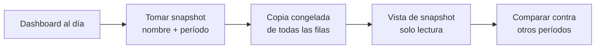

---

## 8. Las tres capas de registro

El producto registra lo que pasa en **tres planos distintos y complementarios**. Confundirlos es la fuente de error más común al leer los datos.

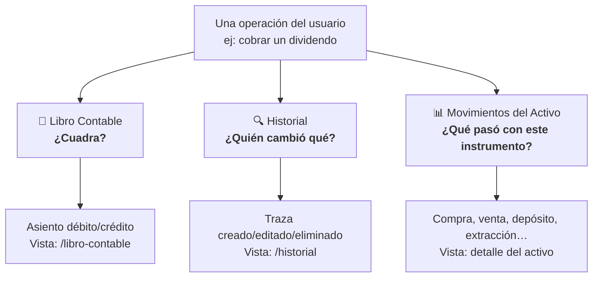

| Capa | Pregunta que responde | Granularidad | Alcance |
|---|---|---|---|
| **Libro Contable** | ¿La contabilidad cierra? | Por evento financiero | Todo el sistema |
| **Historial** | ¿Qué se tocó y cuándo? | Por operación CRUD | Todos los registros |
| **Movimientos de Activo** | ¿Cómo evolucionó este instrumento? | Por transacción | Solo activos |

> **Regla de producto**: toda funcionalidad financiera nueva **debe** generar su asiento contable. Sin esa disciplina, el Libro Contable deja de cuadrar y pierde su valor como control.

---

## 9. Reglas transversales de producto

| # | Regla | Por qué existe |
|---|---|---|
| **RP-01** | Un ingreso o gasto nunca se borra; cambia de estado | Preservar la historia financiera |
| **RP-02** | Un activo se da de baja lógicamente; solo se borra físicamente con saldo cero | Los movimientos históricos deben sobrevivir |
| **RP-03** | Eliminar un activo desde el Dashboard lo pone en cero, no lo da de baja | El Dashboard es una vista de valor, no de existencia |
| **RP-04** | Al crear un nuevo período, versión vieja y nueva se enlazan en una sola operación atómica | La cadena de versiones nunca puede quedar rota |
| **RP-05** | Una entidad tiene como máximo un marcador | El color debe ser inequívoco de un vistazo |
| **RP-06** | Quitar un marcador nunca borra la entidad marcada | Evitar pérdidas de datos por una acción visual |
| **RP-07** | Eliminar un grupo desvincula a sus miembros, no los elimina | Agrupar es organizar, no contener |
| **RP-08** | La sobre-atribución de ingresos a gastos advierte pero no bloquea | La realidad financiera admite fuentes no registradas |
| **RP-09** | Los vínculos gasto↔ingreso sobreviven a los cambios de estado | La trazabilidad no debe depender de la vigencia |
| **RP-10** | Toda operación financiera genera su asiento contable | Garantizar la consistencia del Libro |
| **RP-11** | Toda mutación deja traza en el Historial | Auditoría completa |
| **RP-12** | El valor de un grupo se deriva siempre de sus hijos | Una sola fuente de verdad por grupo |
| **RP-13** | El tipo `GROUP` nunca aparece en los selectores de tipo de activo | Es un organizador, no un instrumento |
| **RP-14** | Cada usuario ve solo sus datos, sin excepción | Aislamiento por sesión en toda consulta |
| **RP-15** | Las tasas de cambio y preferencias viven en el navegador, no en la base | Son preferencias de visualización, no datos financieros |

---

## 10. Matriz entidad × módulo

| Entidad | Dashboard | Activos | Ingresos | Gastos | Obligaciones | Libro | Snapshots | Historial | Config |
|---|:-:|:-:|:-:|:-:|:-:|:-:|:-:|:-:|:-:|
| Ingreso | ✏️ | 🔗 | ✏️ | 🔗 | — | 👁 | 📷 | 👁 | — |
| Gasto | ✏️ | 🔗 | 🔗 | ✏️ | 🔗 | 👁 | 📷 | 👁 | — |
| Activo | ✏️ | ✏️ | 🔗 | 🔗 | — | 👁 | 📷 | 👁 | ⚙️ |
| Pasivo | ✏️ | — | — | — | — | 👁 | 📷 | 👁 | — |
| Grupo de Activos | 👁 | ✏️ | — | — | — | — | 📷 | 👁 | — |
| Movimiento de Activo | — | ✏️ | — | — | — | 👁 | — | — | — |
| Tablero / Dividendo | — | ✏️ | 🔗 | — | — | 👁 | — | — | — |
| Grupo de Flujo | 👁 | — | ✏️ | ✏️ | — | — | — | — | — |
| Vínculo Gasto↔Ingreso | — | — | ✏️ | ✏️ | — | — | — | — | — |
| Obligación | 👁 | — | — | 🔗 | ✏️ | 👁 | — | — | — |
| Regla / Cuota / Pago | 👁 | — | — | 🔗 | ✏️ | 👁 | — | — | — |
| Asiento Contable | — | — | — | — | — | ✏️ | 👁 | — | — |
| Snapshot | ✏️ | — | — | — | — | — | ✏️ | — | — |
| Marcador | 👁 | ✏️ | ✏️ | ✏️ | ✏️ | — | — | — | ✏️ |
| Configuración | 👁 | 👁 | 👁 | 👁 | 👁 | 👁 | 👁 | — | ✏️ |

**Leyenda**: ✏️ se crea o edita · 👁 solo se visualiza · 🔗 aparece como relación · 📷 se congela · ⚙️ se configura su tipo · — no aplica

---

## 11. Límites conocidos

Lo que el producto **hoy no hace**, para evitar expectativas equivocadas:

| Límite | Detalle |
|---|---|
| Sin cotizaciones automáticas | Los precios de acciones y crypto se cargan a mano; solo las tasas de cambio se actualizan desde una API externa |
| Sin comparador de snapshots | Los snapshots se ven de a uno; la comparación entre períodos es manual |
| Sin presupuestos ni metas | No hay límites de gasto por categoría ni objetivos de ahorro |
| Sin categorías de gasto | La organización es por fuente y por grupo visual, no por taxonomía de categorías |
| Sin importación bancaria | No hay carga de extractos ni conciliación automática |
| Sin reportes exportables | No hay exportación a PDF/Excel ni informes generados |
| Libro Contable desde el despliegue | Solo registra operaciones posteriores a su activación; los saldos previos se cargan como apertura |
| Preferencias no sincronizadas | Moneda base, tasas y tipos propios viven en cada navegador — cambiar de dispositivo los reinicia |
| Sin colaboración | No hay usuarios compartidos, roles ni permisos |

---

## Referencias

| Documento | Qué agrega sobre esto |
|---|---|
| [00-Resumen-Ejecutivo.md](00-Resumen-Ejecutivo.md) | Síntesis breve para lectura rápida |
| [02-Reglas-de-Negocio.md](02-Reglas-de-Negocio.md) | Reglas con detalle de implementación |
| [03-Modelo-de-Datos.md](03-Modelo-de-Datos.md) | Tablas, columnas, índices y restricciones |
| [04-Flujos-Principales.md](04-Flujos-Principales.md) | Flujos end-to-end con detalle técnico |
| [09-Glosario.md](09-Glosario.md) | Definición de términos del dominio |
| [financial-domain-architecture.md](financial-domain-architecture.md) | Mapeo completo operación → cuentas contables |
| [modules/](modules/) | Detalle funcional, reglas y Server Actions por módulo |
