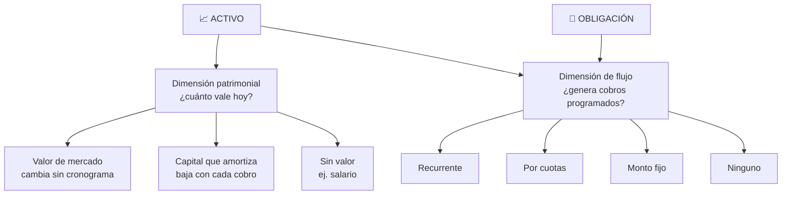

# Análisis — ¿Los tipos de activo entran en la taxonomía de obligaciones?

## Pregunta

Las obligaciones se clasifican en **Recurrente**, **Por cuotas** y **Monto fijo**. ¿Los 11 tipos de activo del sistema encajan en esas mismas tres categorías?

## Método

Se revisó, para cada tipo: su `metadata` en `lib/assets.ts`, su panel en `components/activos/panels/`, y las Server Actions que lo operan. La pregunta concreta fue: **¿este tipo tiene un cronograma de flujos de caja, y de qué forma?**

---

## 1. Qué clasifica realmente la taxonomía de obligaciones

Antes de aplicarla hay que ser preciso sobre qué mide. Leyendo `ObligationType` y sus tablas, el eje no es "tipo de deuda" sino **la forma del cronograma de pagos**:

| Tipo | Cantidad de vencimientos | ¿Tiene fin conocido? | Entidades que usa |
|---|---|---|---|
| **RECURRING** | Indefinida — ventana móvil de 12 meses | No | `ObligationRule` → `ObligationPayment` |
| **INSTALLMENT** | `N` finita y numerada | Sí, al agotarse las cuotas | `ObligationInstallment` |
| **FIXED** | Cero — no hay cronograma | N/A | Ninguna; solo el monto |

Las tres son **tres formas de un calendario**: infinito, finito, o inexistente. Eso es todo lo que distinguen.

## 2. Por qué activos y obligaciones no son simétricos

Una obligación **es** su cronograma: no tiene otro contenido que lo que debe y cuándo. Un activo tiene **dos dimensiones independientes**:

Una obligación solo puebla la caja de la derecha. Un activo puebla las dos, y son ortogonales: un bono tiene valor de mercado **y** cronograma de cupones; una crypto tiene valor **y ningún** cronograma; un salario **no tiene valor** y sí cronograma.

> **Conclusión preliminar**: la taxonomía es aplicable, pero **solo a la dimensión de flujo**. Preguntar "¿de qué tipo es este activo?" en términos de Recurrente/Cuotas/Fijo es una pregunta mal formulada. La pregunta correcta es "¿de qué tipo es el flujo que genera este activo?", y admite la respuesta **"ninguno"**, que en obligaciones no existe.

---

## 3. Clasificación tipo por tipo

| # | Tipo | ¿Cronograma? | Categoría del flujo | Evidencia en el código |
|---|---|---|---|---|
| 1 | **STOCK** — Acciones | Opcional | **Recurrente** *(si tiene tablero de dividendos recurrentes)* | `DividendEntry.recurring` con `type` y `seriesId`; `generateRecurringDividends()` pregenera 12 meses |
| 2 | **CRYPTO** | No | **Ninguna** | Sin metadata propia; usa `GenericAssetPanel` |
| 3 | **FUTURES** — Futuros | No | **Ninguna** | `FuturesMetadata` solo tiene `liquidated`/`liquidationSuffix`; el panel no maneja fechas |
| 4 | **OPTIONS** — Opciones | No | **Ninguna** | Sin panel dedicado ni metadata. El vencimiento, que es intrínseco a una opción, **no está modelado** |
| 5 | **TRADING** | No | **Ninguna** | `{ totalInvested, totalObtained }` — agregados, sin fechas |
| 6 | **TRADING_BOT** — Bot Trading | No | **Ninguna** | `{ totalInvested, totalGained, totalLost, totalExtracted }` — agregados |
| 7 | **REBALANCE_BOT** — Bot Rebalanceo | No | **Ninguna** | `{ assets[] }` — sub-activos con precio y cantidad, sin calendario |
| 8 | **FIXED_TERM** — Plazo Fijo | Sí | **Monto fijo con fecha** ⚠️ | `{ startDate, endDate, rate, collected }` — un único cobro al vencimiento. `collectFixedTerm()` crea un ingreso y da de baja el activo |
| 9 | **BOND** — Bonos | Sí | **Por cuotas** ✅ | `BondDisbursement[]` con `{ dueDate, amount, collected }` — cronograma finito de fechas y montos conocidos |
| 10 | **INCOME_STREAM** — Flujo de Ingresos | Sí | **Recurrente** ✅ *(pero ver §5.3)* | `IncomeRule` + `IncomeOccurrence`, ventana móvil de 12 meses |
| 11 | **GROUP** — Grupo | No | **N/A** — organizador | No es un instrumento; agrupa hijos y totaliza |

### Reparto

| Categoría | Tipos | Proporción |
|---|---|---|
| **Ninguna** — sin cronograma | CRYPTO, FUTURES, OPTIONS, TRADING, TRADING_BOT, REBALANCE_BOT | 6 de 11 |
| **Recurrente** | STOCK *(condicional)*, INCOME_STREAM | 2 de 11 |
| **Por cuotas** | BOND | 1 de 11 |
| **Monto fijo** | FIXED_TERM *(con reservas)* | 1 de 11 |
| **N/A** | GROUP | 1 de 11 |

---

## 4. Respuesta a la pregunta

**No, la taxonomía no clasifica los tipos de activo.** Tres razones concretas:

1. **La mayoría no tiene cronograma.** 6 de 11 tipos son *mark-to-market*: su valor cambia por precio, no por calendario, y solo producen caja al venderse. Forzarlos a una de las tres categorías sería inventar estructura donde no la hay.

2. **Falta una cuarta categoría: "ninguna".** En obligaciones, `FIXED` significa "monto único sin cronograma" — pero una obligación de monto fijo **igual se paga alguna vez**. Un activo sin cronograma no es lo mismo: no es que su flujo sea único, es que **no tiene flujo programado en absoluto**. Meter CRYPTO en `FIXED` confundiría dos cosas distintas.

3. **El eje patrimonial no tiene equivalente.** Un préstamo otorgado y un salario pueden compartir cronograma recurrente y ser opuestos en lo patrimonial: uno amortiza capital, el otro no tiene capital. Eso ya lo captura el flag `reducesPrincipal`, que **es una dimensión que la taxonomía de obligaciones no necesita** y por lo tanto no tiene.

**Sí es aplicable a la dimensión de flujo**, con una cuarta categoría. Y hacer el ejercicio revela duplicación real.

---

## 5. Hallazgos

### 5.1 Hay tres implementaciones distintas de "recurrencia" ⚠️

El sistema resuelve el mismo problema —"generar eventos periódicos en una ventana móvil"— tres veces, con tres modelos de datos sin relación entre sí:

| Mecanismo | Dónde vive | Genera | Ventana |
|---|---|---|---|
| `ObligationRule` → `ObligationPayment` | Tablas propias | Gastos `PENDING` | 12 meses, `ensurePaymentWindow()` |
| `IncomeRule` → `IncomeOccurrence` | Tablas propias | Ingresos `PENDING` | 12 meses, `ensureIncomeWindow()` |
| `DividendEntry.recurring` + `seriesId` | **JSON en `metadata`** | Nada hasta el corte | 12 meses, `generateRecurringDividends()` |

Los dos primeros son espejos deliberados y comparten `RecurrenceType` y `OCCURRENCES_PER_YEAR`. El tercero es anterior, usa **su propio enum** (`RecurringType`: `"monthly"` en minúscula vs. `"MONTHLY"`), vive en un blob JSON sin integridad referencial, y fue justamente el que se rompió en silencio al agotarse su ventana —el bug que arregló `extendRecurringDividends()` en v2.3.0—.

**Consecuencia práctica**: un dividendo recurrente y un ingreso recurrente son lo mismo para el usuario, pero se configuran en dos lugares distintos, con dos vocabularios distintos, y solo uno aparece en la proyección de ganancia anual.

### 5.2 Hay dos implementaciones de "cronograma finito" ⚠️

| Mecanismo | Dónde vive | Campos |
|---|---|---|
| `ObligationInstallment` | Tabla propia | `installmentNumber`, `dueDate`, `expectedAmount`, `status`, `gastoRecordId` |
| `BondDisbursement` | **JSON en `metadata`** | `dueDate`, `amount`, `currency`, `collected` |

Son la misma entidad con distinta fidelidad. El bono no tiene numeración, ni estados (solo un booleano `collected`), ni vínculo al ingreso generado, ni entra en la proyección anual, ni participa del Corte Mensual. **Cobrar un cupón de bono no genera ningún ingreso en el dashboard** — solo marca un checkbox.

### 5.3 `INCOME_STREAM` con preset Préstamo o Cuotas está mal categorizado ⚠️

Conceptualmente son **por cuotas**: un préstamo de 500.000 en 12 cuotas termina. Están implementados como **recurrentes**: ventana móvil infinita, sin `N` ni numeración.

Esto ya se manifestó como caso borde documentado en [flujos-de-ingresos.md](../modules/flujos-de-ingresos.md):

> *"Préstamo totalmente cobrado: el activo llega a 0. Las reglas siguen activas: hay que pausarlas o eliminarlas a mano."*

Ese caso borde no es un detalle: es el síntoma de que falta la categoría "por cuotas" en el módulo. Un préstamo con `N` cuotas conocidas debería completarse solo, como hace `recalcularObligation()` al marcar `COMPLETED` cuando se agotan las cuotas.

### 5.4 `FIXED_TERM` no encaja limpio en ninguna categoría ⚠️

Es **un cobro único en una fecha conocida**. Contra las tres categorías:

- No es *Recurrente*: no se repite
- No es *Monto fijo*: `FIXED` en obligaciones no tiene fecha; el plazo fijo la tiene y es su dato central
- No es *Por cuotas*: no hay `N`

Es, con precisión, **una cuota única** — o sea `INSTALLMENT` con `N = 1`. Que no exista esa lectura sugiere que la categoría `FIXED` de obligaciones está subespecificada: mezcla "sin cronograma" con "un único evento".

### 5.5 `OPTIONS` tiene un vencimiento que el modelo ignora ℹ️

Una opción tiene fecha de expiración por definición. El sistema no la modela: `OPTIONS` no tiene metadata ni panel propio. Es la única brecha donde el instrumento **sí** tiene estructura temporal real y el modelo no la representa.

---

## 6. Conclusión

| Pregunta | Respuesta |
|---|---|
| ¿Los tipos de activo entran en las tres categorías? | **No.** Clasifican cronogramas de flujo, y 6 de 11 tipos no tienen ninguno |
| ¿La taxonomía sirve para algo en activos? | **Sí**, aplicada a la *dimensión de flujo* y agregando la categoría "ninguna" |
| ¿Conviene reclasificar los tipos de activo en esas tres categorías? | **No.** El tipo describe *qué es el instrumento*; el cronograma describe *cómo paga*. Son ejes distintos y conviene que sigan separados |
| ¿Significa eso que los tipos de activo **no se pueden generalizar**? | **No, al contrario.** Ver §6.1: se generalizan sobre cuatro atributos ortogonales. Lo que no aplica es el eje de obligaciones, que solo mide uno de los cuatro |
| ¿Qué reveló el ejercicio? | Que el sistema implementa **la misma recurrencia tres veces** y **el mismo cronograma finito dos veces**, con fidelidad desigual |

La taxonomía no debería aplicarse *a los tipos de activo*. Debería aplicarse **a las reglas de flujo**, que ya son una entidad de primera clase (`IncomeRule`).

### 6.1 Los activos sí se generalizan — sobre otro eje

Que la taxonomía de obligaciones no sirva **no significa que los tipos de activo sean categorías irreducibles**. Descomponen limpiamente sobre cuatro atributos ortogonales:

| Atributo | Valores |
|---|---|
| **Valor** | mark-to-market · amortiza por cronograma · derivado de hijos · proyección de flujo · sin valor |
| **Cantidad** | con unidades (cantidad + precio promedio) · sin unidades |
| **Flujo** | cronograma (ninguno/recurrente/cuotas) × monto (fijo/porcentual/ajustable) × liquidación (efectivo/especie) × ¿descuenta capital? |
| **Composición** | atómico · agrupador |

| Tipo | Valor | Cantidad | Flujo | Composición |
|---|---|---|---|---|
| STOCK | mark-to-market | sí | recurrente % | atómico |
| CRYPTO | mark-to-market | sí | opcional (staking) | atómico |
| FUTURES / OPTIONS | mark-to-market | sí | ninguno | atómico |
| TRADING / TRADING_BOT | mark-to-market | no | ninguno | atómico |
| FIXED_TERM | principal + rendimiento | no | cuota única | atómico |
| BOND | mark-to-market | opcional | cuotas finitas | atómico |
| INCOME_STREAM | proyección o capital | no | recurrente o cuotas | atómico |
| REBALANCE_BOT | derivado | sí, por hijo | ninguno | agrupador |
| GROUP | derivado | no | ninguno | agrupador |

**Los tipos son presets sobre esos cuatro atributos**, igual que Salario / Préstamo / Cuotas son presets sobre reglas de ingreso. Las duplicaciones de §5.1 y §5.2 son la prueba: tres implementaciones de recurrencia solo pueden coexistir si el sistema no reconoce que es el mismo atributo apareciendo en tipos distintos.

**Pero conviene generalizar de a un atributo, no por refactor.** Colapsar el enum en una tabla de atributos sería caro, riesgoso y de beneficio invisible para el usuario. El camino practicable es el de las recomendaciones de abajo: los tipos siguen en el selector, pero por debajo son configuraciones del mismo motor. *(v2.4.0 avanzó los ejes de monto, ajuste, cronograma y liquidación. **v2.5.0 terminó de colapsar el enum**: el tipo pasó a ser una etiqueta y las capacidades se activan por activo.)*

---

## 7. Recomendaciones

Ordenadas por relación valor/costo. **Ninguna está implementada** — este documento es solo el análisis.

| # | Recomendación | Severidad | Beneficio |
|---|---|---|---|
| **R1** | Agregar `INSTALLMENT` a `IncomeRule`: una regla con `installmentCount` que se completa sola al agotarse | Media | Resuelve §5.3. El préstamo se cierra solo en vez de quedar con reglas colgadas |
| **R2** | Migrar `BondDisbursement` a `IncomeOccurrence` con una regla `INSTALLMENT` | Media | Resuelve §5.2. Los cupones pasarían a generar ingresos reales, entrar en la proyección anual y participar del Corte Mensual |
| **R3** | Unificar los dividendos recurrentes sobre `IncomeRule` | Alta (esfuerzo) | Resuelve §5.1. Un solo vocabulario de recurrencia, con integridad referencial y proyección anual |
| **R4** | Modelar `FIXED_TERM` como regla de cuota única | Baja | Resuelve §5.4 y unifica `collectFixedTerm()` con `collectIncomeOccurrence()` |
| **R5** | Agregar fecha de vencimiento a `OPTIONS` | Baja | Cierra §5.5 |

### Orden sugerido

R1 primero: es el más barato y arregla un caso borde que el usuario ya va a encontrar. R2 después, porque reutiliza lo que construya R1. R3 es el de mayor valor conceptual pero implica migrar datos que hoy viven en JSON, y conviene hacerlo cuando R1 y R2 hayan validado el modelo.

> **Advertencia sobre R3**: los dividendos ya guardan `ingresoRecordId` dentro del JSON de tableros y el Corte Mensual depende de ese campo para no duplicar ingresos. Cualquier migración tiene que preservar ese vínculo o generará ingresos duplicados en activos que ya cobraron dividendos.

---

## Referencias

| Documento | Relación |
|---|---|
| [modules/obligaciones.md](../modules/obligaciones.md) | Los tres tipos de obligación y su comportamiento |
| [modules/flujos-de-ingresos.md](../modules/flujos-de-ingresos.md) | `IncomeRule` / `IncomeOccurrence` y el flag `reducesPrincipal` |
| [modules/corte-mensual.md](../modules/corte-mensual.md) | Cómo se activan los flujos de cada período |
| [10-Producto.md](../10-Producto.md) | Los 11 tipos de activo en lenguaje de producto |
| [03-Modelo-de-Datos.md](../03-Modelo-de-Datos.md) | Tablas de obligaciones, flujos de ingreso y el `metadata` de cada tipo |
