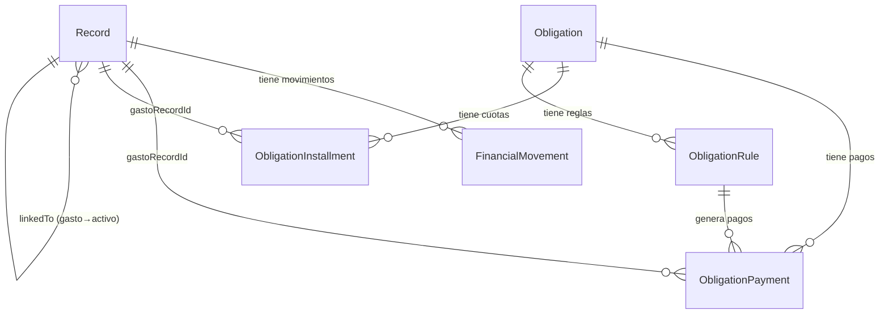
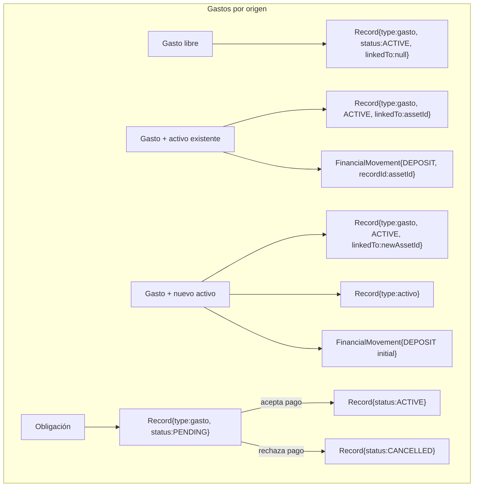
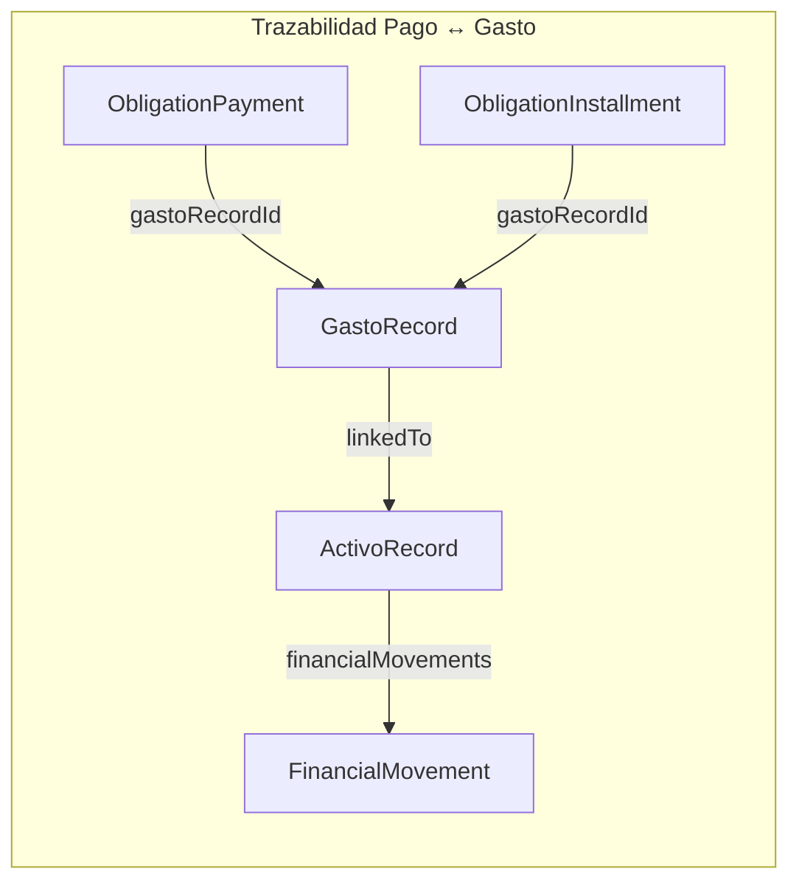

# Módulo Gastos — Relaciones, Arquitectura e Implementación

> ✅ **IMPLEMENTADO**: La página `/gastos` existe (`app/(dashboard)/gastos/page.tsx`) y muestra los gastos agrupados por origen. La ruta está en la navegación lateral (sección Flujo de Caja) y en el drawer móvil. Este documento se conserva como referencia de las relaciones entre entidades y los flujos de creación.

## Estado actual

### Entidad Gasto

Un **Gasto** es un `Record` con `type = "gasto"` en la tabla `records`. No existe una tabla separada ni una entidad de dominio propia. El campo `status` (ACTIVE / PENDING / CANCELLED) fue agregado en la iteración anterior.

```
records
  id        String
  type      String   = "gasto"
  name      String
  amount    Decimal
  currency  String
  status    String   = "ACTIVE"
  linkedTo  String?  ← existe pero sin uso documentado para gastos
  deletedAt DateTime?
  userId    String?
  operationDate DateTime?
```

~~No existe ruta `/gastos`.~~ La página `/gastos` está implementada (`app/(dashboard)/gastos/page.tsx`). Los gastos también son visibles como filas en la tabla "Gastos" del Dashboard.

---

### Caminos de creación de gastos (estado actual)

| Origen | Mecanismo | Estado creado | Audit Log |
|--------|-----------|---------------|-----------|
| Dashboard (fila inline) | `createRecord()` via finance-store | ACTIVE | Sí |
| Obligación RECURRING (ventana de pago) | `ensurePaymentWindow()` → `record.createMany` | PENDING | No |
| Obligación INSTALLMENT (al crear) | `createObligation()` → `record.createMany` | PENDING | No |
| Aceptar pago RECURRING | `acceptObligationPayment()` → `record.update(ACTIVE)` | ACTIVE | No |
| Aceptar cuota INSTALLMENT | `acceptInstallmentPayment()` → `record.update(ACTIVE)` | ACTIVE | No |
| Pago manual FIXED | `registerManualPayment()` → `record.create` | ACTIVE | No |

### Entidades existentes involucradas

```
records                     — Todos los registros financieros (activo/pasivo/ingreso/gasto)
obligation_payments         — Pagos de obligaciones RECURRING y FIXED; tiene gastoRecordId
obligation_installments     — Cuotas de obligaciones INSTALLMENT; tiene gastoRecordId
financial_movements         — Movimientos de activos (DEPOSIT/EXTRACT/ADJUSTMENT/etc.)
movements (audit_log)       — Log de auditoría de record changes (creado/editado/eliminado)
```

---

## Problemas detectados

### P-01: Gastos sin entidad de dominio y sin página
No existe `/gastos`. El usuario no puede ver, filtrar ni navegar a sus gastos fuera del Dashboard.

### P-02: Sin asociación Gasto ↔ Activo
Crear un activo desde el Dashboard o desde `/activos` no genera ningún gasto. El campo `linkedTo` en `Record` existe pero no tiene uso documentado ni UI para gastos.

### P-03: Creación de activo con formulario incorrecto desde Dashboard
El "+" en la tabla Activos del Dashboard agrega una fila inline que crea un `Record{type:"activo"}` vía `finance-store.createRecord()`, lo que genera un error silencioso de PK duplicada (el activo se crea via el draft pero no el FinancialMovement inicial). El flujo correcto es usar `AssetFormDialog` que llama a `createAsset()` (genera DEPOSIT movement).

### P-04: Trazabilidad parcial en tabla de pagos de Obligaciones
La tabla de pagos en `/obligaciones/[id]` muestra el monto real del gasto (ya fue implementado via `gastoAmounts` map), pero no muestra el ID del gasto ni un enlace para navegar a él.

### P-05: Sin soporte de pago parcial por cuota (INSTALLMENT)
`acceptInstallmentPayment` marca la cuota entera como PAID. No hay mecanismo para registrar un pago parcial dejando la cuota con saldo restante.

### P-06: `registerManualPayment` no pasa `status: "ACTIVE"` explícitamente
El `prisma.record.create` en `registerManualPayment` no pasa el campo `status`. Funciona porque el DEFAULT en DB es 'ACTIVE', pero es inconsistente con el resto del código.

### P-07: `linkedTo` existe pero sin uso visible
El campo `linkedTo` en `FinancialRecord` y `records` DB existe como potencial vínculo entre entidades, pero ninguna sección del Dashboard lo usa ni lo muestra (I-06 en docs/analisis/Inconsistencias.md).

---

## Propuesta de arquitectura

### Gasto como entidad con fuente (source)

Sin cambios de schema. Se usa el campo `linkedTo` ya existente para la asociación Gasto ↔ Activo:

```
linkedTo = assetId    →  gasto vinculado a un activo existente
linkedTo = null       →  gasto libre (sin asociación) o vinculado via ObligationPayment
```

Para la asociación Gasto ↔ Obligación, ya existe vía:
- `ObligationPayment.gastoRecordId` → gasto.id
- `ObligationInstallment.gastoRecordId` → gasto.id

### Tipos de gasto por fuente

```typescript
type GastoSourceType = "obligation" | "asset" | "free"

type GastoSource =
  | { type: "obligation"; obligationId: string; obligationName: string; paymentId?: string }
  | { type: "asset";      assetId: string;      assetName: string }
  | { type: "free" }
```

### Ciclo de vida

```
[Usuario crea gasto libre]       → Record{status: ACTIVE, linkedTo: null}
[Usuario crea gasto + activo]    → Record{status: ACTIVE, linkedTo: assetId}
                                   FinancialMovement{movementType: DEPOSIT, recordId: assetId}
[Obligación genera cuota/pago]   → Record{status: PENDING, linkedTo: null}
[Usuario acepta pago]            → Record{status: PENDING → ACTIVE}
[Usuario rechaza pago]           → Record{status: PENDING → CANCELLED}
```

---

## Flujos detallados

### Nuevo Gasto — Opción 1: Activo existente

```
Usuario abre GastoFormDialog → selecciona activo existente → ingresa monto

Server Action: createGastoForExistingAsset(gastoData, assetId)
  1. prisma.record.create({type: "gasto", status: "ACTIVE", linkedTo: assetId, ...})
  2. prisma.financialMovement.create({movementType: "DEPOSIT", recordId: assetId, amount: X})
  3. prisma.record.update({id: assetId, data: {amount: asset.amount + X}})
  4. prisma.auditLog.create({...})  ← trazabilidad de creación
  5. recalcularGrupo(assetId) si es hijo de grupo

Resultado:
  - Gasto ACTIVE aparece en Dashboard y /gastos
  - Activo incrementa su valor
  - FinancialMovement DEPOSIT registrado en historial del activo
```

### Nuevo Gasto — Opción 2: Crear activo nuevo

```
Usuario abre GastoFormDialog → ingresa nombre activo, tipo, monto, moneda

Server Action: createGastoAndNewAsset(gastoData, assetData)
  1. createAsset() → crea Record{type:"activo"} + FinancialMovement{DEPOSIT}  (reutiliza lógica existente)
  2. prisma.record.create({type: "gasto", status: "ACTIVE", linkedTo: newAssetId, ...})
  3. prisma.auditLog.create({...})

Resultado:
  - Nuevo activo aparece en Dashboard y /activos
  - Gasto ACTIVE con linkedTo = newAssetId aparece en Dashboard y /gastos
  - FinancialMovement DEPOSIT registrado (ya lo crea createAsset)
```

### Nuevo Gasto — Opción 3: Libre

```
Usuario abre GastoFormDialog → ingresa nombre, monto, moneda (sin activo)

Server Action: createFreeGasto(data)
  1. prisma.record.create({type: "gasto", status: "ACTIVE", linkedTo: null, ...})
  2. prisma.auditLog.create({...})

Resultado:
  - Gasto ACTIVE aparece en Dashboard y /gastos
```

### Activo con gasto asociado (desde AssetFormDialog)

```
Usuario abre AssetFormDialog → marca "Generar gasto asociado" → guarda

Server Action: createAsset() (existente, sin cambios)
  → El componente luego llama a createGastoForExistingAsset(gastoData, newAssetId)

Resultado:
  - Activo creado con DEPOSIT movement
  - Gasto ACTIVE con linkedTo = newAssetId
```

---

## Relaciones entre entidades







---

## Migraciones necesarias

**Sin cambios de schema.** Todos los campos necesarios ya existen:

| Campo | Tabla | Uso |
|-------|-------|-----|
| `linkedTo` | `records` | Gasto → Activo (ya existe, ahora documentado y usado) |
| `gastoRecordId` | `obligation_payments` | Obligación → Gasto (ya existe) |
| `gastoRecordId` | `obligation_installments` | Cuota → Gasto (ya existe) |
| `status` | `records` | ACTIVE / PENDING / CANCELLED (ya existe) |

---

## Página /gastos

### Estructura

```
/gastos
  ├── Tabla de todos los gastos ACTIVE
  │   ├── Nombre
  │   ├── Monto
  │   ├── Moneda
  │   ├── Fuente (Obligación / Activo / Libre) con link
  │   └── Fecha
  └── Botón "Nuevo Gasto" → GastoFormDialog
```

### Enriquecimiento de source

`loadGastos()` en `lib/gasto-actions.ts`:
1. Carga todos los `records` con `type:"gasto"`, `status:"ACTIVE"`, `deletedAt:null`
2. Para los que tienen `linkedTo != null`: carga los activos correspondientes para obtener nombres
3. Para los sin `linkedTo`: busca en `obligation_payments` y `obligation_installments` por `gastoRecordId`
4. Construye y retorna `GastoWithSource[]`

---

## Tabla de pagos /obligaciones/[id] — Columna ID

En `obligation-detail.tsx`, el componente `PaymentsBoard` (y la vista de cuotas INSTALLMENT) recibe una nueva columna "Gasto" que muestra:
- Un badge con el prefijo del `gastoRecordId` (primeros 8 chars)
- Un link icon que navega a `/gastos` (lista filtrada por ese gasto en el futuro)

---

## Validaciones

| Escenario | Validación |
|-----------|------------|
| Gasto + activo: activo eliminado | Verificar `deletedAt: null` del activo antes de crear |
| Gasto libre sin nombre | Bloquear guardado hasta que `name.trim()` y `amount > 0` |
| Gasto + activo existente: monto 0 | Monto debe ser > 0 |
| Gasto + nuevo activo: nombre duplicado | Verificar unicidad de nombre en activos del usuario |
| Aceptar pago con gasto ya ACTIVE | Guard en `acceptObligationPayment`: verificar status del gasto antes de activar |

---

## Riesgos

| Riesgo | Severidad | Mitigación |
|--------|-----------|------------|
| `linkedTo` repurposado: ruptura si había otros usos | Baja | Campo actualmente sin uso en UI (I-06), ahora documentado para gasto→activo |
| Activo modificado externamente luego de crear el gasto | Baja | El DEPOSIT movement persiste como traza histórica aunque el activo cambie de valor |
| Gasto PENDING sin gastoRecordId (datos legacy) | Baja | Ya cubierto: backwards compat en acceptObligationPayment/acceptInstallmentPayment |
| Pagos parciales INSTALLMENT fuera de scope v1 | Media | Documentado como deferred. FIXED ya soporta pagos parciales |
| `loadGastos()` N+1 si hay muchos gastos | Baja | Se usa una sola query bulk para payments/installments, no N queries individuales |

---

## Entregables de esta iteración

1. ✅ Este documento
2. `lib/gasto-actions.ts` — server actions: loadGastos, createFreeGasto, createGastoForExistingAsset, createGastoAndNewAsset
3. `components/gastos/gasto-form-dialog.tsx` — modal con 3 opciones
4. `app/(dashboard)/gastos/page.tsx` — lista de gastos
5. `components/activos/asset-form-dialog.tsx` — checkbox "Generar gasto asociado"
6. `components/dashboard-sheet.tsx` — prop `onAddAsset` para activos "+"
7. `app/(dashboard)/page.tsx` — wiring AssetFormDialog para activos "+"
8. `components/obligations/obligation-detail.tsx` — columna Gasto en tabla de pagos
9. Navegación: /gastos en sidebar y bottom nav

### Fuera de scope v1

- Pago parcial de cuotas INSTALLMENT (requiere nuevo estado "PARTIALLY_PAID" + saldo restante)
- `/gastos/[id]` — página de detalle de gasto individual
- Columna "Fuente" visible en la tabla Gastos del Dashboard
- Eliminar `deleteObligation` (borrado físico legacy)
- Notificaciones para gastos PENDING próximos a vencer
