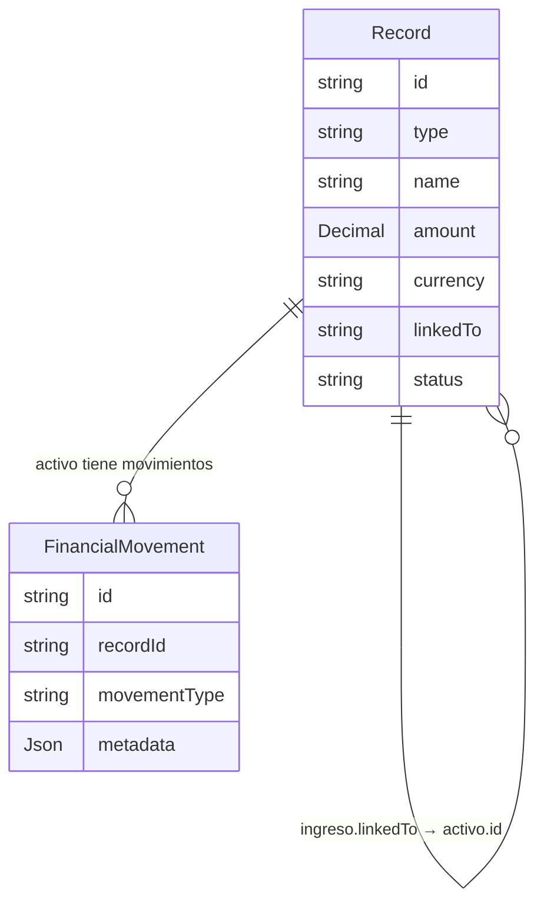
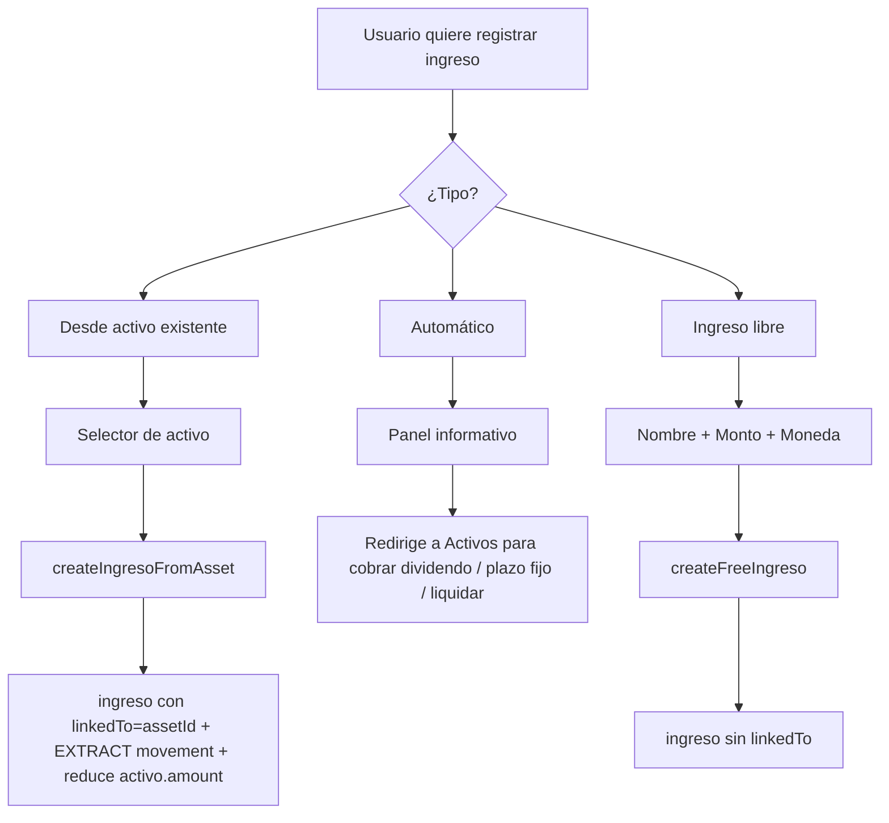

# Módulo Ingresos — Análisis de relaciones y propuesta de formalización

> ✅ **IMPLEMENTADO**: La página `/ingresos` existe (`app/(dashboard)/ingresos/page.tsx`) y muestra los ingresos agrupados por origen. La ruta está en la navegación lateral (sección Flujo de Caja) y en el drawer móvil. Este documento se conserva como referencia de los flujos de creación y las brechas de trazabilidad identificadas.

## Estado actual

Los ingresos son `FinancialRecord` con `type="ingreso"` y persisten en la tabla `records`. ~~No existe una página `/ingresos` ni una columna "Entidad relacionada" en el dashboard~~ → La página `/ingresos` ya existe. La trazabilidad via `linkedTo` sigue siendo una brecha pendiente.

## Flujos que crean ingresos hoy

| ID | Función | Archivo | Trigger | Nombre del ingreso | linkedTo |
|----|---------|---------|---------|---------------------|----------|
| F-01 | `collectDividend()` | `lib/assets-actions.ts` | Usuario cobra dividendo desde `/activos/[id]` | `Ganancia dividendos {assetName}` | ❌ no seteado |
| F-02 | `collectFixedTerm()` | `lib/assets-actions.ts` | Usuario cobra plazo fijo | `Cobro plazo fijo: {assetName}` | ❌ no seteado |
| F-03 | `zeroOutAsset()` | `lib/assets-actions.ts` | Usuario pone activo en 0 desde dashboard | `Liquidación {assetName}` | ❌ no seteado |
| F-04 | `liquidarActivo()` | `lib/assets-actions.ts` | Usuario liquida activo desde `/activos` | `Liquidación de {assetName}` | ❌ no seteado |
| F-05 | `createExtractFromDashboard()` | `lib/assets-actions.ts` | Usuario hace extracción parcial desde dashboard | `Venta de {assetName}` | ❌ no seteado |
| F-06 | Dashboard "+" manual | `finance-store.ts` → `actions.ts` | Usuario ingresa fila nueva en sección Ingresos | (libre, lo que el usuario escriba) | ❌ no seteado |

## Rastreo parcial existente

- **Dividendos (F-01):** El `ingresoRecordId` se guarda en los metadatos del dividendo (`asset.metadata.boards[].dividends[].ingresoRecordId`). Permite ir desde dividendo → ingreso, pero no al revés.
- **Liquidaciones/extracciones (F-04, F-05):** El `relatedIngresoId` se guarda en los metadatos del `FinancialMovement` de tipo EXTRACT. Permite ir desde movimiento → ingreso, pero no al revés.
- **Plazo fijo (F-02), zero-out (F-03), manual (F-06):** Sin ningún rastreo.

## Brechas identificadas

| ID | Problema |
|----|---------|
| P-01 | Ningún ingreso tiene `linkedTo` → no hay forma de saber a qué activo pertenece |
| P-02 | No existe página `/ingresos` para listar y gestionar ingresos |
| P-03 | Dashboard: sección Ingresos no muestra "Entidad relacionada" |
| P-04 | No existe form dialog para crear ingresos manualmente con vínculo a activo |
| P-05 | No hay navegación hacia `/ingresos` en sidebar ni bottom nav |
| P-06 | No hay sección "Ingresos relacionados" en `/activos/[id]` |

## Propuesta de solución

### Principio guía
Reutilizar el campo `linkedTo String?` (ya existe en el modelo `Record`, igual que para Gastos) para vincular ingresos a su activo origen. Sin cambios de schema.

### Cambios en rutas existentes (Paso 1)
Agregar `linkedTo: assetId` en las 5 funciones de `lib/assets-actions.ts`. Los ingresos existentes sin `linkedTo` se clasificarán como "libres" en `loadIngresos()`.

### Tipos (`lib/ingreso-actions.ts`)

```typescript
export type IngresoSourceType = "dividend" | "fixed-term" | "liquidation" | "extraction" | "manual"

export type IngresoSource =
  | { type: "asset"; assetId: string; assetName: string; sourceType: IngresoSourceType }
  | { type: "free" }

export interface IngresoWithSource {
  id: string
  name: string
  amount: number
  currency: Currency
  status: string
  operationDate?: string
  source: IngresoSource
}
```

### Detección de `sourceType` por nombre (retrocompatibilidad)

Para ingresos sin `linkedTo` que podrían tener origen conocible por el nombre:

| Prefijo del nombre | sourceType |
|---|---|
| `"Ganancia dividendos"` | `dividend` |
| `"Cobro plazo fijo:"` | `fixed-term` |
| `"Liquidación"` | `liquidation` |
| `"Venta de"` | `extraction` |
| (resto) | `manual` |

### Diagrama de relaciones



### Flujos de creación formalizados



## Página /ingresos

Grupos de display:
- **Desde Activos** — `source.type === "asset"`, con `SourceBadge` (link al activo) + chip de tipo (Dividendo / Plazo Fijo / Liquidación / Extracción)
- **Ingresos Libres** — `source.type === "free"`, sin badge de entidad

## Dashboard — columna "Activo"

La infra de `linkType` / `linkLabel` ya existe en `SectionTable` pero no se usa en ninguna sección actualmente. Solo se pasa `linkType="activo"` y `linkLabel="Activo"` al `SectionTable` de Ingresos para habilitar la columna.

## Migraciones de BD

**Ninguna.** El campo `linkedTo String?` ya existe en el modelo `Record`.

## Riesgos

| Riesgo | Mitigación |
|--------|-----------|
| Ingresos existentes sin `linkedTo` | Se tratan como "libres" en `loadIngresos()` — no se rompe nada |
| `loadIngresos()` N+1 | Mismo patrón bulk query + Map que `loadGastos()` |
| `createIngresoFromAsset()` con activo eliminado | Guard: verificar `deletedAt: null` antes de proceder |
