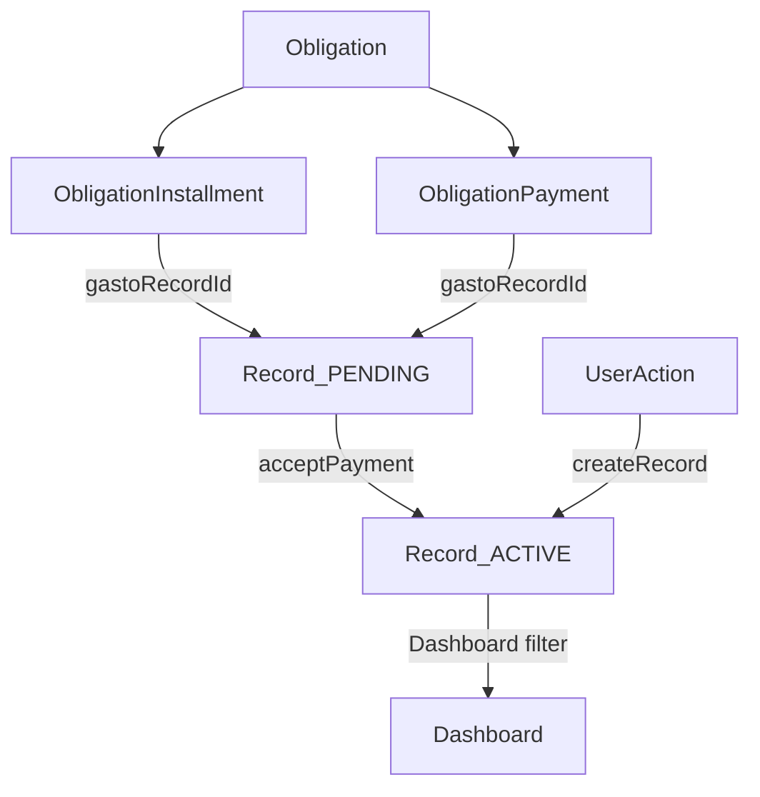

# Refactor — Gastos como entidad de dominio

## Estado actual

### Cómo funcionan actualmente los gastos

Un **gasto** es un `Record` con `type = "gasto"` en la tabla `records`.  
No tiene estado propio (sin campo `status`). Solo existe o está soft-deleted (`deletedAt`).

**Ciclo de vida actual:**
```
Creado (manual o desde obligación) → visible en dashboard
Eliminado (trash en dashboard)      → deletedAt = now(), desaparece permanentemente
```

**Relación con Dashboard:** `loadData()` carga todos los records con `deletedAt: null`.  
Todos los gastos no eliminados aparecen en la tabla "Gastos" del dashboard.

**Relación con Obligaciones:**
- Al **aceptar un pago RECURRING** (`acceptObligationPayment`): se crea un nuevo Record{type:"gasto"} con status = PAID (actualmente, sin status, simplemente existe).
- Al **pagar una cuota INSTALLMENT** (`acceptInstallmentPayment`): ídem — se crea un gasto al momento del pago.
- Al **pago manual FIXED** (`registerManualPayment`): ídem.
- Al **finalizar con gastos** (`finalizeObligation`, generateExpenses=true): crea gastos para todas las cuotas pendientes.

**Relación con Notificaciones:** Las notificaciones disparan para pagos PENDING de obligaciones. Al aceptar desde notificaciones se crea el gasto.

**Relación con Activos:** Los activos pueden generar ingresos (dividendos) pero no gastos en este módulo.

**Relación con Dividendos:** `collectDividend` crea un ingreso (`type:"ingreso"`), no un gasto.

---

## Problemas detectados

### 1. Sin estado propio — no hay gastos "pendientes"
Los gastos solo existen en un estado: visible. No hay concepto de gasto **programado/futuro** que no impacte en las métricas hasta llegar a su fecha.

**Consecuencia:** Cuando una obligación genera pagos futuros (12 meses de ventana para RECURRING, 12 cuotas para INSTALLMENT), no existe representación formal de esos pagos como gastos hasta que el usuario los acepta manualmente.

### 2. Gasto se crea solo al momento del pago — no hay anticipación
Los gastos de obligaciones se crean reactivamente (en el momento de aceptar), no proactivamente (al crear la obligación).  
Esto impide planificación financiera futura: el usuario no puede ver en el dashboard "cuánto debo pagar próximamente".

### 3. Eliminación irreversible
`dbDeleteRecord` hace soft-delete permanente (`deletedAt`). Si un usuario elimina un gasto vinculado a una obligación, la trazabilidad entre gasto y pago se rompe.

### 4. No hay diferenciación dashboard entre gasto manual y gasto de obligación
Un gasto creado manualmente ("Supermercado $5000") y un gasto generado por obligación ("Cuota 3 — Auto") son indistinguibles visualmente en el dashboard.

### 5. Ambigüedad en `deleteObligation` vs `finalizeObligation`
Existe `deleteObligation` (borrado físico en cascada) que viola el principio de trazabilidad histórica. La UI ya usa `finalizeObligation`, pero el action queda expuesto.

---

## Propuesta de arquitectura

### Gasto como entidad con ciclo de vida

Agregar campo `status` a la tabla `records`:

```prisma
model Record {
  // ... campos existentes ...
  status    String  @default("ACTIVE")  // "ACTIVE" | "PENDING" | "CANCELLED"
}
```

### Estados definidos

| Estado | Descripción | Visible en Dashboard |
|--------|-------------|---------------------|
| `ACTIVE` | Gasto confirmado, impacta métricas | ✅ Sí |
| `PENDING` | Gasto programado futuro (generado por obligación) | ❌ No |
| `CANCELLED` | Pago rechazado, no materializado | ❌ No |

**Nota:** Se elige NO usar `INACTIVE` ni `PAID` en v1. El estado `INACTIVE` (ocultar sin eliminar) se difiere por complejidad de UI. El estado `PAID` no aporta diferenciación útil vs `ACTIVE` en este modelo.

### Transiciones de estado

```
[Obligación creada]
       ↓
  Record{status: PENDING}  ←── creado upfront al generar cuotas/ventanas de pago
       ↓
  [Usuario acepta pago]
       ↓
  Record{status: ACTIVE}   ←── aparece en Dashboard
       ↓
  [Usuario elimina del Dashboard]  (comportamiento actual: deletedAt, no cambia)
```

Para gastos manuales (creados desde el dashboard):
```
[Usuario crea gasto] → Record{status: ACTIVE}  (sin pasar por PENDING)
```

---

## Modelo de relaciones



---

## Flujo detallado por tipo de obligación

### INSTALLMENT
```
createObligation()
  → Para cada cuota i=1..N:
      Record{id: gastoId, status: PENDING, name: "Cuota i — Nombre", amount: X}
      ObligationInstallment{gastoRecordId: gastoId}

acceptInstallmentPayment(installmentId)
  → Si installment.gastoRecordId existe:
      Record.update({status: ACTIVE})
  → Si no (legacy):
      Record.create({status: ACTIVE})   ← backwards compat
```

### RECURRING
```
ensurePaymentWindow(ruleId)
  → Para cada fecha nueva en la ventana de 12 meses:
      gastoId = UUID
      ObligationPayment{gastoRecordId: gastoId, status: PENDING}
      Record{id: gastoId, status: PENDING, name: "[Programado] Nombre"}

acceptObligationPayment(paymentId)
  → Si payment.gastoRecordId existe:
      Record.update({status: ACTIVE})
  → Si no (legacy):
      Record.create({status: ACTIVE})
```

### FIXED (sin cambios)
```
registerManualPayment()
  → Record.create({status: ACTIVE})   ← creado directamente ACTIVE
```

---

## Impacto en módulos

### Dashboard
- `loadData()` filtra: type != 'gasto' OR (type = 'gasto' AND status = 'ACTIVE')
- Gastos PENDING no aparecen
- Gastos manuales: no cambia (siempre ACTIVE)

### /obligaciones
- Sin cambios en la UI
- `ObligationInstallment` ya muestra gastoRecordId, ahora con estado

### Notificaciones
- Sin cambios. Las notificaciones son para pagos PENDING de obligaciones (no para gastos Records).

### Movimientos (Audit Log)
- `dbCreateRecord` para gastos manuales: sin cambios
- Gastos PENDING de obligaciones NO crean AuditLog entries (son internos del módulo Obligaciones)

---

## Riesgos y mitigaciones

| Riesgo | Severidad | Mitigación |
|--------|-----------|------------|
| Datos existentes (registros sin status) | Baja | Campo con DEFAULT 'ACTIVE', todos los records existentes heredan ACTIVE automáticamente |
| InstallmentPayments existentes sin gastoRecordId | Baja | Backwards compat: si no tiene gastoRecordId, crear gasto nuevo al aceptar |
| Gasto PENDING no aparece en movimientos | Media | Documentado: gastos de obligaciones son gestionados por el módulo de Obligaciones, no por audit log |
| Eliminar gasto vinculado desde dashboard | Media | No se cambia el comportamiento de delete en v1. El gasto se soft-deletes pero el link en ObligationInstallment/Payment queda huérfano |

---

## Migraciones necesarias

### DB
```sql
-- Aplicado via `prisma db push`
ALTER TABLE records ADD COLUMN status VARCHAR(20) NOT NULL DEFAULT 'ACTIVE';
```

Todos los records existentes quedan con `status = 'ACTIVE'` por el DEFAULT.  
No hay backfill adicional necesario.

### Código

| Archivo | Cambio |
|---------|--------|
| `prisma/schema.prisma` | Agregar campo `status` a `Record` |
| `lib/finance.ts` | Agregar `status` a `FinancialRecord` type |
| `lib/actions.ts` | `loadData()`: filtrar gastos por status; `dbCreateRecord()`: set status ACTIVE |
| `lib/obligation-actions.ts` | `createObligation`, `ensurePaymentWindow`, `acceptInstallmentPayment`, `acceptObligationPayment`, `finalizeObligation` |

---

## Decisiones diferidas (fuera de scope v1)

- **Estado INACTIVE**: ocultar gasto del dashboard sin eliminarlo. Requiere cambio en delete button + UI para ver "gastos inactivos".
- **Columna Estado en tabla Gastos del dashboard**: mostrar PENDING/ACTIVE visualmente.
- **Notificaciones para gastos PENDING**: alertar cuando un gasto programado llega a su fecha.
- **Eliminar `deleteObligation`** del código (borrado físico legacy).

---

## Entregables de v1

1. ✅ Este documento
2. `status` campo en DB (prisma db push)
3. Tipos TypeScript actualizados
4. `loadData()` filtrado
5. Obligaciones: gastos PENDING upfront al crear/generar ventanas
6. Aceptar pago: activar gasto PENDING en lugar de crear uno nuevo
