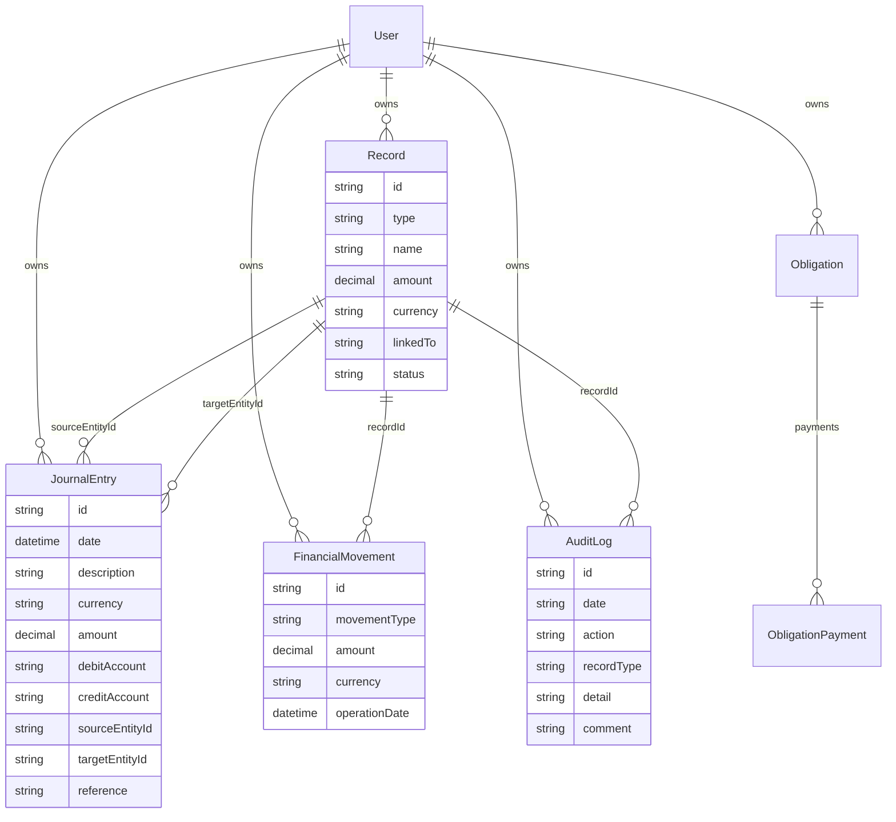
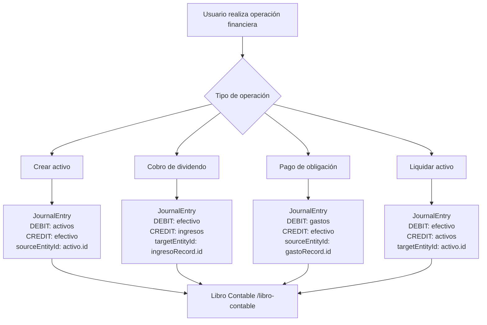
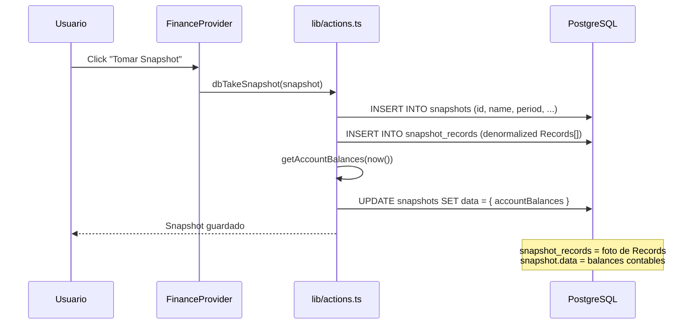

# Arquitectura del Dominio Financiero

> **Fuente de verdad** del dominio financiero de DashboardCashFlow.
> Última actualización: 2026-06-23

---

## 1. Dominio actual — Estado de las entidades

### 1.1 Entidades de negocio

| Entidad | Tabla | Tipo en Record | Descripción |
|---------|-------|----------------|-------------|
| Activo | `records` | `"activo"` | Inversión o bien con valor (stock, crypto, plazo fijo, etc.) |
| Pasivo | `records` | `"pasivo"` | Deuda o compromiso de valor negativo |
| Ingreso | `records` | `"ingreso"` | Entrada de dinero (dividendo, venta, cobro, libre) |
| Gasto | `records` | `"gasto"` | Salida de dinero (inversión, pago de obligación, libre) |
| Obligación | `obligations` | — | Compromiso periódico o en cuotas (alquiler, préstamo) |
| Cuota (Installment) | `obligation_installments` | — | Cuota específica de una obligación |
| Pago de Obligación | `obligation_payments` | — | Registro de pago de una regla recurrente |
| Dividendo | En `records.metadata` | — | Entrada en el tablero de dividendos de un activo |
| Grupo | `records` con `assetType="GROUP"` | `"activo"` | Agrupador de activos hijos (parentId) |

### 1.2 Capas de registro financiero actuales

El sistema tiene **dos capas de registro paralelas, no integradas**:

```
┌─────────────────────────────────────────────┐
│  AuditLog  (tabla: movements)               │
│  ─────────────────────────────────────────  │
│  PROPÓSITO: Auditoría de eventos CRUD       │
│  CREA: actions.ts, gasto-actions.ts,        │
│         ingreso-actions.ts                  │
│  MUESTRA EN UI: /movimientos (→ /historial) │
│  ACCIONES: "creado" | "editado" | "elimina  │
└─────────────────────────────────────────────┘

┌─────────────────────────────────────────────┐
│  FinancialMovement (tabla: financial_mvmts) │
│  ─────────────────────────────────────────  │
│  PROPÓSITO: Tracking operacional de activos │
│  CREA: assets-actions.ts                    │
│  MUESTRA EN UI: /activos/[id] (panel)       │
│  TIPOS: BUY|SELL|DEPOSIT|EXTRACT|DIVIDEND   │
└─────────────────────────────────────────────┘
```

**Gap principal:** Ninguna de estas capas representa un asiento financiero completo. No hay "desde dónde viene" y "hacia dónde va" el dinero.

---

## 2. Problema: Ausencia de libro contable

### 2.1 Síntomas

- Un dividendo cobrado crea un `ingreso` Record, pero no hay registro de que ese ingreso fue desde una cuenta Activos hacia Ingresos.
- Un gasto creado no indica que el dinero salió de "Efectivo" hacia "Gastos".
- Las operaciones de activos (createAsset, addMovement, liquidar) **no crean AuditLog**. Son invisibles en el historial de usuario.
- No hay forma de calcular el saldo neto de "Efectivo" (cuánto dinero líquido entró/salió).
- Los snapshots capturan el estado de los Records pero no el estado de las cuentas contables.

### 2.2 Lo que falta

Un **Libro Contable** que registre cada evento financiero como un asiento de doble entrada:

> Por cada operación que mueve dinero, se registra (1) qué cuenta aumenta y (2) qué cuenta disminuye, con el mismo importe.

---

## 3. Nueva capa: Libro Contable

### 3.1 Plan de cuentas (Chart of Accounts)

Fijo, definido por el sistema. No configurable por el usuario.

| Cuenta | Tipo | Descripción |
|--------|------|-------------|
| `activos` | Real | Suma del valor de todos los activos del usuario |
| `pasivos` | Real | Suma de pasivos/deudas |
| `ingresos` | Resultado | Entradas de dinero (dividendos, ventas, cobros) |
| `gastos` | Resultado | Salidas de dinero (inversiones, pagos) |
| `efectivo` | Virtual | Dinero líquido / caja / banco (contra-cuenta implícita) |
| `obligaciones` | Compromisos | Compromisos periódicos o en cuotas |

> **Nota sobre `efectivo`:** La app no trackea el saldo bancario explícito. La cuenta `efectivo` es una contra-partida contable que representa "dinero fuera del sistema" (banco, efectivo en mano). Permite que los asientos cierren sin necesidad de un record de banco real.

### 3.2 Entidad: `JournalEntry` (Asiento Contable)

```prisma
model JournalEntry {
  id             String   @id @default(uuid())
  date           DateTime @default(now())
  description    String
  currency       String
  amount         Decimal  @db.Decimal(18, 4)
  debitAccount   String   // AccountType
  creditAccount  String   // AccountType
  sourceEntityId String?  // FK → Record (entidad que genera el asiento)
  targetEntityId String?  // FK → Record (entidad destino del asiento)
  reference      String?  // ID externo (obligationPaymentId, dividendId, etc.)
  notes          String?
  userId         String
  user           User     @relation(fields: [userId], references: [id])

  @@index([userId])
  @@index([userId, date])
  @@map("journal_entries")
}
```

```typescript
export type AccountType =
  | "activos"
  | "pasivos"
  | "ingresos"
  | "gastos"
  | "efectivo"
  | "obligaciones"
```

---

## 4. Mapa de operaciones → asientos

Todo evento financiero genera al menos un `JournalEntry`. Los campos `sourceEntityId` y `targetEntityId` permiten navegar desde el asiento hasta la entidad de negocio.

| Operación | Función | DEBIT | CREDIT | sourceEntityId | targetEntityId |
|-----------|---------|-------|--------|----------------|----------------|
| Crear activo | `createAsset()` | activos | efectivo | activo.id | — |
| Depósito en activo | `addMovement(DEPOSIT)` | activos | efectivo | activo.id | — |
| Ajuste positivo de activo | `addMovement(ADJUSTMENT+)` | activos | efectivo | activo.id | — |
| Ajuste negativo de activo | `addMovement(ADJUSTMENT-)` | efectivo | activos | — | activo.id |
| Extracción parcial de activo | `createExtractFromDashboard()` | efectivo | activos | — | activo.id |
| Liquidación total de activo | `zeroOutAsset()` / `liquidarActivo()` | efectivo | activos | — | activo.id |
| Cobro de dividendo | `collectDividend()` | efectivo | ingresos | — | ingresoRecord.id |
| Cobro de plazo fijo | `collectFixedTerm()` | efectivo | ingresos | — | ingresoRecord.id |
| Gasto libre | `createFreeGasto()` | gastos | efectivo | gastoRecord.id | — |
| Depósito en activo via gasto | `createGastoForExistingAsset()` | activos (1) + gastos (2) | efectivo (ambos) | gastoRecord.id | activo.id |
| Pago de obligación | `acceptObligationPayment()` | gastos | efectivo | gastoRecord.id | — |
| Ingreso libre | `createFreeIngreso()` | efectivo | ingresos | — | ingresoRecord.id |
| Ingreso desde activo | `createIngresoFromAsset()` | efectivo (1) + ingresos (2) | activos (1) + efectivo (2) | — | ingresoRecord.id |

> Para `createGastoForExistingAsset`: Se crean dos asientos. Asiento 1: DEBIT gastos / CREDIT efectivo (el dinero sale). Asiento 2: DEBIT activos / CREDIT efectivo (el activo aumenta). En la práctica el activo crece y el gasto registra el desembolso.

---

## 5. Relación entre entidades y asientos



---

## 6. Flujo de asientos por operación



---

## 7. Separación de responsabilidades

### 7.1 Tres capas con roles distintos

| Capa | Entidad | Rol | UI |
|------|---------|-----|----|
| **Libro Contable** | `JournalEntry` | Asientos de doble entrada. Responde "qué cuenta se movió". | `/libro-contable` (nuevo) |
| **Historial de Auditoría** | `AuditLog` | Registro de eventos CRUD. Responde "quién creó/editó/eliminó". | `/historial` (renombrado de /movimientos) |
| **Movimientos de Activos** | `FinancialMovement` | Tracking operacional por activo. Responde "qué compré/vendí". | `/activos/[id]` (sin cambios) |

### 7.2 Flujo de navegación propuesto

```
SIDEBAR (agrupado por dominios funcionales)
├── [Inicio]
│   └── Dashboard            /
├── [Patrimonio]
│   ├── Activos              /activos
│   └── Obligaciones         /obligaciones
├── [Flujo de Caja]
│   ├── Ingresos             /ingresos
│   └── Gastos               /gastos
├── [Control]
│   ├── Snapshots            /snapshots
│   └── Libro Contable  ✦    /libro-contable
├── [Auditoría]
│   └── Historial            /historial     ← RENOMBRADO (era Movimientos)
└── [Configuración]
    └── Personalización      /configuracion
```

---

## 8. Impacto en Snapshots

### 8.1 Estado actual

Los snapshots capturan solo los `Record[]` activos al momento de tomarlos (tabla `snapshot_records`). No capturan el estado del Libro Contable.

### 8.2 Nuevo comportamiento

Al tomar un snapshot, se guardan además los **balances de cuenta** en el campo `Snapshot.data JSON?` (ya existe en schema):

```json
{
  "accountBalances": {
    "activos":      { "USD": 15000, "ARS": 500000 },
    "ingresos":     { "USD": 3200 },
    "gastos":       { "USD": 1100 },
    "efectivo":     { "USD": 2100 },
    "pasivos":      {},
    "obligaciones": { "ARS": 50000 }
  }
}
```

En la página `/snapshots/[id]` se agrega un panel "Balances Contables" que muestra estos valores del período capturado.

---

## 9. Estrategia de migración

### 9.1 Decisión: Solo prospectiva

**No se crean asientos retroactivos** para transacciones anteriores al deploy.

**Razón técnica:**
- `AuditLog` no contiene información de "cuenta origen/destino" — solo sabe que se "creó" o "editó" un record.
- `FinancialMovement` registra el lado del activo pero no el "efectivo" contra-partida.
- Intentar reconstruir asientos retroactivos generaría datos aproximados e incorrectos.

### 9.2 Apertura de cuentas

Al hacer deploy, se ejecuta una función `initializeAccountBalances()` que:
1. Calcula el valor actual de cada tipo de cuenta (sumando Records activos)
2. Crea un asiento de apertura por cuenta: "Saldo inicial — {fecha deploy}"

```
Asiento de apertura:
  DEBIT: activos   → suma de todos los activos activos en USD
  CREDIT: efectivo → misma suma
  description: "Saldo inicial al 2026-06-23"
```

Esto establece el punto de partida del Libro Contable sin información incorrecta.

### 9.3 Convivencia

Los registros anteriores siguen accesibles en:
- `AuditLog` → visible en `/historial`
- `FinancialMovement` → visible en `/activos/[id]`

---

## 10. Riesgos y limitaciones

| ID | Riesgo | Mitigación |
|----|--------|-----------|
| R-01 | "Efectivo" es virtual: el saldo real del banco no se trackea | Documentar explícitamente que `efectivo` es una cuenta contable, no un saldo bancario real |
| R-02 | Asientos dobles (createGastoForExistingAsset) pueden confundir | UI: mostrar asientos relacionados agrupados por `reference` |
| R-03 | Operaciones nuevas sin asiento creado = inconsistencia silenciosa | Agregar en CLAUDE.md: "toda nueva función financiera DEBE llamar createJournalEntry" |
| R-04 | Performance: cada operación crea 1-2 registros extra en DB | Aceptable para escala de app personal |
| R-05 | Multi-moneda: asientos en distintas monedas no "balancean" en valor real | La doble entrada es por moneda, no convertida. El balance por cuenta es per-currency |
| R-06 | Datos históricos sin asientos (antes del deploy) | Documentado y aceptado: saldo inicial via `initializeAccountBalances()` |

---

## 11. Diagramas de flujo de snapshots



---

## 12. Archivos afectados

| Archivo | Tipo de cambio |
|---------|---------------|
| `prisma/schema.prisma` | Nuevo modelo `JournalEntry` |
| `lib/journal-actions.ts` | Nuevo: createJournalEntry, loadJournalEntries, getAccountBalances |
| `lib/assets-actions.ts` | Modificar 8 funciones: agregar createJournalEntry |
| `lib/gasto-actions.ts` | Modificar 3 funciones |
| `lib/ingreso-actions.ts` | Modificar 2 funciones |
| `lib/obligation-actions.ts` | Modificar función de pago |
| `lib/actions.ts` | dbTakeSnapshot: agregar accountBalances |
| `app/(dashboard)/libro-contable/page.tsx` | Nueva página |
| `app/(dashboard)/historial/page.tsx` | Nueva (copia de /movimientos con label actualizado) |
| `components/app-sidebar.tsx` | Agregar Libro Contable, renombrar Movimientos→Historial |
| `components/app-bottom-nav.tsx` | Mismo |
| `app/(dashboard)/snapshots/[id]/page.tsx` | Agregar panel "Balances Contables" |

---

---

## 13. Modelo de estados para ingresos y gastos

### 13.1 Tabla de estados

| Status | Aplica a | Descripción | Visible en Dashboard | Visible en /ingresos, /gastos |
|--------|----------|-------------|----------------------|-------------------------------|
| `ACTIVE` | ingreso, gasto | Registro vigente | ✓ | ✓ |
| `PENDING` | gasto | Gasto de obligación no pagado | ✗ | ✓ |
| `CANCELLED` | gasto | Gasto de obligación cancelada | ✗ | ✓ |
| `HISTORICAL` | ingreso, gasto | Eliminado del Dashboard o reemplazado por nueva versión | ✗ | ✓ (con filtro) |
| `ARCHIVED` | ingreso, gasto | Archivado manualmente por el usuario | ✗ | ✓ (con filtro) |

### 13.2 Transiciones válidas

```
ACTIVE ──────────────────────────────────────────────┐
  │ eliminado del Dashboard                          │ archivado manualmente
  │ o nuevo período creado                           │
  ▼                                                  ▼
HISTORICAL ←──────────────────────────────────── ARCHIVED
  │ restaurado por usuario                  │ restaurado por usuario
  └─────────────────────────────────────────┘
            ambos → ACTIVE

ACTIVE → CANCELLED  (solo para gastos de obligaciones)
ACTIVE → PENDING    (solo para gastos de obligaciones pendientes)
```

**Transiciones NO permitidas**:
- `HISTORICAL → ARCHIVED` (no tiene sentido semántico)
- `ARCHIVED → HISTORICAL`
- Cualquier transición que involucre `CANCELLED` o `PENDING` fuera del dominio de obligaciones

### 13.3 Impacto en el Libro Contable

Los JournalEntries NO se eliminan cuando un registro cambia de `ACTIVE` a `HISTORICAL` o `ARCHIVED`. Los asientos representan transacciones financieras reales que ya ocurrieron. La cuenta `efectivo` y las cuentas relacionadas mantienen su saldo correcto independientemente del estado del Record.

### 13.4 Nuevo asiento para "Crear nuevo período"

| Operación | Función | DEBIT | CREDIT | sourceEntityId | targetEntityId |
|-----------|---------|-------|--------|----------------|----------------|
| Nuevo período de ingreso | `editOrVersionRecord(mode="new-period")` | efectivo | ingresos | — | nuevoIngresoRecord.id |
| Nuevo período de gasto | `editOrVersionRecord(mode="new-period")` | gastos | efectivo | nuevoGastoRecord.id | — |

El registro anterior (HISTORICAL) conserva sus JournalEntries originales. No se crean asientos de reversión.

---

## Glosario de términos contables usados en este sistema

| Término | Definición en este contexto |
|---------|----------------------------|
| **Asiento** (JournalEntry) | Registro de un evento financiero con cuenta DEBIT y CREDIT |
| **DEBIT** | La cuenta que aumenta (activos aumentan con DEBIT; gastos aumentan con DEBIT) |
| **CREDIT** | La cuenta que disminuye (activos disminuyen con CREDIT; ingresos aumentan con CREDIT) |
| **Efectivo** | Cuenta virtual representando caja/banco del usuario |
| **Libro Contable** | Conjunto de todos los asientos del usuario ordenados cronológicamente |
| **Saldo inicial** | Asiento de apertura al momento del deploy, calculado desde Records existentes |
| **Double-entry (doble entrada)** | Principio: toda operación afecta exactamente dos cuentas en igual monto |
