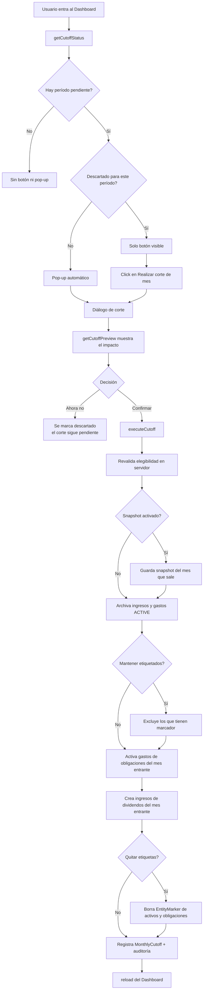
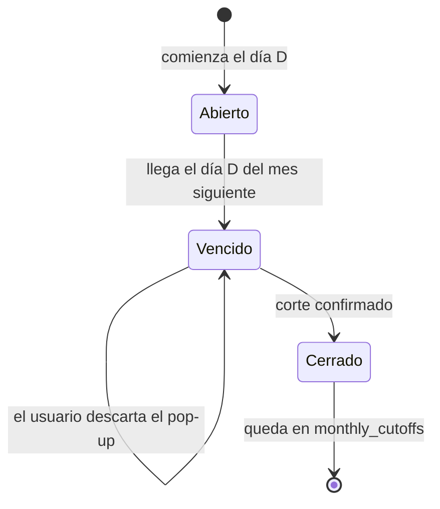

# Módulo: Corte Mensual

## Objetivo

Cerrar un período mensual en una sola operación confirmada por el usuario: archivar los ingresos y gastos del mes que sale, y dejar preparados los del mes entrante a partir de las obligaciones y los activos que tienen flujos configurados.

**Punto de entrada**: Dashboard (`/`) — pop-up automático + botón manual
**Configuración**: `/configuracion` → sección "Corte Mensual"
**Server Actions**: `lib/cutoff-actions.ts`
**Helpers puros**: `lib/cutoff.ts`

---

## Entidades involucradas

| Entidad | Tabla DB | Rol |
|---------|----------|-----|
| `MonthlyCutoff` | `monthly_cutoffs` | Registro de cada corte ejecutado. Su unicidad impide repetir un período |
| `User.cutoffDay` | `users.cutoff_day` | Día del mes en que corresponde el corte (1–28) |
| `Record` (ingreso/gasto) | `records` | Se archivan los del mes que sale; se activan/crean los del entrante |
| `ObligationPayment` | `obligation_payments` | Origen de los gastos recurrentes del mes entrante |
| `ObligationInstallment` | `obligation_installments` | Origen de las cuotas del mes entrante |
| `EntityMarker` | `entity_markers` | Decide qué se conserva y qué se limpia |
| `Snapshot` | `snapshots` | Foto opcional del estado previo al corte |
| `JournalEntry` | `journal_entries` | Asiento por cada gasto/ingreso generado |
| `AuditLog` | `movements` | Traza del corte y de cada registro afectado |

---

## Modelo de período

El corte no trabaja sobre meses calendario sino sobre **períodos definidos por el día de corte**.

Sea `D` el día de corte configurado (1–28):

> **El período `P` abarca desde el día `D` del mes `P` hasta el día `D` del mes siguiente (exclusivo).**

| Día de corte | Período `2026-08` abarca | Su corte se habilita el |
|---|---|---|
| 1 | 01/08/2026 → 31/08/2026 | 01/09/2026 |
| 10 | 10/08/2026 → 09/09/2026 | 10/09/2026 |
| 25 | 25/08/2026 → 24/09/2026 | 25/09/2026 |

### Cálculo de disponibilidad

```
periodoAbierto(hoy, D) = hoy.día >= D  ?  mes(hoy)  :  mes(hoy) - 1
periodoPendiente        = periodoAbierto - 1 mes
periodoEntrante         = periodoAbierto

disponible = NO existe MonthlyCutoff para (usuario, periodoPendiente)
```

**Ejemplo con D = 1, hoy = 05/09/2026**
`periodoAbierto = 2026-09` → `periodoPendiente = 2026-08` (se cierra agosto) → `periodoEntrante = 2026-09`.

**Ejemplo con D = 25, hoy = 10/09/2026**
`10 < 25` → `periodoAbierto = 2026-08` (va del 25/08 al 24/09) → `periodoPendiente = 2026-07`. Si julio ya se cortó, no hay corte disponible: agosto recién se podrá cerrar el 25/09.

> **Por qué 1–28**: evita el caso de un día de corte inexistente en febrero. El rango se valida en cliente y en servidor.

---

## Features

### 1. Configuración del día de corte
- Selector 1–28 en `/configuracion` → sección "Corte Mensual"
- Muestra el último corte ejecutado y la fecha del próximo
- Persistido en `users.cutoff_day` (no en `localStorage`: el servidor decide la elegibilidad)

### 2. Pop-up de confirmación
- Al entrar al Dashboard, si hay un período pendiente, se abre automáticamente
- **Nunca ejecuta nada sin confirmación explícita**
- "Ahora no" lo descarta y no vuelve a abrirse solo para ese período (`localStorage: cashflow:cutoff-dismissed`)
- Descartarlo **no** ejecuta ni cancela el corte: sigue pendiente

### 3. Botón manual en el Dashboard
- "Realizar corte de mes", junto a "Tomar Snapshot"
- **Solo se renderiza cuando hay un período pendiente** — es el mecanismo que impide cortar todos los días
- Abre el mismo diálogo que el pop-up

### 4. Vista previa del impacto
- El diálogo consulta `getCutoffPreview()` y muestra, antes de confirmar:
  - Ingresos y gastos que pasarán a histórico
  - Cuántos de ellos tienen etiqueta (los que el primer switch conservaría)
  - Gastos de obligaciones que se activarán
  - Ingresos de dividendos que se crearán
  - Etiquetas de activos y obligaciones que se quitarían

### 5. Los tres switches

| Switch | Default | Efecto |
|---|---|---|
| **Guardar snapshot del mes que sale** | ✅ On | Toma un snapshot del dashboard *antes* de archivar, nombrado `Cierre {mes} {año}` |
| **Mantener los ingresos y gastos con etiqueta** | ⬜ Off | Los registros con marcador asignado quedan `ACTIVE` y cruzan el corte |
| **Quitar las etiquetas a activos y obligaciones** | ⬜ Off | Elimina las asignaciones de marcador de activos y obligaciones (los marcadores en sí no se borran) |

**Razón de ser de los dos últimos**: los ingresos y gastos son efímeros — una etiqueta como *"revisar"* sobre ellos significa "esto todavía no está resuelto", así que conviene que sobrevivan al corte. Los activos y las obligaciones son permanentes — una etiqueta como *"actualizado"* es un estado de este mes que conviene limpiar al empezar el siguiente.

### 6. Ejecución del corte

Pasos en orden. Cada paso reporta un contador que queda guardado en `MonthlyCutoff`.

```
1. Revalidar elegibilidad en servidor         (nunca se confía en el cliente)
2. Snapshot del estado actual                 (si el switch está activo)
3. Archivar ingresos y gastos ACTIVE  → HISTORICAL
     └─ excluye los que tienen etiqueta si el switch está activo
4. Activar gastos de obligaciones del período entrante
5. Ingresos del período entrante:
     ├─ extender las series de dividendos recurrentes
     ├─ crear los ingresos de dividendos
     └─ activar los cobros de reglas de ingreso
6. Refrescar la ventana de 12 meses de las reglas activas
7. Limpiar etiquetas de activos y obligaciones (si el switch está activo)
8. Registrar MonthlyCutoff + entrada de auditoría
```

### 7. Gastos de obligaciones del mes entrante

Las obligaciones **ya pre-generan** sus gastos en estado `PENDING`: las recurrentes vía la ventana móvil de 12 meses, las de cuotas al momento de crearse. El corte no los duplica — **los activa**.

Para cada obligación en estado `ACTIVE` (las pausadas, completadas y canceladas se ignoran):

| Origen | Condición | Acción |
|---|---|---|
| `ObligationPayment` | `status = PENDING` y `expectedDate` dentro del período entrante | Su gasto pasa a `ACTIVE` y se le quita el prefijo `[Programado] ` |
| `ObligationInstallment` | `status ∈ {PENDING, OVERDUE}` y `dueDate` dentro del período entrante | Ídem |

- Si el pago o la cuota **no tiene gasto asociado** (datos legados), el corte lo crea `ACTIVE` y lo vincula.
- **El pago/cuota sigue `PENDING`**: aceptarlo o rechazarlo desde `/obligaciones` sigue siendo un acto explícito del usuario. Aceptar lo marca `PAID`; rechazar deja el gasto en `CANCELLED`.
- Cada activación genera su asiento contable `gastos / efectivo`.

### 8. Ingresos de dividendos del mes entrante

Para cada activo no eliminado con un tablero de tipo `dividends`, se buscan las entradas cuyo `month` coincide con el período entrante.

| Condición de la entrada | Acción |
|---|---|
| Ya tiene `ingresoRecordId` | Se omite (evita duplicar) |
| `estimatedGain <= 0` | Se omite |
| Sin ingreso y con estimación | Se crea un ingreso `ACTIVE` por el monto estimado |

- El ingreso se llama `Dividendo estimado {activo}` y queda vinculado al activo (`linkedTo`), por lo que en `/ingresos` aparece con fuente **Dividendo**.
- Su `id` se guarda en `ingresoRecordId` dentro de la entrada del tablero.
- Genera asiento `efectivo / ingresos` por el monto estimado.

> **Coincidencia por mes calendario**: las entradas de dividendo se identifican por su clave `YYYY-MM`. Con un día de corte distinto de 1, un dividendo de septiembre se genera en el corte que abre el período `2026-09`, aunque ese período arranque el día 25 de septiembre.

**Series recurrentes** (v2.3.0): antes de buscar entradas, el corte llama a `extendRecurringDividends()` para empujar cada serie hasta el período entrante. Sin esto la ventana de 12 meses pregenerada al crear la serie se agotaba y el corte dejaba de encontrar dividendos que cobrar. Las entradas nuevas se persisten en el activo.

### 8bis. Ingresos de flujos recurrentes

Los activos con **reglas de ingreso** ([flujos-de-ingresos.md](flujos-de-ingresos.md)) pre-generan sus ingresos en `PENDING`, igual que las obligaciones sus gastos. El corte:

- Activa los ingresos de las `IncomeOccurrence` con `status = PENDING` y vencimiento dentro del período entrante, cuya regla esté `ACTIVE`
- **No** cambia el estado de la ocurrencia: sigue `PENDING` hasta que el usuario confirme el monto real
- **No** emite asiento contable todavía: hasta conocer el monto real no se sabe cuánto imputar, y si la regla descuenta capital el asiento va contra `activos` en vez de `ingresos`
- Refresca la ventana de 12 meses de todas las reglas activas

### 9. Conciliación al cobrar el dividendo

`collectDividend()` cambia de comportamiento cuando la entrada ya tiene un ingreso creado por el corte:

| Situación | Antes | Ahora |
|---|---|---|
| Dividendo sin `ingresoRecordId` | Crea ingreso | Crea ingreso *(sin cambios)* |
| Dividendo con `ingresoRecordId` | Creaba un **segundo** ingreso | **Actualiza** el ingreso existente |

Al actualizar, el ingreso pasa a llamarse `Ganancia dividendos {activo}` y toma el monto real. Si el monto real difiere del estimado, se emite un **asiento de ajuste** por la diferencia:

- Real > estimado → `efectivo / ingresos` por la diferencia
- Real < estimado → `ingresos / efectivo` por la diferencia (reversa)

Así el Libro Contable refleja el monto real sin borrar el asiento del estimado.

---

## Reglas de negocio

- **RB-C01**: El corte **nunca** se ejecuta automáticamente. Requiere confirmación explícita en el diálogo.
- **RB-C02**: Un período solo puede cortarse una vez — garantizado por `@@unique([userId, period])` en `monthly_cutoffs`.
- **RB-C03**: La elegibilidad se recalcula **en el servidor** dentro de `executeCutoff()`. Un cliente manipulado no puede forzar un corte fuera de fecha.
- **RB-C04**: Descartar el pop-up ("Ahora no") no consume el corte: el botón del Dashboard sigue disponible.
- **RB-C05**: El botón del Dashboard solo existe cuando hay período pendiente. No hay forma de cortar dos veces el mismo mes ni de adelantarse a la fecha.
- **RB-C06**: Archivar usa `status = "HISTORICAL"`, nunca `deletedAt` — consistente con RB-G01 / RB-I01.
- **RB-C07**: Los gastos `PENDING` y `CANCELLED` de obligaciones no se archivan: no están `ACTIVE`, así que el paso 3 no los toca.
- **RB-C08**: Activar el gasto de una obligación **no** marca su pago o cuota como pagada. La confirmación sigue siendo manual.
- **RB-C09**: Si un dividendo ya generó su ingreso, el corte no lo vuelve a generar (idempotencia por `ingresoRecordId`).
- **RB-C10**: Quitar etiquetas elimina solo las asignaciones (`EntityMarker`), nunca los marcadores (`Marker`) ni las entidades marcadas — consistente con RP-06.
- **RB-C11**: Si un ingreso o gasto se conserva por tener etiqueta, conserva también sus vínculos, su cadena de versiones y su etiqueta.
- **RB-C12**: El snapshot se toma **antes** de archivar, de modo que retrata el mes que sale, no el que entra.
- **RB-C13**: El día de corte se valida en el rango 1–28 en cliente y servidor.

---

## Flujo funcional



---

## Ciclo de vida de un período



---

## Server Actions

| Función | Archivo | Descripción |
|---------|---------|-------------|
| `getCutoffStatus()` | `lib/cutoff-actions.ts` | Día de corte, período pendiente, fecha del próximo corte, último corte y disponibilidad |
| `getCutoffPreview()` | `lib/cutoff-actions.ts` | Conteos del impacto del corte, sin ejecutar nada |
| `executeCutoff(options)` | `lib/cutoff-actions.ts` | Ejecuta el corte completo y devuelve los contadores |
| `setCutoffDay(day)` | `lib/cutoff-actions.ts` | Cambia el día de corte (valida 1–28) |
| `listCutoffs(limit?)` | `lib/cutoff-actions.ts` | Historial de cortes ejecutados |

## Helpers puros

| Función | Archivo | Descripción |
|---------|---------|-------------|
| `periodKeyOf(date)` | `lib/cutoff.ts` | `Date` → `"YYYY-MM"` |
| `addPeriodMonths(key, n)` | `lib/cutoff.ts` | Desplaza un período |
| `periodLabel(key)` | `lib/cutoff.ts` | `"2026-08"` → `"Agosto 2026"` |
| `currentOpenPeriod(today, day)` | `lib/cutoff.ts` | Período abierto según el día de corte |
| `pendingCutoffPeriod(today, day)` | `lib/cutoff.ts` | Período que corresponde cerrar |
| `periodRange(key, day)` | `lib/cutoff.ts` | `[inicio, fin)` del período |
| `nextCutoffDate(key, day)` | `lib/cutoff.ts` | Fecha en que se habilita el corte de ese período |
| `isValidCutoffDay(day)` | `lib/cutoff.ts` | Valida el rango 1–28 |

---

## Componentes

| Componente | Archivo | Rol |
|---|---|---|
| `CutoffDialog` | `components/cutoff/cutoff-dialog.tsx` | Diálogo con vista previa, los tres switches y confirmación |
| `CutoffBanner` | `components/cutoff/cutoff-banner.tsx` | Botón del Dashboard, visible solo con período pendiente |

`data-testid`: `cutoff-dialog`, `cutoff-button`, `cutoff-preview`, `cutoff-switch-snapshot`, `cutoff-switch-keep-marked`, `cutoff-switch-clear-markers`.

---

## Casos borde

| Caso | Comportamiento |
|---|---|
| Usuario nuevo sin datos | El primer corte disponible archiva 0 registros y genera lo que corresponda; queda registrado igual |
| Varios meses sin cortar | Solo se ofrece cerrar el período pendiente más reciente. Un único corte archiva **todos** los ingresos y gastos activos, sin importar de qué mes sean |
| Cambio del día de corte a mitad de mes | El período pendiente se recalcula con el día nuevo. Puede habilitar o deshabilitar el corte de inmediato |
| Obligación pausada | Sus gastos no se activan |
| Dividendo sin estimación | No genera ingreso |
| Dos pestañas ejecutando el corte a la vez | La segunda falla por la restricción de unicidad y muestra el error; no hay doble ejecución |
| Registro etiquetado y conservado | Sigue `ACTIVE` en el mes entrante junto a los generados por el corte |
