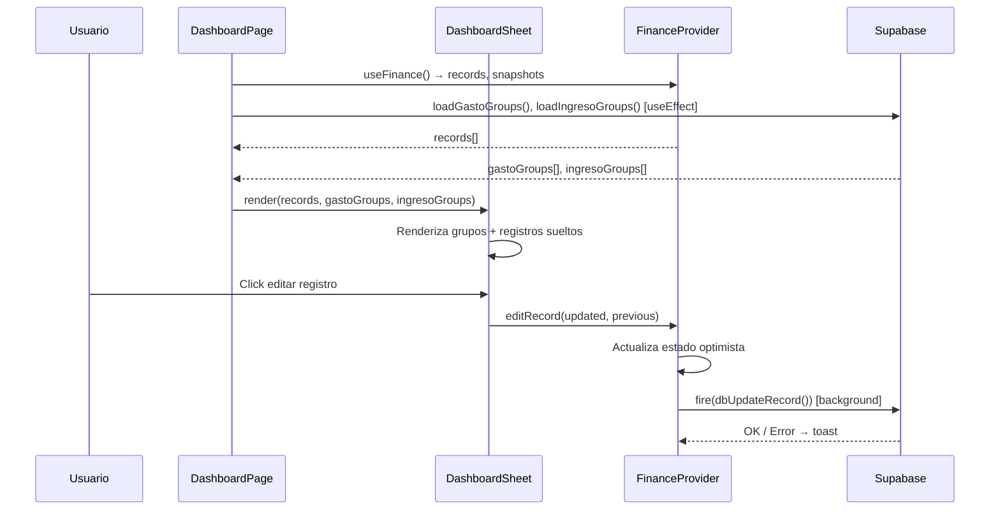

# Módulo: Dashboard

## Objetivo

Mostrar el estado financiero actual del usuario en tiempo real: Estado de Resultados (ingresos vs. gastos) y Balance (activos vs. pasivos). Permite crear, editar y eliminar registros financieros directamente desde la vista, y tomar snapshots del estado.

**v2.6.0** (ver `docs/CHANGELOG.md` y `PRODUCT_REVIEW.md` §3.1 en la raíz): el panel Auditor suma **Libertad Financiera** (ingreso vinculado a un activo ÷ gasto total) y un aviso cuando las tasas de cambio están desactualizadas. **v2.5.1**: cada tabla (Ingresos/Gastos/Activos/Obligaciones) tiene su propio skeleton de carga y estado vacío — el shell ya no espera a la DB para pintarse.

**Ruta**: `/`
**Componente principal**: `components/dashboard-sheet.tsx` (`DashboardSheet`)
**Página**: `app/(dashboard)/page.tsx` (Client Component)

---

## Entidades involucradas

| Entidad | Rol |
|---------|-----|
| `FinancialRecord` | Registros de ingreso, gasto, activo, pasivo |
| `Snapshot` | Capturas periódicas del estado |
| `FlowGroupWithMembers` | Grupos de gastos e ingresos (colapsables) |
| `Obligation` | Vinculadas como filas extra en la sección de Pasivos |
| `EntityMarker` / `MarkerDefinition` | Marcadores visuales por fila |

---

## Features

### 1. Estado de Resultados
- Sección **Ingresos**: lista de registros tipo `"ingreso"` con suma total por moneda
- Sección **Gastos**: lista de registros tipo `"gasto"` con suma total por moneda
- Sección **Flujo de caja**: diferencia calculada (Ingresos − Gastos)

### 2. Balance
- Sección **Activos**: registros tipo `"activo"` y `"GROUP"` con expansión de grupos
- Sección **Pasivos**: registros tipo `"pasivo"` + filas extra de obligaciones

### 3. Grupos de flujos colapsables
- Grupos de Gastos e Ingresos se renderizan primero, como cabeceras con chevron
- Click en chevron: expande/colapsa miembros del grupo
- Header muestra: nombre, count de miembros, totales por moneda
- Registros sin grupo aparecen debajo de los grupos (siempre visibles)

### 4. Edición inline
- Click en nombre o monto → edición in-place (para activos: diálogo de ajuste/depósito)
- Gastos e Ingresos: edición directa del monto y nombre via `editRecord()`
- Activos: diálogo con tipo de movimiento (Ajuste | Depósito | Extracción)
  - Depósito: opción de crear gasto asociado automáticamente
  - Extracción: opción de crear ingreso asociado automáticamente
- Pasivos: edición directa

### 5. Eliminación
- **Ingresos/Gastos**: `deleteRecord()` → `status = "HISTORICAL"` (no se borra físicamente)
- **Activos**: diálogo de confirmación con opción de crear ingreso asociado → `zeroOutAsset()` (monto → 0, movimiento EXTRACT)
- **Activos en grupo**: botón de zero-out también en filas expandidas de hijos

### 6. Marcadores visuales
- Cada fila tiene un ícono de tag (MarkerPicker)
- Click → popover para seleccionar o quitar marcador
- Fila marcada: borde izquierdo del color del marcador + fondo tenue (12% opacidad)
- Un marcador por registro a la vez

### 7. Navegación a detalle (Eye icon)
- Filas de **activo**: ícono Eye → `/activos/{id}`
- Filas de **ingreso**: ícono Eye → `/ingresos/{id}`
- Filas de **gasto**: ícono Eye → `/gastos/{id}`
- Filas de obligación extra: ícono Eye → `/obligaciones/{id}`

### 8. Snapshot
- Botón "Tomar Snapshot" abre diálogo con nombre y rango de fechas
- `takeSnapshot(name, period)` → guarda el estado actual en DB
- Snapshots listados en `/snapshots`

### 9. Modo readOnly
- `DashboardSheet` acepta prop `readOnly={true}` — oculta controles de edición/creación
- Usado en `/snapshots/[id]` para vista histórica no editable

---

## Reglas de negocio

- **RB-D01**: Los registros `status = "HISTORICAL"` o `status = "ARCHIVED"` NO aparecen en el dashboard. `loadData()` filtra por `status = "ACTIVE"` para ingresos y gastos.
- **RB-D02**: Los activos tipo `GROUP` con `deletedAt != null` no aparecen. Sus hijos tampoco si tienen `deletedAt != null`.
- **RB-D03**: Los grupos de activos son colapsables en el dashboard. Al colapsar, los hijos se ocultan pero sus montos SÍ se incluyen en el total del padre.
- **RB-D04**: Los grupos de flujos (Gastos/Ingresos) renderizan primero; los registros sueltos, debajo.
- **RB-D05**: El flujo de caja es solo visual (Ingresos − Gastos), calculado en el cliente. No se persiste.
- **RB-D06**: Eliminar un activo desde el dashboard NO lo borra físicamente — llama `zeroOutAsset()` que registra un movimiento EXTRACT y pone `amount = 0`. Para borrado real ir a `/activos`.
- **RB-D07**: El estado optimista: la UI se actualiza inmediatamente, la escritura en DB ocurre con `fire(promise)`. Si falla, se muestra toast de error.

---

## Flujo funcional

---

## Componentes clave

| Componente | Archivo | Rol |
|-----------|---------|-----|
| `DashboardSheet` | `components/dashboard-sheet.tsx` | Tabla principal Estado de Resultados + Balance |
| `SectionTable` | dentro de `dashboard-sheet.tsx` | Sección individual (Ingresos / Gastos / Activos / Pasivos) |
| `DashboardPage` | `app/(dashboard)/page.tsx` | Orquesta: carga grupos, pasa datos, maneja dialogs |
| `FinanceProvider` | `components/finance-store.tsx` | Estado global de records y snapshots |
| `GroupBreakdownDialog` | `components/activos/group-breakdown-dialog.tsx` | Vista detallada de hijos de un grupo de activos |
| `ObligationFormDialog` | `components/obligations/obligation-form-dialog.tsx` | Crear obligación desde dashboard |
| `AssetFormDialog` | `components/activos/asset-form-dialog.tsx` | Crear activo desde dashboard |
