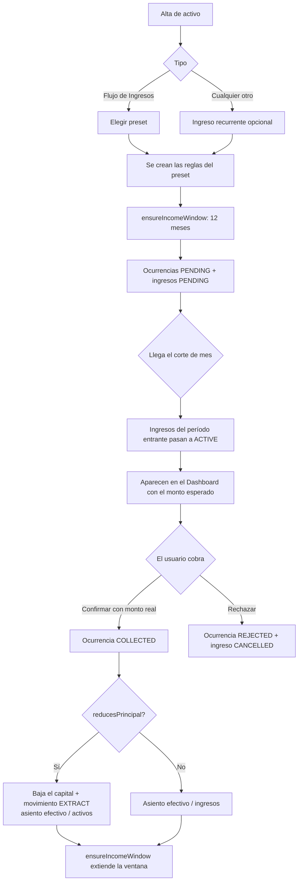
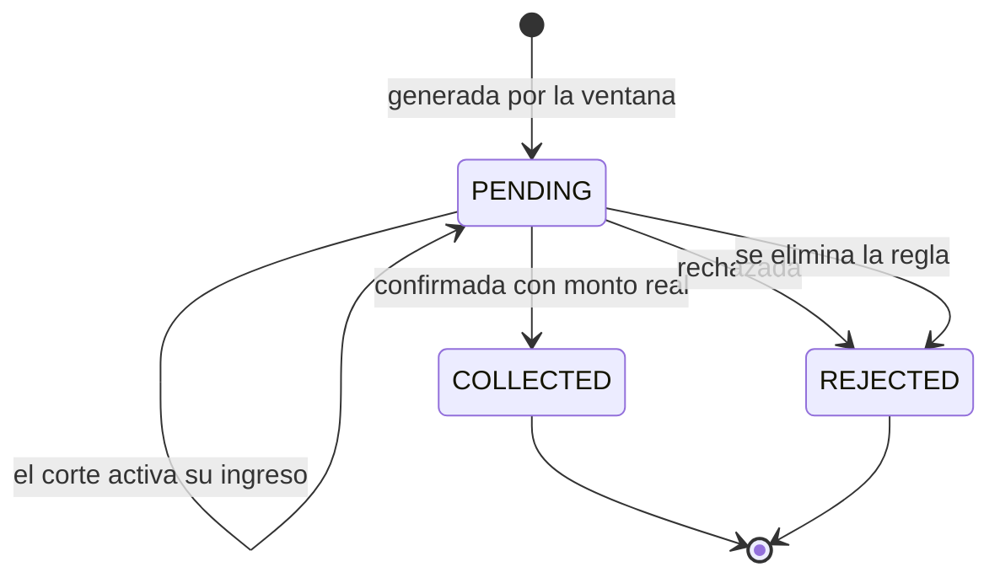

# Módulo: Flujos de Ingresos

## Objetivo

Modelar activos que **generan ingresos periódicos**: sueldos, préstamos otorgados que se cobran en cuotas, alquileres, rentas. Es el espejo exacto del módulo de Obligaciones — donde aquél proyecta un **costo** anual y genera **gastos** por período, éste proyecta una **ganancia** anual y genera **ingresos**.

**Rutas**: `/activos/[id]` (sección "Ingresos recurrentes"), `/activos` (alta con presets)
**Server Actions**: `lib/income-actions.ts`
**Helpers puros**: `lib/income-streams.ts`

---

## Simetría con Obligaciones

| Concepto | Obligaciones | Flujos de Ingresos |
|---|---|---|
| Entidad contenedora | `Obligation` | `Record` (type=`activo`) |
| Regla de recurrencia | `ObligationRule` | `IncomeRule` |
| Vencimiento programado | `ObligationPayment` | `IncomeOccurrence` |
| Registro generado | Gasto `PENDING` → `ACTIVE` | Ingreso `PENDING` → `ACTIVE` |
| Estados del vencimiento | `PENDING` / `PAID` / `REJECTED` | `PENDING` / `COLLECTED` / `REJECTED` |
| Proyección | Costo anual | Ganancia anual |
| Ventana de generación | 12 meses móviles | 12 meses móviles |
| Confirmación | Aceptar / Rechazar pago | Confirmar / Rechazar cobro |

La diferencia real: **una regla de ingreso puede descontar del capital del activo** (`reducesPrincipal`). Es lo que permite modelar un préstamo cuyo saldo baja mes a mes.

---

## Los cuatro ejes de una regla (v2.4.0)

Una `IncomeRule` no es solo "monto × frecuencia". Se configura sobre cuatro ejes independientes, y de su combinación salen todos los casos reales:

| Eje | Campo | Valores | Para qué |
|---|---|---|---|
| **Cronograma** | `installmentCount` | `null` = indefinido · `N` = finito | Sueldo vs. préstamo en 12 cuotas |
| **Monto** | `amountMode` | `FIXED` · `PERCENTAGE` | Alquiler en USD vs. dividendo del 5 % |
| **Ajuste** | `adjustmentPct` + `adjustEveryN` | Aumento compuesto cada N cobros | Sueldo o alquiler ajustado por inflación |
| **Liquidación** | `settlement` | `CASH` · `IN_KIND` | Alquiler cobrado vs. staking en monedas |

Más el flag transversal `reducesPrincipal`, que decide si el cobro amortiza capital.

### Monto porcentual

Con `amountMode = "PERCENTAGE"`, cada ocurrencia se calcula como `valorDelActivo × percentage / 100` **en el momento de generarse**. Si el activo sube de precio, los cobros futuros suben con él.

`expectedAmount` se guarda en `0`: en modo porcentual no significa nada y dejarlo con un valor viejo confundiría.

> **El ajuste no aplica en modo porcentual.** Seguir el valor del activo ya *es* la forma de ajustarse; sumarle un ajuste encima duplicaría el efecto. Los campos se guardan en `null`.

### Ajuste periódico

Con `adjustmentPct = 10` y `adjustEveryN = 3`, el monto de la ocurrencia de índice `i` es:

```
monto(i) = expectedAmount × (1 + 10/100) ^ floor(i / 3)
```

O sea: cobros 0–2 al monto base, 3–5 un 10 % arriba, 6–8 un 21 % arriba (compuesto), etc. Es determinista: no depende de cuándo se generó la ocurrencia, solo de su posición en el cronograma.

### Cronograma finito

Con `installmentCount = N`:

- Se generan las **N cuotas completas desde `startDate`**, incluidas las ya vencidas — igual que las cuotas de una obligación, y a diferencia del modo indefinido que solo mira 12 meses hacia adelante
- Cada ocurrencia lleva su `installmentNumber` (1..N)
- Al resolverse las N (cobradas o rechazadas), la regla pasa a `COMPLETED` y deja de proyectar

Esto cierra el caso borde de v2.3.0: un préstamo totalmente cobrado ya no queda con reglas activas colgando.

### Liquidación en especie

Con `settlement = "IN_KIND"` el cobro **no genera efectivo**: crece el propio activo.

- El valor del activo sube por el monto cobrado
- Si se informan unidades, se suman a `currentQty`
- Queda un movimiento `DIVIDEND` con la cantidad
- El asiento es `activos / ingresos` en vez de `efectivo / ingresos`

Es el caso del staking, los dividendos reinvertidos y los cupones capitalizados: el patrimonio sube, la caja no.

---

## Valuación del activo: `valueMode`

Una obligación recurrente **vale su costo anual proyectado** (`recalcularObligation()`). El espejo para un activo se controla con `metadata.valueMode`:

| Valor | Qué significa | Quién lo pone |
|---|---|---|
| `PROJECTION` | El `amount` del activo **es** su proyección anual de ingresos, recalculada en cada cambio | El preset Salario, o el usuario desde el detalle |
| `MANUAL` | El `amount` lo fija el usuario, o lo amortizan las reglas de capital | Default de todo lo demás |

> **Por qué `MANUAL` es el default**: un departamento con una regla de alquiler tiene valor de mercado propio. Si la valuación por proyección fuera automática para toda regla que no descuenta capital, el sistema pisaría el valor del inmueble con la suma de sus alquileres. El modo es explícito justamente para que eso no pase por accidente.

Activar `PROJECTION` en un sueldo de 800.000 ARS mensuales hace que el activo valga 9.600.000 ARS en el Balance, exactamente como una obligación recurrente pesa su costo anual en el pasivo.

---

## Entidades

| Entidad | Tabla DB | Rol |
|---|---|---|
| `Record` (type=`activo`) | `records` | El activo que genera los ingresos |
| `IncomeRule` | `income_rules` | Patrón de recurrencia: cada cuánto, cuánto y si descuenta capital |
| `IncomeOccurrence` | `income_occurrences` | Un vencimiento concreto de una regla |
| `Record` (type=`ingreso`) | `records` | El ingreso generado, vinculado al activo vía `linkedTo` |
| `FinancialMovement` | `financial_movements` | Movimiento `EXTRACT` cuando el cobro descuenta capital |
| `JournalEntry` | `journal_entries` | Asiento por cada cobro confirmado |

### Nuevo tipo de activo: `INCOME_STREAM`

Etiqueta: **Flujo de Ingresos**. Es un contenedor genérico de reglas; su forma concreta la definen los presets del formulario de alta.

| Preset | Valor inicial | Reglas creadas |
|---|---|---|
| **Salario** | `0` — no tiene valor patrimonial | 1: *Sueldo*, mensual, sin descontar capital |
| **Préstamo otorgado** | Capital prestado | 2: *Capital* (descuenta) + *Interés* (no descuenta) |
| **Cobro en cuotas** | Valor del activo | 1: *Cuota*, descuenta capital |
| **Personalizado** | Libre | Ninguna — se agregan desde el detalle |

> Los presets solo precargan reglas al crear. Después son reglas normales: se editan, pausan y borran igual que cualquier otra.

### Reglas de ingreso en cualquier activo

`IncomeRule` cuelga de un `Record`, no del tipo `INCOME_STREAM`. **Cualquier activo puede tener ingresos recurrentes**: una acción con renta fija, un inmueble con alquiler, un plazo fijo con pagos parciales. El formulario de alta ofrece la sección "Ingreso recurrente asociado" para todos los tipos.

---

## Features

### 1. Proyección de ganancia anual
- Por moneda, sumando `montoEsperado × ocurrenciasPorAño` de las reglas `ACTIVE`
- Mensual = ×12, Trimestral = ×4, Semestral = ×2, Anual = ×1
- Las reglas `PAUSED` no computan
- Espejo de `computeRecurringBreakdown()` de obligaciones

### 2. Gestión de reglas
- Alta con nombre, recurrencia, fecha de inicio, monto esperado, moneda y switch "descuenta del capital"
- Editar, pausar, reanudar y eliminar
- Al crear o reanudar una regla se genera su ventana de 12 meses

### 3. Ventana móvil de 12 meses
- `ensureIncomeWindow()` crea las `IncomeOccurrence` faltantes y su ingreso `PENDING`
- Se invoca al crear, editar y reanudar una regla, al confirmar un cobro, y en cada corte mensual
- Nunca duplica: omite las fechas que ya tienen ocurrencia

### 4. Ajuste de monto (aumento de sueldo)
Editar el monto esperado de una regla **regenera las ocurrencias pendientes**:

| Ocurrencia | ¿Se regenera? |
|---|---|
| `COLLECTED` o `REJECTED` | No — el pasado no se toca |
| `PENDING` con ingreso ya activado por un corte | No — ya está en el dashboard del mes en curso |
| `PENDING` con ingreso todavía `PENDING` | **Sí** — se borra y se recrea con el monto nuevo |

### 5. Confirmación del cobro
- Diálogo con el monto real precargado con el esperado, más un comentario opcional
- Confirmar → ocurrencia `COLLECTED`, ingreso a `ACTIVE` con el monto **real**
- Rechazar → ocurrencia `REJECTED`, ingreso a `CANCELLED`
- Al confirmar se extiende la ventana, igual que al aceptar un pago de obligación

### 6. Descuento de capital
Cuando la regla tiene `reducesPrincipal`:
- El valor del activo baja por el monto **real** cobrado, con piso en `0`
- Queda un movimiento `EXTRACT` en el historial del activo
- Si el activo pertenece a un grupo, el grupo se recalcula

### 7. Integración con el Corte Mensual
En cada corte, además de lo que ya hacía:
- Se extienden las series de **dividendos recurrentes** para que el período entrante siempre tenga su entrada
- Se activan los ingresos `PENDING` de las ocurrencias que vencen en el período entrante
- Se refresca la ventana de 12 meses de cada regla activa

---

## Tratamiento contable

Esta es la parte que **no** es un espejo simple. Un cobro de capital no es una ganancia: es un activo que se convierte en efectivo.

| Tipo de regla | Ingreso en el dashboard | Asiento contable |
|---|---|---|
| `reducesPrincipal = false` (sueldo, interés, alquiler) | Sí | `efectivo / ingresos` — es renta |
| `reducesPrincipal = true` (capital de un préstamo) | Sí | `efectivo / activos` — es conversión de activo |
| `settlement = IN_KIND` (staking, cupón capitalizado) | Sí | `activos / ingresos` — es renta que no pasa por caja |

Así el préstamo cierra: cobrar 41.666 de capital baja el activo en 41.666 y sube el efectivo en 41.666, sin inventar ganancia. Los 15.000 de interés sí son ingreso.

> **Por qué el capital igual aparece como ingreso en el dashboard**: el Estado de Resultados de este producto es una vista de **flujo de caja**, no de resultado contable. La plata entró. El Libro Contable es el que distingue renta de recuperación de capital.

---

## Reglas de negocio

- **RB-F01**: Una `IncomeRule` pertenece a un `Record` de tipo `activo`. Cualquier tipo de activo puede tenerlas, no solo `INCOME_STREAM`.
- **RB-F02**: Las reglas `PAUSED` no proyectan ni generan ocurrencias nuevas. Las ya generadas siguen en pie.
- **RB-F03**: La ventana es de 12 meses y nunca duplica una fecha ya generada para la misma regla.
- **RB-F04**: Editar el monto de una regla regenera solo las ocurrencias `PENDING` cuyo ingreso siga `PENDING`.
- **RB-F05**: Confirmar un cobro usa el monto **real**, que puede diferir del esperado. Es el caso normal en un sueldo con ajustes.
- **RB-F06**: `reducesPrincipal` descuenta por el monto real cobrado, con piso en `0`. Nunca deja el activo en negativo.
- **RB-F07**: El asiento de un cobro con `reducesPrincipal` es `efectivo / activos`; sin él, `efectivo / ingresos`.
- **RB-F08**: Rechazar un cobro deja el ingreso en `CANCELLED`, nunca lo elimina.
- **RB-F09**: Eliminar una regla marca sus ocurrencias `PENDING` como `REJECTED` y cancela sus ingresos `PENDING`. Los cobros ya confirmados sobreviven.
- **RB-F10**: Eliminar una regla nunca modifica ingresos ya `ACTIVE` ni `HISTORICAL`.
- **RB-F11**: Un activo `INCOME_STREAM` con preset Salario nace con `valueMode = "PROJECTION"`: su valor es la proyección anual, no un capital.
- **RB-F12**: Los dividendos recurrentes extienden su serie en cada corte, de modo que el período entrante siempre tiene entrada disponible.
- **RB-F13**: El ajuste periódico solo aplica en `amountMode = "FIXED"`. En modo porcentual se guarda `null`: seguir el valor del activo ya es el ajuste.
- **RB-F14**: Un cobro `IN_KIND` asienta `activos / ingresos`, nunca contra `efectivo`. No entró caja.
- **RB-F15**: Un cronograma finito genera sus N cuotas desde `startDate`, incluidas las vencidas, y se marca `COMPLETED` al resolverse todas.
- **RB-F16**: `recalcularIncomeStream()` solo pisa el `amount` cuando `valueMode = "PROJECTION"`. Nunca toca el valor de un activo administrado a mano.

---

## Flujo funcional



---

## Ciclo de vida de una ocurrencia



Nótese que **activar el ingreso en el corte no cambia el estado de la ocurrencia**: sigue `PENDING` hasta que el usuario confirme el monto real. Es la misma asimetría que en obligaciones (RB-C08).

---

## Server Actions

| Función | Descripción |
|---------|-------------|
| `loadIncomeRules(recordId)` | Reglas del activo con sus ocurrencias y la proyección anual |
| `createIncomeRule(recordId, data)` | Crea la regla y genera su ventana |
| `updateIncomeRule(ruleId, data)` | Actualiza y regenera las ocurrencias pendientes (RB-F04) |
| `pauseIncomeRule(ruleId)` / `resumeIncomeRule(ruleId)` | Pausa / reanuda (reanudar regenera la ventana) |
| `deleteIncomeRule(ruleId)` | Elimina la regla y cancela lo pendiente (RB-F09) |
| `collectIncomeOccurrence(id, actualAmount, comment?)` | Confirma el cobro con el monto real |
| `rejectIncomeOccurrence(id)` | Rechaza el cobro |
| `refreshIncomeWindows()` | Extiende la ventana de todas las reglas activas — lo usa el corte |
| `setIncomeStreamValueMode(recordId, mode)` | Cambia entre valuación por proyección y valor propio |

## Helpers puros (`lib/income-streams.ts`)

| Función | Descripción |
|---------|-------------|
| `occurrenceAmount(rule, index, assetAmount)` | Monto de la ocurrencia `index`: resuelve modo porcentual y ajuste compuesto |
| `occurrenceIndexOf(startDate, date, recurrence)` | Posición 0-based de una fecha en el cronograma |
| `computeAnnualProjection(rules, occurrences?)` | Proyección anual. Con ocurrencias suma los montos reales de los próximos 12 meses; sin ellas cae a `monto × ocurrenciasPorAño` |
| `buildPresetRules(preset, input)` | Reglas iniciales de un preset, con cuotas y ajuste |
| `valueModeOf(metadata)` / `presetValueMode(preset)` | Modo de valuación del activo |
| `PRESET_LABELS`, `INCOME_STATUS_LABELS`, `RULE_STATUS_LABELS`, `AMOUNT_MODE_LABELS`, `SETTLEMENT_LABELS` | Etiquetas en español |

> **Por qué la proyección prefiere las ocurrencias reales**: con ajuste, porcentaje o cronograma finito, la fórmula `monto × ocurrenciasPorAño` miente. Un sueldo que se ajusta un 10 % cada 3 meses proyectaría como si valiera todo el año lo que vale hoy. Sumar las ocurrencias ya generadas —que llevan su monto calculado— es la única forma fiel.

---

## Componentes

| Componente | Archivo | Rol |
|---|---|---|
| `IncomeRulesSection` | `components/activos/income/income-rules-section.tsx` | Proyección + reglas + próximos cobros |
| `IncomeRuleDialog` | `components/activos/income/income-rule-dialog.tsx` | Alta y edición de regla |
| `CollectIncomeDialog` | `components/activos/income/collect-income-dialog.tsx` | Confirmación con monto real |
| `IncomeStreamPanel` | `components/activos/panels/income-stream-panel.tsx` | Panel del tipo `INCOME_STREAM` |

`data-testid`: `asset-income-rules`, `asset-panel-income-stream`, `income-rule-dialog`, `income-collect-dialog`.

---

## Casos borde

| Caso | Comportamiento |
|---|---|
| Salario con valor 0 y regla que descuenta capital | El descuento tiene piso en 0: el activo queda en 0, no negativo |
| Préstamo totalmente cobrado | Con `installmentCount` la regla se marca `COMPLETED` sola y deja de proyectar. Sin él sigue generando indefinidamente |
| Regla porcentual sobre un activo en 0 | Genera ocurrencias de monto 0; no rompe, pero conviene fijar el valor antes |
| Cobro en especie sin informar unidades | Sube el valor del activo pero no la cantidad. Se admite: no siempre se conoce el número exacto |
| Cambiar el valor del activo con reglas porcentuales ya generadas | Las ocurrencias existentes conservan el monto con que se generaron; solo las nuevas usan el valor nuevo |
| Activar `PROJECTION` en un activo con valor propio | El valor se pisa con la proyección anual. Es reversible: al volver a `MANUAL` hay que fijar el valor de nuevo |
| Regla en moneda distinta a la del activo | Permitido. La proyección se muestra desglosada por moneda |
| Dos reglas con la misma fecha de vencimiento | Genera dos ocurrencias y dos ingresos independientes — es justamente el caso del préstamo |
| Corte antes de confirmar el cobro anterior | El ingreso viejo pasa a `HISTORICAL` con su monto esperado; su ocurrencia queda `PENDING` y se puede rechazar después |
| Eliminar el activo | Las reglas y ocurrencias se eliminan en cascada; los ingresos ya generados sobreviven |
