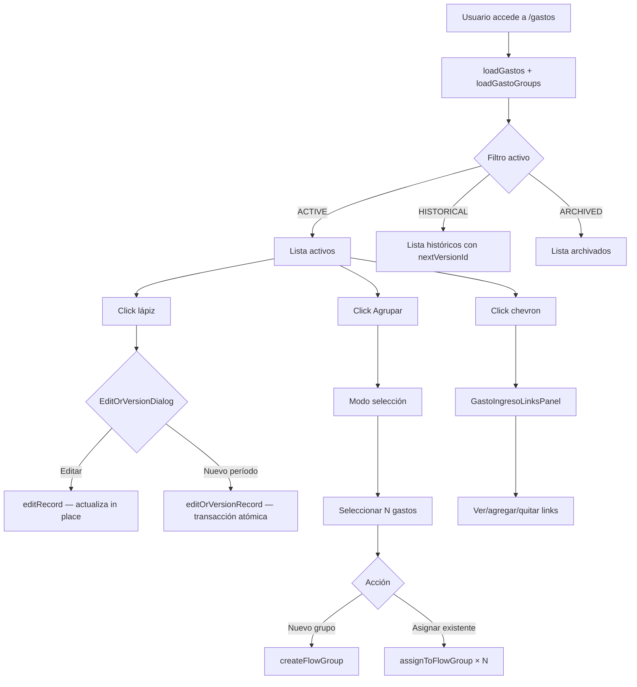

# Módulo: Gastos

## Objetivo

Gestionar el registro de gastos financieros del usuario: ver el listado completo, filtrar por estado (Activos/Históricos/Archivados), editar o versionar registros, archivar, agrupar visualmente, vincular a ingresos que los financiaron, y acceder al detalle individual.

**Ruta**: `/gastos` (lista), `/gastos/[id]` (detalle)
**Página lista**: `app/(dashboard)/gastos/page.tsx` (Client Component)
**Página detalle**: `app/(dashboard)/gastos/[id]/page.tsx` (Server Component)

---

## Entidades involucradas

| Entidad | Tabla DB | Rol |
|---------|----------|-----|
| `Record` (type="gasto") | `records` | Registro principal de gasto |
| `GastoIngresoLink` | `gasto_ingreso_links` | Vínculo N:M con ingresos |
| `Group` (groupType="EXPENSE") | `groups` | Agrupación visual de gastos |
| `RecordGroup` | `record_groups` | Junction table Gasto↔Grupo |
| `EntityMarker` | `entity_markers` | Marcador visual por gasto |
| `Obligation` | `obligations` | Fuente del gasto si es cuota |
| `Record` (type="activo") | `records` | Fuente del gasto si es depósito en activo |

---

## Features

### 1. Lista de gastos con fuente
- Gastos agrupados por fuente: Desde Obligación / Desde Activo / Gastos libres
- Cada gasto muestra: nombre, monto, moneda, fecha, estado (badge), fuente
- Fuente resuelta en `lib/gasto-actions.ts` (`GastoWithSource`)

### 2. Filtro de estado
- Filtros: **Activos** | **Históricos** | **Archivados** (toggle buttons, default: Activos)
- Activos: `status = "ACTIVE"`
- Históricos: `status = "HISTORICAL"` (versionados o eliminados del dashboard)
- Archivados: `status = "ARCHIVED"` (archivado explícitamente por el usuario)

### 3. Edición y versionado
- Botón lápiz por fila ACTIVE → `EditOrVersionDialog`
- Modo **Editar**: actualiza nombre/monto/moneda/fecha en el registro existente
- Modo **Nuevo período**: crea nuevo registro ACTIVE + marca el anterior HISTORICAL en una transacción atómica. El nuevo tiene `previousVersionId` apuntando al anterior

### 4. Archivado y restauración
- Menú "..." en filas ACTIVE → opción "Archivar" → `archiveGasto(id)` → `status = "ARCHIVED"`
- Botón "Restaurar" en filas HISTORICAL/ARCHIVED → `restoreGasto(id)` → `status = "ACTIVE"`

### 5. Cadena de versiones
- Filas HISTORICAL con `nextVersionId`: link "Ver versión actual →" al ID del sucesor
- `nextVersionId` calculado en memoria por `loadGastos()`: para cada registro, si algún otro tiene `previousVersionId = este.id`, ese es el `nextVersionId`

### 6. Agrupación visual
- Botón "Agrupar" en header → activa modo de selección
- Checkbox por fila en modo selección (reemplaza la chevron de expansión)
- Barra de acciones sticky inferior con 2 opciones:
  - **Crear nuevo grupo**: input de nombre → `createFlowGroup(name, "EXPENSE", selectedIds)`
  - **Asignar a grupo existente**: select de grupos existentes → `assignToFlowGroup(groupId, id)` por cada seleccionado
- Botón "Cancelar" para salir del modo selección
- Grupos listados arriba: colapsables, con nombre editable inline, count y botón eliminar
- Click en nombre del grupo (modo edición inline) → `renameFlowGroup(id, name)`
- Botón papelera del grupo → `deleteFlowGroup(id)` (cascade elimina RecordGroup; los gastos no se eliminan)
- X por miembro dentro del grupo → `removeFromFlowGroup(groupId, recordId)`

### 7. Links Gasto↔Ingreso
- Chevron de expansión por fila (en modo normal, no selección) → `GastoIngresoLinksPanel`
- Panel muestra ingresos vinculados: nombre, monto atribuido, moneda
- Botón "Agregar ingreso" → sub-diálogo: select de ingresos activos + NumericInput de monto + moneda → `createGastoIngresoLink()`
- X por fila de ingreso vinculado → `deleteGastoIngresoLink(id)`

### 8. Marcadores visuales
- Ícono de tag (MarkerPicker) por fila
- Click → popover de marcadores disponibles
- Fila marcada: borde izquierdo de color + fondo tenue

### 9. Navegación a detalle
- Ícono Eye por fila → `/gastos/{id}`

---

## Página de detalle `/gastos/[id]`

- **Carga**: `loadGasto(id)` + `loadLinksForGasto(id)` en paralelo (Promise.all)
- **404**: `notFound()` si el gasto no existe o no pertenece al usuario
- **Información mostrada**:
  - Nombre, monto formateado, moneda, fecha de operación
  - Fuente: badge con texto según origen (Obligación: `obligationName`; Activo: `assetName`; Libre)
  - Estado (badge)
- **Cadena de versiones**: si tiene `previousVersionId` → link al anterior; si tiene `nextVersionId` → link al siguiente
- **Panel de links**: ingresos que financiaron este gasto (read-only desde la página de detalle)

---

## Reglas de negocio

- **RB-G01**: NUNCA usar `deletedAt` para gastos — usar `status = "HISTORICAL"` al eliminar.
- **RB-G02**: Los gastos con `status = "PENDING"` o `"CANCELLED"` son cuotas de obligaciones. No se editan/archivan manualmente.
- **RB-G03**: Al crear "nuevo período", la transacción en DB debe ser atómica: marcar anterior HISTORICAL + crear nuevo ACTIVE + `previousVersionId` = id anterior.
- **RB-G04**: Los links `GastoIngresoLink` tienen `attributedAmount > 0`. La validación de sobre-atribución es blanda (advertencia, no bloquea).
- **RB-G05**: Los links sobreviven cambios de estado (los gastos HISTORICAL conservan sus links).
- **RB-G06**: `deleteFlowGroup()` elimina el grupo y sus RecordGroup pero NO modifica los gastos miembros.
- **RB-G07**: Un gasto puede pertenecer a un solo grupo (upsert en `assignToFlowGroup` previene duplicados con `@@unique([recordId, groupId])`).

---

## Flujo funcional

---

## Server Actions

| Función | Archivo | Descripción |
|---------|---------|-------------|
| `loadGastos(statuses?)` | `lib/gasto-actions.ts` | Lista gastos con fuente resuelta y nextVersionId |
| `loadGasto(id)` | `lib/gasto-actions.ts` | Gasto individual con fuente y versiones |
| `archiveGasto(id)` | `lib/gasto-actions.ts` | status → ARCHIVED |
| `restoreGasto(id)` | `lib/gasto-actions.ts` | status → ACTIVE |
| `editOrVersionRecord(id, data, mode, "gasto")` | `lib/versioning-actions.ts` | Editar o crear nuevo período |
| `createFlowGroup(name, "EXPENSE", ids)` | `lib/flow-group-actions.ts` | Crear grupo de gastos |
| `renameFlowGroup(id, name)` | `lib/flow-group-actions.ts` | Renombrar grupo |
| `deleteFlowGroup(id)` | `lib/flow-group-actions.ts` | Eliminar grupo (cascade RecordGroup) |
| `assignToFlowGroup(groupId, recordId)` | `lib/flow-group-actions.ts` | Asignar gasto a grupo (upsert) |
| `removeFromFlowGroup(groupId, recordId)` | `lib/flow-group-actions.ts` | Quitar gasto de grupo |
| `loadLinksForGasto(id)` | `lib/link-actions.ts` | Links de un gasto con ingresos |
| `createGastoIngresoLink(data)` | `lib/link-actions.ts` | Crear vínculo gasto↔ingreso |
| `deleteGastoIngresoLink(id)` | `lib/link-actions.ts` | Eliminar vínculo |
