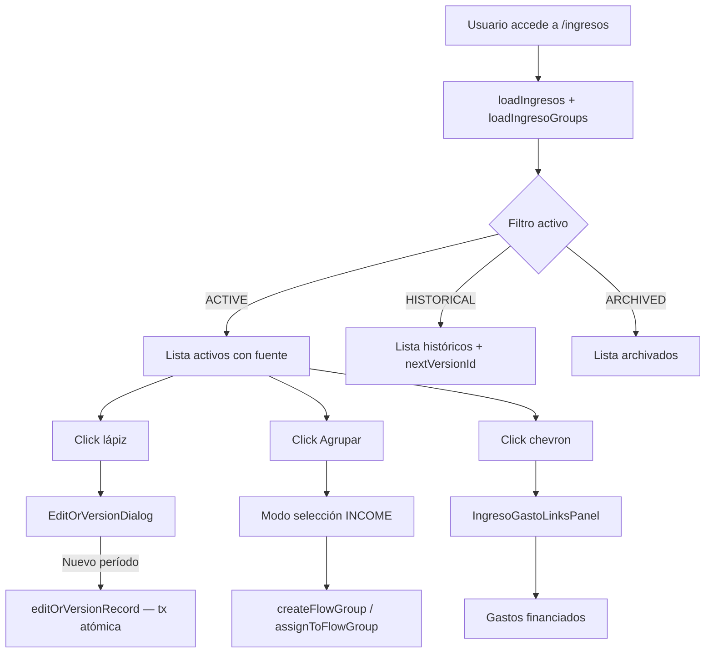

# Módulo: Ingresos

## Objetivo

Gestionar el registro de ingresos financieros del usuario: ver el listado completo, filtrar por estado, editar o versionar registros, archivar, agrupar visualmente, vincular a gastos que financian, y acceder al detalle individual.

**Ruta**: `/ingresos` (lista), `/ingresos/[id]` (detalle)
**Página lista**: `app/(dashboard)/ingresos/page.tsx` (Client Component)
**Página detalle**: `app/(dashboard)/ingresos/[id]/page.tsx` (Server Component)

---

## Entidades involucradas

| Entidad | Tabla DB | Rol |
|---------|----------|-----|
| `Record` (type="ingreso") | `records` | Registro principal de ingreso |
| `GastoIngresoLink` | `gasto_ingreso_links` | Vínculo N:M con gastos |
| `Group` (groupType="INCOME") | `groups` | Agrupación visual de ingresos |
| `RecordGroup` | `record_groups` | Junction table Ingreso↔Grupo |
| `EntityMarker` | `entity_markers` | Marcador visual por ingreso |
| `Record` (type="activo") | `records` | Fuente si el ingreso proviene de dividendos/extracción de activo |

---

## Features

### 1. Lista de ingresos con fuente
- Ingresos agrupados por fuente: Desde Activo / Ingresos libres
- Cada ingreso muestra: nombre, monto, moneda, fecha, estado (badge), fuente
- Fuente resuelta en `lib/ingreso-actions.ts` (`IngresoWithSource`)

### 2. Filtro de estado
- Filtros: **Activos** | **Históricos** | **Archivados** (default: Activos)
- Activos: `status = "ACTIVE"`
- Históricos: `status = "HISTORICAL"` (versionados o eliminados del dashboard)
- Archivados: `status = "ARCHIVED"` (archivado explícitamente)

### 3. Edición y versionado
- Botón lápiz por fila ACTIVE → `EditOrVersionDialog`
- Modo **Editar**: actualiza nombre/monto/moneda/fecha in place
- Modo **Nuevo período**: transacción atómica — nuevo ACTIVE + anterior HISTORICAL + `previousVersionId`

### 4. Archivado y restauración
- Menú "..." → "Archivar" → `archiveIngreso(id)` → `status = "ARCHIVED"`
- Botón "Restaurar" en filas HISTORICAL/ARCHIVED → `restoreIngreso(id)` → `status = "ACTIVE"`

### 5. Cadena de versiones
- Filas HISTORICAL con `nextVersionId`: link "Ver versión actual →"
- `nextVersionId` calculado en memoria por `loadIngresos()`

### 6. Agrupación visual
- Idéntica a Gastos, pero con `groupType: "INCOME"`
- `createFlowGroup(name, "INCOME", selectedIds)`
- Grupos colapsables, renombrables, eliminables
- Quitar miembro sin eliminar el ingreso

### 7. Links Ingreso↔Gasto (inverso)
- Chevron de expansión → `IngresoGastoLinksPanel`
- Panel muestra gastos que este ingreso financia: nombre, monto atribuido, moneda
- Botón "Agregar gasto" → `createGastoIngresoLink()` con roles invertidos (este ingreso → financia → ese gasto)
- X por fila → `deleteGastoIngresoLink(id)`

### 8. Marcadores visuales
- Idéntico al módulo Gastos: MarkerPicker por fila, borde de color, fondo tenue

### 9. Navegación a detalle
- Ícono Eye por fila → `/ingresos/{id}`

---

## Página de detalle `/ingresos/[id]`

- **Carga**: `loadIngreso(id)` + `loadLinksForIngreso(id)` en paralelo
- **404**: `notFound()` si no existe o no pertenece al usuario
- **Información**:
  - Nombre, monto, moneda, fecha de operación, estado
  - Fuente: badge según origen (Activo: `assetName`; Libre)
- **Cadena de versiones**: links a anterior/siguiente si existen
- **Panel de links**: gastos que este ingreso financia (read-only desde detalle)

---

## Reglas de negocio

- **RB-I01**: NUNCA usar `deletedAt` para ingresos — usar `status = "HISTORICAL"` al eliminar.
- **RB-I02**: Los ingresos creados automáticamente por extracción de activo o cobro de dividendo tienen fuente `assetId`. No deben ser versionados manualmente (aunque técnicamente es posible).
- **RB-I03**: La transacción de nuevo período es atómica: si cualquier paso falla, no persiste ninguno de los dos cambios.
- **RB-I04**: Los links `GastoIngresoLink` son simétricos pero el rol es importante: `gastoId` y `ingresoId` son campos distintos. Un ingreso vincula a gastos por el campo `ingresoId`. Ver desde el lado contrario.
- **RB-I05**: Los links sobreviven cambios de estado.
- **RB-I06**: Un ingreso puede financiar múltiples gastos (N:M), y un gasto puede ser financiado por múltiples ingresos.

---

## Flujo funcional

---

## Server Actions

| Función | Archivo | Descripción |
|---------|---------|-------------|
| `loadIngresos(statuses?)` | `lib/ingreso-actions.ts` | Lista ingresos con fuente y nextVersionId |
| `loadIngreso(id)` | `lib/ingreso-actions.ts` | Ingreso individual |
| `archiveIngreso(id)` | `lib/ingreso-actions.ts` | status → ARCHIVED |
| `restoreIngreso(id)` | `lib/ingreso-actions.ts` | status → ACTIVE |
| `editOrVersionRecord(id, data, mode, "ingreso")` | `lib/versioning-actions.ts` | Editar o crear nuevo período |
| `createFlowGroup(name, "INCOME", ids)` | `lib/flow-group-actions.ts` | Crear grupo de ingresos |
| `renameFlowGroup / deleteFlowGroup / assignToFlowGroup / removeFromFlowGroup` | `lib/flow-group-actions.ts` | CRUD grupos |
| `loadLinksForIngreso(id)` | `lib/link-actions.ts` | Links de un ingreso con gastos |
| `createGastoIngresoLink / deleteGastoIngresoLink` | `lib/link-actions.ts` | CRUD de vínculos |
