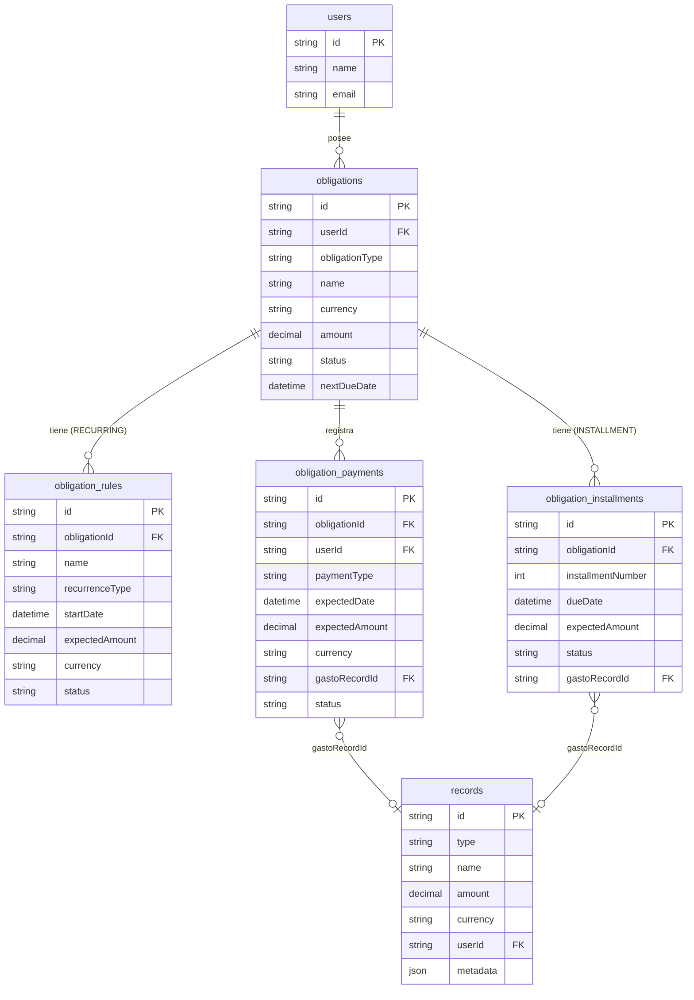
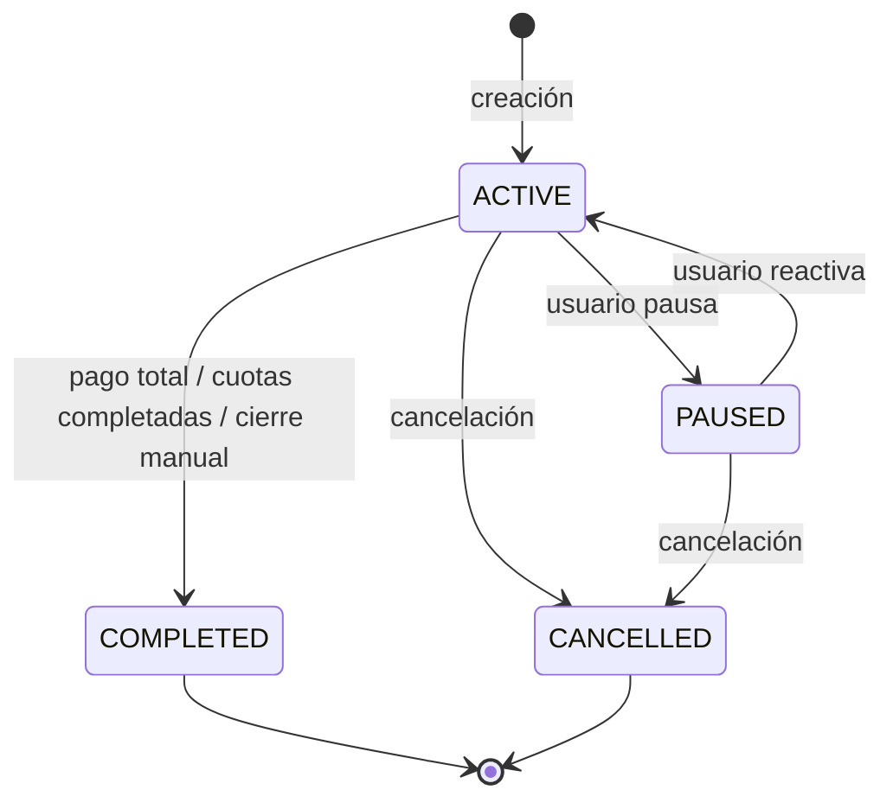
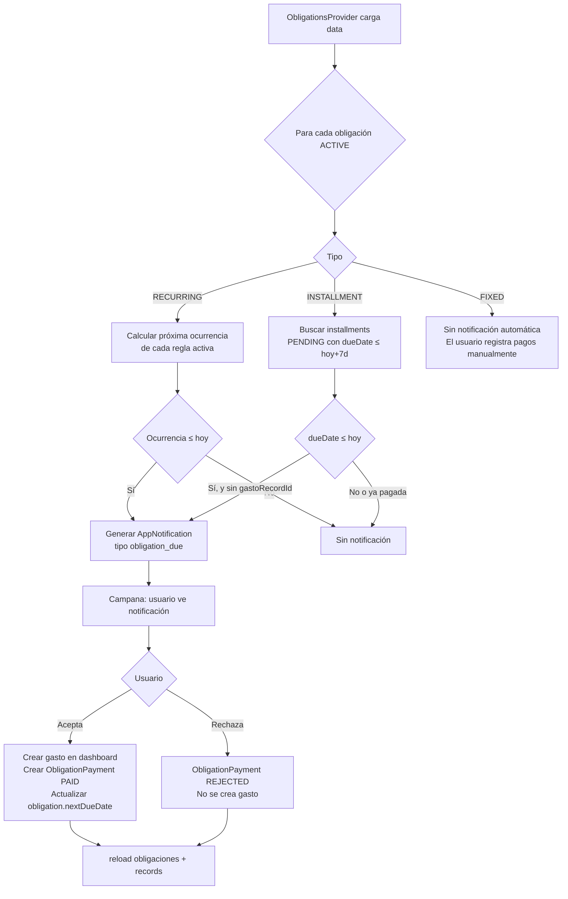
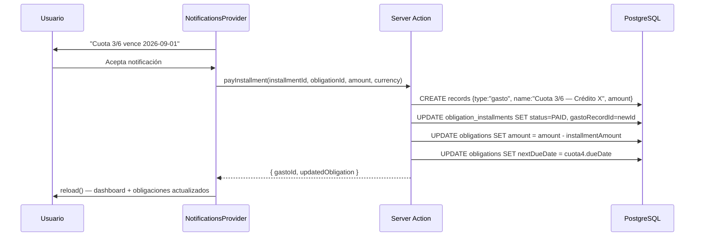
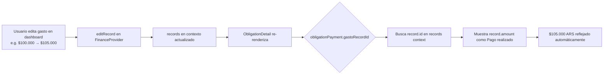

# Módulo Obligaciones — Diseño funcional y técnico

**Versión:** 1.0 | **Fecha:** 2026-06-20 | **Estado:** Diseño (pre-implementación)

---

## 1. Objetivos

### 1.1 Objetivo principal

Incorporar un módulo **Obligaciones** que permita representar compromisos financieros futuros con distintos ciclos de vida: gastos recurrentes, deudas en cuotas y deudas de monto fijo. El módulo debe:

- Generar notificaciones cuando un pago es próximo o vencido
- Crear gastos reales en el dashboard al confirmar pagos
- Mantener trazabilidad bidireccional entre la obligación y los gastos generados
- Proyectar el costo o saldo pendiente de cada obligación
- Ser extensible a nuevos tipos sin rediseño estructural

### 1.2 Relación con "Pasivos" existentes

Los **Pasivos** actuales (`type: "pasivo"` en `records`) son registros simples de valor fijo en el Balance. Son editable smanualmente desde el dashboard. **No tienen ciclo de vida propio, historial de pagos ni notificaciones.**

Las **Obligaciones** son entidades más ricas. A largo plazo, el módulo Obligaciones reemplazará el concepto de Pasivos para representar cualquier compromiso financiero con lifecycle propio. Durante la transición, ambos coexisten.

> **Decisión de diseño:** Las Obligaciones viven en sus propias tablas de DB, completamente separadas de `records`. Tienen su propio contexto React (`ObligationsProvider`), sus propias server actions y su propia ruta (`/obligaciones`).

---

## 2. Casos de uso

### UC-01: Crear obligación recurrente

**Actor:** Usuario  
**Precondición:** Está en `/obligaciones`  
**Flujo:**
1. Usuario hace click en "Nueva obligación" → elige tipo "Recurrente"
2. Completa nombre, descripción, moneda
3. Agrega reglas de gasto (ej: "Alquiler", mensual, $100.000 ARS, desde 2026-01-01)
4. Sistema calcula valor anual proyectado: $1.200.000 ARS
5. Obligación creada → aparece en listado y en dashboard

### UC-02: Confirmar pago recurrente

**Actor:** Notificación del sistema  
**Precondición:** Una regla de gasto tiene su fecha de vencimiento hoy o pasada  
**Flujo:**
1. Campana de notificaciones muestra "Alquiler vence hoy — $100.000 ARS"
2. Usuario hace click en la notificación
3. Popup con opciones: **Aceptar** (crea gasto) | **Rechazar** (descarta)
4. Si acepta: gasto `"Alquiler — [Nombre Obligación]"` creado en dashboard
5. Registro de pago aparece en tablero "Pagos" de la obligación

### UC-03: Crear obligación en cuotas

**Actor:** Usuario  
**Precondición:** Está en `/obligaciones`  
**Flujo:**
1. Elige tipo "Por cuotas"
2. Completa: monto total $6.000, moneda USD, cuotas: 6, vencimiento primera cuota: 2026-07-01
3. Sistema genera cronograma: 6 filas en `obligation_installments`
4. Valor inicial: $6.000 USD (saldo pendiente)

### UC-04: Pagar cuota

**Actor:** Usuario  
**Precondición:** Una cuota está vencida o próxima  
**Flujo:**
1. Notificación "Cuota 3/6 — vence 2026-09-01 — $1.000 USD"
2. Usuario acepta → gasto creado en dashboard
3. Cuota marcada como PAGADA, `gastoRecordId` guardado
4. Saldo pendiente: $3.000 USD (cuotas 4, 5, 6 pendientes)

### UC-05: Pago parcial en obligación de monto fijo

**Actor:** Usuario  
**Precondición:** Obligación de monto fijo activa  
**Flujo:**
1. Usuario navega al detalle de la obligación
2. Hace click en "Registrar pago"
3. Ingresa monto: $500 USD (pago parcial de $2.000 pendientes)
4. Sistema crea gasto `"Pago parcial — [Nombre]"` de $500 en dashboard
5. Saldo pendiente actualiza a $1.500 USD

### UC-06: Registrar interés en obligación de monto fijo

**Actor:** Usuario  
**Precondición:** Obligación de monto fijo activa  
**Flujo:**
1. Usuario en detalle de obligación, click "Agregar interés"
2. Ingresa monto: $50 USD
3. Sistema crea gasto `"Intereses — [Nombre]"` en dashboard
4. Gasto queda asociado a la obligación (visible en tablero Pagos)
5. El saldo pendiente NO aumenta automáticamente (el usuario decide si incrementa el monto)

### UC-07: Editar gasto generado desde obligación

**Actor:** Usuario  
**Precondición:** Gasto creado desde pago de obligación  
**Flujo:**
1. Usuario edita el gasto en dashboard (cambia monto de $100.000 a $105.000)
2. En el tablero "Pagos" de la obligación, el "Pago realizado" refleja $105.000 automáticamente
3. (El link `obligation_payments.gastoRecordId` → el monto se lee siempre del gasto real)

### UC-08: Ver resumen en dashboard

**Actor:** Usuario  
**Precondición:** Hay obligaciones activas  
**Flujo:**
1. Dashboard `/` muestra tabla "Obligaciones" con columnas: Nombre | Tipo | Valor | Próximo vencimiento | Estado
2. Tabla es de solo lectura (sin edición inline)
3. Click en nombre → navega a `/obligaciones/[id]`

---

## 3. Flujos funcionales

### 3.1 Tipo 1 — Obligación recurrente

```
CICLO DE VIDA:
ACTIVE → PAUSED → ACTIVE   (el usuario puede pausar reglas o toda la obligación)
ACTIVE → COMPLETED          (el usuario marca la obligación como finalizada)
ACTIVE → CANCELLED          (cancelada sin finalizar)

CICLO DE UNA REGLA DE GASTO:
[Fecha inicio de regla]
      │
      ▼
[Cálculo virtual de próxima ocurrencia = hoy o futuro]
      │
      ├─ Hoy o pasado → NOTIFICACIÓN generada
      │                       │
      │                       ├─ Usuario ACEPTA → gasto creado + ObligationPayment PAID
      │                       └─ Usuario RECHAZA → ObligationPayment REJECTED
      │
      └─ Futuro → esperar (próxima revisión)
```

**Cálculo del valor proyectado:**

```
Para cada regla activa:
  ocurrencias_por_año = 12 / meses_entre_ocurrencias
  aporte_anual = expectedAmount × ocurrencias_por_año

valor_obligacion = SUM(aporte_anual de todas las reglas en la misma moneda)
```

Si hay reglas en múltiples monedas → seguir la misma estrategia que `GroupValueDisplay`:
- `convertCurrencies=true` → suma convertida a moneda base
- `convertCurrencies=false` → breakdown por moneda

### 3.2 Tipo 2 — Obligación por cuotas

```
CREACIÓN:
  monto_total / cuotas = monto_por_cuota
  Generar N filas en obligation_installments (N = cuotas totales)
  Cada fila: dueDate, expectedAmount, status=PENDING

CICLO DE UNA CUOTA:
  dueDate ≤ hoy → NOTIFICACIÓN
       │
       ├─ ACEPTA → gasto creado, installment.status=PAID, installment.gastoRecordId=id
       └─ RECHAZA → installment.status=REJECTED (o queda PENDING, decidir)

VALOR (saldo pendiente):
  value = SUM(installment.expectedAmount WHERE status IN (PENDING, OVERDUE))
```

**Estado de cuota:**
- `PENDING`: aún no vencida
- `OVERDUE`: fecha pasada y sin pagar
- `PAID`: pagada
- `REJECTED`: usuario rechazó la notificación (registrado pero sin gasto)

### 3.3 Tipo 3 — Obligación de monto fijo

```
CREACIÓN:
  amount = monto inicial pendiente
  (Sin cronograma predefinido)

PAGO PARCIAL:
  Usuario registra pago de X
  → gasto creado (con opción)
  → obligation.amount -= X (actualizar saldo)
  → obligation_payment creado (PAID)

PAGO TOTAL:
  obligation.amount → 0
  obligation.status → COMPLETED

INTERÉS:
  Usuario registra interés de X
  → gasto creado (tipo "interés")
  → obligation.amount permanece (el usuario decide si incrementa)
  → obligation_payment creado (tipo INTEREST)

EDICIÓN DESDE DASHBOARD:
  Editar monto → popup con opción "Generar gasto asociado"
  Si activado: gasto "Pago — [nombre]" por diferencia
  El nuevo monto se actualiza en la obligación

VALOR:
  value = obligation.amount (actualizado con cada pago)
```

---

## 4. Modelo de datos propuesto

### 4.1 Análisis de estrategias de modelado

#### Estrategia A: Tabla única con metadata JSON

```
obligations: id, type, name, currency, amount, metadata Json
```

**Pros:** Sin migraciones adicionales para nuevos tipos. Consistente con el patrón `records` + `metadata` existente.  
**Contras:** No hay referential integrity para reglas ni cuotas. Las queries sobre fechas de vencimiento requieren JSON traversal. Difícil indexar por `nextDueDate`. La experiencia con `metadata.boards` muestra que las consultas cross-field son complejas.

#### Estrategia B: Tabla por tipo

```
obligations_recurring: ...
obligations_installment: ...
obligations_fixed: ...
```

**Pros:** Columnas específicas por tipo, queries limpias por tipo.  
**Contras:** Imposible hacer "find all obligations due this week" sin UNION. Cada feature cross-tipo (ej: listado global, notificaciones) requiere N queries. No escalable para nuevos tipos.

#### Estrategia C: Tabla base + tablas de subtipo (herencia de tabla) ★ RECOMENDADA

```
obligations (base):     id, userId, type, name, description, currency, status, amount, metadata
obligation_rules:       id, obligationId, recurrenceType, expectedAmount, startDate, ...
obligation_installments: id, obligationId, installmentNumber, dueDate, expectedAmount, ...
obligation_payments:    id, obligationId, gastoRecordId, amount, date, type, status, ...
```

**Pros:**
- Queries globales sobre `obligations` (listado, notificaciones, dashboard) sin UNION
- Datos tipo-específicos en sub-tablas con referential integrity
- Nuevos tipos: solo agregar sub-tabla sin tocar la base
- Indexar `obligations.nextDueDate` para notificaciones eficientes

**Contras:** Más tablas; joins para datos completos.

### 4.2 Schema propuesto (Prisma)

```prisma
model Obligation {
  id              String   @id @default(uuid())
  userId          String   @map("user_id")
  obligationType  String   @map("obligation_type") // "RECURRING" | "INSTALLMENT" | "FIXED"
  name            String
  description     String?
  currency        String
  amount          Decimal  @db.Decimal(18, 4)       // valor actual: proyección anual / saldo pendiente
  status          String   @default("ACTIVE")       // "ACTIVE" | "PAUSED" | "COMPLETED" | "CANCELLED"
  nextDueDate     DateTime? @map("next_due_date")   // desnormalizado para queries rápidas
  createdAt       DateTime  @default(now()) @map("created_at")
  metadata        Json?                              // extensiones futuras

  user         User                    @relation(fields: [userId], references: [id])
  rules        ObligationRule[]
  installments ObligationInstallment[]
  payments     ObligationPayment[]

  @@map("obligations")
  @@index([userId, status])
  @@index([userId, nextDueDate])
}

model ObligationRule {
  id             String    @id @default(uuid())
  obligationId   String    @map("obligation_id")
  name           String
  recurrenceType String    @map("recurrence_type") // "MONTHLY" | "QUARTERLY" | "SEMI_ANNUAL" | "ANNUAL"
  startDate      DateTime  @map("start_date")
  expectedAmount Decimal   @db.Decimal(18, 4)  @map("expected_amount")
  currency       String
  status         String    @default("ACTIVE")  // "ACTIVE" | "PAUSED"
  metadata       Json?

  obligation Obligation @relation(fields: [obligationId], references: [id], onDelete: Cascade)

  @@map("obligation_rules")
  @@index([obligationId])
}

model ObligationInstallment {
  id                 String    @id @default(uuid())
  obligationId       String    @map("obligation_id")
  installmentNumber  Int       @map("installment_number")
  dueDate            DateTime  @map("due_date")
  expectedAmount     Decimal   @db.Decimal(18, 4) @map("expected_amount")
  status             String    @default("PENDING") // "PENDING" | "OVERDUE" | "PAID" | "REJECTED"
  gastoRecordId      String?   @map("gasto_record_id")

  obligation Obligation @relation(fields: [obligationId], references: [id], onDelete: Cascade)

  @@map("obligation_installments")
  @@index([obligationId])
  @@index([dueDate, status])
}

model ObligationPayment {
  id            String    @id @default(uuid())
  obligationId  String    @map("obligation_id")
  userId        String    @map("user_id")
  paymentType   String    @map("payment_type")  // "PAYMENT" | "INTEREST" | "FEE"
  expectedDate  DateTime? @map("expected_date")
  expectedAmount Decimal? @db.Decimal(18, 4)  @map("expected_amount")
  currency      String
  gastoRecordId String?   @map("gasto_record_id")  // FK a records.id
  status        String    // "PENDING" | "PAID" | "REJECTED"
  comment       String?
  createdAt     DateTime  @default(now()) @map("created_at")

  obligation Obligation @relation(fields: [obligationId], references: [id], onDelete: Cascade)
  user       User       @relation(fields: [userId], references: [id])

  @@map("obligation_payments")
  @@index([obligationId])
  @@index([userId, expectedDate])
}
```

### 4.3 Tipos TypeScript

```ts
// lib/obligations.ts

export type ObligationType = "RECURRING" | "INSTALLMENT" | "FIXED"
export type ObligationStatus = "ACTIVE" | "PAUSED" | "COMPLETED" | "CANCELLED"
export type RecurrenceType = "MONTHLY" | "QUARTERLY" | "SEMI_ANNUAL" | "ANNUAL"
export type InstallmentStatus = "PENDING" | "OVERDUE" | "PAID" | "REJECTED"
export type PaymentType = "PAYMENT" | "INTEREST" | "FEE"
export type PaymentStatus = "PENDING" | "PAID" | "REJECTED"

export const OBLIGATION_TYPE_LABELS: Record<ObligationType, string> = {
  RECURRING: "Recurrente",
  INSTALLMENT: "Por cuotas",
  FIXED: "Monto fijo",
}

export const RECURRENCE_TYPE_LABELS: Record<RecurrenceType, string> = {
  MONTHLY: "Mensual",
  QUARTERLY: "Trimestral",
  SEMI_ANNUAL: "Semestral",
  ANNUAL: "Anual",
}

export const RECURRENCE_MONTHS: Record<RecurrenceType, number> = {
  MONTHLY: 1,
  QUARTERLY: 3,
  SEMI_ANNUAL: 6,
  ANNUAL: 12,
}

export const OCCURRENCES_PER_YEAR: Record<RecurrenceType, number> = {
  MONTHLY: 12,
  QUARTERLY: 4,
  SEMI_ANNUAL: 2,
  ANNUAL: 1,
}

export interface ObligationRule {
  id: string
  obligationId: string
  name: string
  recurrenceType: RecurrenceType
  startDate: string        // ISO date
  expectedAmount: number
  currency: Currency
  status: "ACTIVE" | "PAUSED"
}

export interface ObligationInstallment {
  id: string
  obligationId: string
  installmentNumber: number
  dueDate: string          // ISO date
  expectedAmount: number
  status: InstallmentStatus
  gastoRecordId?: string
}

export interface ObligationPayment {
  id: string
  obligationId: string
  paymentType: PaymentType
  expectedDate?: string
  expectedAmount?: number
  currency: Currency
  gastoRecordId?: string   // FK → records.id (gasto real en dashboard)
  status: PaymentStatus
  comment?: string
  createdAt: string
  // Derived at load time from linked gasto:
  actualAmount?: number    // read from records.amount WHERE id = gastoRecordId
  actualDate?: string      // read from records.operationDate
}

export interface Obligation {
  id: string
  userId: string
  obligationType: ObligationType
  name: string
  description?: string
  currency: Currency
  amount: number           // proyección anual (RECURRING) | saldo pendiente (INSTALLMENT/FIXED)
  status: ObligationStatus
  nextDueDate?: string     // ISO date; desnormalizado para display rápido
  createdAt: string
  rules: ObligationRule[]           // solo RECURRING
  installments: ObligationInstallment[] // solo INSTALLMENT
  payments: ObligationPayment[]     // todos los tipos
}
```

---

## 5. Relaciones entre entidades

### 5.1 Diagrama de relaciones



### 5.2 Relaciones clave

| Relación | Cardinalidad | Descripción |
|---------|--------------|-------------|
| Obligation → Rules | 1:N | Solo tipo RECURRING; mínimo 1 regla activa |
| Obligation → Installments | 1:N | Solo tipo INSTALLMENT; N = cuotas totales |
| Obligation → Payments | 1:N | Historial de pagos (todos los tipos) |
| Payment → Record (gasto) | 0..1:1 | Un pago puede tener un gasto asociado en dashboard |
| Installment → Record (gasto) | 0..1:1 | Una cuota pagada tiene su gasto en dashboard |

---

## 6. Diagramas Mermaid

### 6.1 Estado de la obligación



### 6.2 Ciclo de vida de notificación de obligación



### 6.3 Flujo de pago de cuota (Tipo 2)



### 6.4 Flujo de sincronización gasto↔pago



### 6.5 Arquitectura del módulo

```mermaid
graph TB
    subgraph "Client Context"
        FP[FinanceProvider\nrecords + gastos]
        OP[ObligationsProvider\nobligations + installments + payments]
        NP[NotificationsProvider\nextendido]
    end

    subgraph "Pages"
        DASH[/ Dashboard\nTabla Obligaciones summary]
        LIST[/obligaciones\nListado completo]
        DETAIL[/obligaciones/id\nDetalle + tableros]
    end

    subgraph "Server Actions"
        OA[lib/obligation-actions.ts\ncreateObligation\npayInstallment\nregisterPayment\npauseObligation]
    end

    subgraph "DB"
        OBL[(obligations)]
        RUL[(obligation_rules)]
        INS[(obligation_installments)]
        PAY[(obligation_payments)]
        REC[(records / gastos)]
    end

    FP --> NP
    OP --> NP
    NP --> DASH
    NP --> LIST
    NP --> DETAIL
    OA --> OBL
    OA --> RUL
    OA --> INS
    OA --> PAY
    OA --> REC
    OP --> OA
```

---

## 7. Estrategia de generación de gastos

### 7.1 Problema central

Las obligaciones recurrentes generan gastos indefinidamente en el futuro. Pre-generar todos los gastos futuros no es viable (almacenamiento infinito, latencia en la carga).

### 7.2 Estrategias analizadas

#### Estrategia A: Generación física anticipada (ventana de tiempo)

Pre-generar los pagos esperados para los próximos N meses en `obligation_payments`. Similar a cómo los dividendos recurrentes pre-generan 12 meses.

**Pros:**
- Queries simples sobre tabla con datos reales
- No se requiere cálculo en tiempo de display
- Los pagos vencidos quedan registrados (OVERDUE)

**Contras:**
- Requiere un mecanismo de extensión (cron job o trigger en load)
- La ventana puede quedar desactualizada si el usuario no entra a la app por mucho tiempo

#### Estrategia B: Generación virtual (cálculo dinámico en cliente)

Los pagos esperados se calculan en tiempo de display a partir de las reglas. Solo los pagos CONFIRMADOS (aceptados o rechazados) se persisten en DB.

**Pros:**
- Sin datos infinitos en DB
- No requiere cron jobs
- Siempre up-to-date con la configuración actual

**Contras:**
- El estado "OVERDUE" requiere comparar fecha de hoy con fechas calculadas (correcto pero más lógica en cliente)
- Perder la visibilidad de pagos rechazados históricos si no se persisten

#### Estrategia C: Híbrida (recomendada para recurrentes) ★

Igual que los dividendos recurrentes (`generateRecurringDividends` en `lib/assets.ts`):

1. Al crear una obligación recurrente: generar pagos esperados para la ventana de **los próximos 12 meses** en `obligation_payments` con `status: PENDING`
2. Al cerrar/aceptar un pago: marcar como PAID; si era el último de la ventana, extender 12 meses más
3. Si el usuario rechaza: marcar como REJECTED (sin gasto)
4. Al cargar la obligación: mostrar todos los PENDING + historial de PAID/REJECTED

**Para cuotas (Tipo 2):** Generar todos los installments al crear (número finito y conocido). No se necesita ventana.

**Para monto fijo (Tipo 3):** No hay generación anticipada. Los pagos se registran manualmente.

### 7.3 Lógica de cálculo de próxima ocurrencia (Tipo 1)

```ts
function nextOccurrenceDate(rule: ObligationRule, after: Date): Date {
  const months = RECURRENCE_MONTHS[rule.recurrenceType]
  let date = new Date(rule.startDate)
  while (date <= after) {
    date = addMonths(date, months)
  }
  return date
}
```

---

## 8. Estrategia de notificaciones

### 8.1 Sistema actual

`NotificationsProvider` computa client-side desde `records` vía `useMemo`. Solo `dividend_pending`. Lee/escribe `readIds` en `localStorage: "cashflow:notifications"`.

`AppNotification.type` actualmente: `"dividend_pending"` (extensible por comentario en el código).

### 8.2 Extensión requerida

Extender `AppNotification` en `lib/assets.ts`:

```ts
export interface AppNotification {
  id: string
  type:
    | "dividend_pending"
    | "obligation_due"        // vencimiento de cualquier tipo
    | "obligation_overdue"    // ya vencida sin pagar
  title: string
  body: string
  // Campos opcionales según tipo:
  assetId?: string            // para dividends
  dividendId?: string         // para dividends
  obligationId?: string       // para obligations
  installmentId?: string      // para type 2
  paymentId?: string          // para type 1 payments
  expectedAmount?: number
  currency?: string
  dueDate?: string
  createdAt: string
}
```

### 8.3 Acciones de notificación

Las notificaciones de obligaciones tienen **dos acciones** (a diferencia de dividendos que solo se "marcan como leídas"):

```ts
interface ObligationNotificationAction {
  type: "accept" | "reject"
  obligationId: string
  // Según tipo de obligación:
  paymentId?: string      // RECURRING: id del ObligationPayment PENDING
  installmentId?: string  // INSTALLMENT: id del ObligationInstallment
}
```

**Al ACEPTAR:**
1. Server Action: crear gasto en `records`
2. Server Action: actualizar payment/installment `status=PAID`, `gastoRecordId=newGastoId`
3. Server Action: recalcular `obligation.amount` (saldo pendiente o proyección)
4. Server Action: actualizar `obligation.nextDueDate`
5. `reload()` en contextos FinanceProvider + ObligationsProvider

**Al RECHAZAR:**
1. Server Action: actualizar payment/installment `status=REJECTED`
2. No se crea gasto
3. `reload()` en ObligationsProvider

### 8.4 Ventana de notificación

Notificar cuando `dueDate ≤ hoy + 3 días` (configurable en el futuro). Esto da al usuario tiempo de anticipación sin ser invasivo. Para obligaciones OVERDUE, notificar siempre hasta que se resuelva.

### 8.5 Integración con NotificationsProvider

```ts
// En NotificationsProvider, extender el useMemo:

// Dividend notifications (existente):
for (const record of records) { ... }

// Obligation notifications (nuevo):
const today = new Date()
const alertWindow = new Date(today.getTime() + 3 * 24 * 60 * 60 * 1000) // hoy + 3 días

for (const obligation of obligations) {
  if (obligation.status !== "ACTIVE") continue

  if (obligation.obligationType === "RECURRING") {
    // Buscar payments PENDING con expectedDate ≤ alertWindow
    for (const payment of obligation.payments.filter(p => p.status === "PENDING")) {
      if (payment.expectedDate && new Date(payment.expectedDate) <= alertWindow) {
        result.push({ type: "obligation_due", obligationId: obligation.id, paymentId: payment.id, ... })
      }
    }
  }

  if (obligation.obligationType === "INSTALLMENT") {
    // Buscar installments PENDING o OVERDUE con dueDate ≤ alertWindow
    for (const inst of obligation.installments.filter(i => ["PENDING","OVERDUE"].includes(i.status))) {
      if (new Date(inst.dueDate) <= alertWindow) {
        result.push({ type: "obligation_due", obligationId: obligation.id, installmentId: inst.id, ... })
      }
    }
  }
  // FIXED: sin notificaciones automáticas
}
```

---

## 9. Estrategia de pagos

### 9.1 Trazabilidad obligación ↔ gasto

El vínculo es **unidireccional desde el pago hacia el gasto**:

```
ObligationPayment.gastoRecordId → records.id (gasto)
```

El gasto en `records` **no conoce** la obligación que lo originó. Esto mantiene la independencia del sistema de records.

**Razón de diseño:** No modificar `FinancialRecord` ni su schema. La obligación es la que "sabe" sobre el gasto, no al revés.

**Sincronización de montos:** Como `gastoRecordId` apunta al record real, el monto que se muestra como "Pago realizado" en el tablero de pagos se lee en tiempo real desde el record. Si el usuario edita el gasto en el dashboard, la obligación lo refleja automáticamente en el próximo render (sin webhooks ni eventos especiales).

### 9.2 Tablero "Pagos" — estructura de display

Para Tipo 1 (Recurrente):

| Fecha esperada | Regla | Monto esperado | Fecha real | Pago realizado | Estado |
|---------------|-------|----------------|------------|----------------|--------|
| 2026-07-01 | Alquiler | $100.000 ARS | 2026-07-02 | $100.000 ARS | PAGADO |
| 2026-08-01 | Alquiler | $100.000 ARS | — | — | PENDIENTE |
| 2026-09-01 | Alquiler | $100.000 ARS | — | — | PENDIENTE |

Para Tipo 2 (Cuotas):

| Cuota | Fecha vencimiento | Período | Monto | Fecha pago | Pago realizado | Estado |
|-------|------------------|---------|-------|------------|----------------|--------|
| 1/6 | 2026-07-01 | Jul 2026 | $1.000 | 2026-07-03 | $1.000 | PAGADA |
| 2/6 | 2026-08-01 | Ago 2026 | $1.000 | — | — | PENDIENTE |

Para Tipo 3 (Monto fijo):

| Fecha | Tipo | Monto | Descripción | Estado |
|-------|------|-------|-------------|--------|
| 2026-06-15 | PAYMENT | $500 | Pago parcial | PAGADO |
| 2026-07-01 | INTEREST | $30 | Intereses junio | PAGADO |

### 9.3 Flujo de creación de gasto desde obligación

```ts
// Server action: obligationPay(obligationId, paymentData) → string (gastoId)

async function obligationPay(
  obligationId: string,
  paymentData: {
    amount: number
    currency: Currency
    gastoName: string
    comment?: string
    paymentId?: string       // para RECURRING: id del ObligationPayment existente
    installmentId?: string   // para INSTALLMENT
    paymentType: PaymentType
  }
): Promise<string> {
  // 1. Crear el gasto en records
  // 2. Crear o actualizar ObligationPayment con gastoRecordId
  // 3. Si INSTALLMENT: actualizar installment.status + gastoRecordId
  // 4. Si FIXED: UPDATE obligation.amount -= paymentData.amount
  // 5. Actualizar obligation.nextDueDate
  // 6. Retornar gastoId
}
```

---

## 10. Estrategia de cálculo de valor

### 10.1 Fuente de verdad por tipo

| Tipo | Campo en DB | Descripción | Cuándo actualizar |
|------|------------|-------------|------------------|
| RECURRING | `obligation.amount` | Costo anual proyectado | Al crear/editar reglas |
| INSTALLMENT | `obligation.amount` | Saldo pendiente | Al crear (total) y al pagar cada cuota |
| FIXED | `obligation.amount` | Saldo pendiente | Al registrar cada pago |

### 10.2 Fórmula por tipo

**RECURRING:**
```ts
function calcRecurringValue(rules: ObligationRule[]): Record<Currency, number> {
  const totals: Record<Currency, number> = {}
  for (const rule of rules.filter(r => r.status === "ACTIVE")) {
    const annual = rule.expectedAmount * OCCURRENCES_PER_YEAR[rule.recurrenceType]
    totals[rule.currency] = (totals[rule.currency] ?? 0) + annual
  }
  return totals  // puede ser multi-divisa
}
// Nota: si multi-divisa → respetar convertCurrencies de settings para display
```

**INSTALLMENT:**
```ts
const pending = installments.filter(i => ["PENDING","OVERDUE"].includes(i.status))
const amount = pending.reduce((s, i) => s + i.expectedAmount, 0)
// Guardar en obligation.amount con cada pago
```

**FIXED:**
```ts
// Se actualiza directamente con cada pago:
obligation.amount -= paymentAmount
// Si obligation.amount <= 0: obligation.status = "COMPLETED"
```

### 10.3 Display en dashboard y listado

El campo `obligation.amount` se muestra directamente en la tabla del dashboard (resumen). Para obligaciones RECURRING multi-divisa, aplicar la misma lógica `GroupValueDisplay` (convertir si `convertCurrencies=true`, breakdown si no).

### 10.4 "Próximo vencimiento"

`obligation.nextDueDate` se desnormaliza en DB para queries eficientes. Se actualiza en cada server action que cambia el estado de pagos. Se calcula como:

- **RECURRING:** `nextOccurrenceDate(earliestActiveRule, today)`
- **INSTALLMENT:** `MIN(dueDate WHERE status IN (PENDING, OVERDUE))`
- **FIXED:** `null` (sin fecha predefinida)

---

## 11. Riesgos

| # | Riesgo | Probabilidad | Impacto | Mitigación |
|---|--------|-------------|---------|-----------|
| R1 | Gastos generados desde obligaciones no son distinguibles de gastos manuales en `/movimientos` | ALTA | MEDIO | Agregar `relatedObligationId` en `records.metadata` (ya es Json?). El audit log en `/movimientos` podría mostrar el origen. |
| R2 | El usuario elimina el gasto vinculado → `gastoRecordId` apunta a un record eliminado (soft-delete) | MEDIA | BAJO | Al cargar payments, hacer JOIN LEFT OUTER. Si `deletedAt != null`, mostrar "gasto eliminado" en la columna. |
| R3 | La ventana de 12 meses para RECURRING se agota si el usuario no interactúa | BAJA | BAJO | Al cargar la obligación, verificar si hay pagos PENDING para los próximos 30 días. Si no, extender ventana automáticamente en el mismo load. |
| R4 | Performance: cargar todas las obligaciones con sus sub-entidades en el contexto global | MEDIA | MEDIO | Cargar obligaciones con un nivel de detalle reducido para el dashboard (amount + nextDueDate + status). Los sub-detalles (rules, installments, payments) se cargan solo en `/obligaciones/[id]`. |
| R5 | La tasa de cambio al momento del pago puede diferir de la configurada | BAJA | BAJO | Guardar la tasa efectiva en `ObligationPayment.metadata`. El gasto se crea en la divisa de la obligación (no se convierte en el momento del pago). |
| R6 | Obligaciones en múltiples divisas complicarán el total del Balance | MEDIA | BAJO | Aplicar la misma estrategia de `computeGroupValue()` ya implementada: convertir si `convertCurrencies=true`, breakdown si no. |
| R7 | Migraciones de Prisma para las 4 nuevas tablas | ALTA (certeza) | MEDIO | Las migraciones son necesarias. No hay forma de evitarlas. Requieren `npx prisma migrate deploy` en producción (Supabase). |
| R8 | Coexistencia con `pasivos` existentes: duplicate concept | MEDIA | BAJO | Durante la transición, `pasivos` y `obligaciones` coexisten. En una versión futura, migrar pasivos existentes a obligaciones de tipo FIXED. |

---

## 12. Alternativas consideradas

### 12.1 Alternativa: Extender `records` con `type: "obligacion"`

Agregar `"obligacion"` al `RecordType` y usar `metadata Json?` para toda la data compleja (rules, installments, payments).

**Análisis:**
- No requiere nuevas tablas (sin migrations inicialmente)
- Consistente con el patrón `activo` + `metadata`
- Sin embargo: los pagos (obligation_payments) necesitan FK a gastos (records). Una FK dentro de metadata es una string sin referential integrity. Las queries sobre fechas de vencimiento requieren JSON path queries en PostgreSQL → no indexables eficientemente. Un historial grande de pagos crece el campo metadata.

**Conclusión:** No recomendado para este módulo. La complejidad relacional de las obligaciones supera la simplicidad que ofrece el patrón metadata. Es el mismo análisis que llevó a tener tabla separada para `financial_movements` en lugar de metadata.

### 12.2 Alternativa: Notificaciones server-side con cron

Pre-generar notificaciones en DB vía cron job o Supabase scheduled functions.

**Análisis:**
- Permite push notifications y email alerts en el futuro
- Requiere infraestructura de background jobs no existente
- La app actual no tiene ningún job scheduler

**Conclusión:** Fuera de scope para esta versión. La arquitectura client-side es coherente con lo existente (dividendos ya funcionan igual). El diseño es extensible: si en el futuro se agrega un cron, los `ObligationPayment` con `status=PENDING` son la fuente de verdad para generar push notifications.

### 12.3 Alternativa: Tipo 3 (monto fijo) como Pasivo enriquecido

Reutilizar el tipo `pasivo` existente y agregar campos de tracking de pagos en su metadata.

**Análisis:**
- Evita una entidad nueva para el caso más simple
- Pero: los pasivos actuales ya tienen datos del usuario en producción. Modificar su comportamiento puede romper workflows existentes.
- Además: la trazabilidad obligación ↔ gasto requiere la tabla `obligation_payments`. No se puede hacer sin nuevas tablas.

**Conclusión:** No recomendado. La separación limpia entre `records` (simple, inmutable en estructura) y `obligations` (complejo, ciclo de vida propio) es la opción correcta.

---

## 13. Recomendación final de arquitectura

### 13.1 Modelo

**Cuatro tablas nuevas en Prisma:**
- `obligations` (base)
- `obligation_rules` (Tipo 1)
- `obligation_installments` (Tipo 2)
- `obligation_payments` (todos los tipos)

Justificación: El modelo relacional es el correcto para queries por fecha, FK referential integrity, y escalabilidad a nuevos tipos.

### 13.2 Datos en contexto

**`ObligationsProvider`** nuevo (similar a `FinanceProvider`):
- Carga datos al iniciar la sesión
- Expone: `obligations`, `reload()`
- Se monta en `app/(dashboard)/layout.tsx` junto a `FinanceProvider` y `SettingsProvider`
- Para el dashboard: solo carga `id + name + type + amount + currency + status + nextDueDate` (sin sub-tablas)
- Para `/obligaciones/[id]`: cargar detail completo via `loadObligation(id)` (Server Action)

### 13.3 Notificaciones

**Extender `NotificationsProvider`** para consumir `ObligationsProvider`:
- Las notificaciones de obligaciones se computan en el mismo `useMemo`
- Agregar `obligationId`, `paymentId`, `installmentId` a `AppNotification`
- El popup de notificación distingue por `type`: "dividend_pending" (solo marcar como leída) vs "obligation_due" (Aceptar / Rechazar)

### 13.4 Generación de gastos

**Estrategia híbrida:**
- **RECURRING:** ventana de 12 meses en `obligation_payments`. Extensión automática al cargar si la ventana se agota.
- **INSTALLMENT:** todos los installments generados al crear (finitos, conocidos).
- **FIXED:** sin generación anticipada; pagos manuales.

En todos los casos, el gasto real en `records` se crea solo cuando el usuario confirma. **No hay gastos pre-generados en el dashboard.**

### 13.5 Integración con sistema existente

| Componente | Cambio |
|-----------|--------|
| `app/(dashboard)/layout.tsx` | Montar `ObligationsProvider` |
| `components/dashboard-sheet.tsx` | Agregar tabla "Obligaciones" (read-only, summary) |
| `components/notifications/notifications-store.tsx` | Extender `useMemo` para obligations |
| `components/app-sidebar.tsx` | Agregar link a `/obligaciones` |
| `lib/assets.ts` | Extender `AppNotification.type` |
| `prisma/schema.prisma` | 4 modelos nuevos (requiere migration) |

### 13.6 Archivos nuevos

| Archivo | Descripción |
|---------|-------------|
| `lib/obligations.ts` | Tipos TS + funciones de cálculo (computeValue, nextDueDate, generateWindow) |
| `lib/obligation-actions.ts` | Server Actions: createObligation, updateObligation, obligationPay, payInstallment, addRule, pauseObligation |
| `components/obligations-store.tsx` | `ObligationsProvider` + `useObligations()` hook |
| `components/obligations/obligation-list.tsx` | Listado con filtros y búsqueda |
| `components/obligations/obligation-form-dialog.tsx` | Crear nueva obligación (wizard por tipo) |
| `components/obligations/obligation-detail.tsx` | Detalle + tableros (Pagos, Reglas para Tipo 1) |
| `components/obligations/obligation-notification-popup.tsx` | Popup Aceptar/Rechazar (distinto al notifications-popover actual) |
| `app/(dashboard)/obligaciones/page.tsx` | Listado de obligaciones |
| `app/(dashboard)/obligaciones/[id]/page.tsx` | Detalle de obligación |

### 13.7 Orden de implementación recomendado

1. Schema Prisma + migration + seed de datos de prueba
2. `lib/obligations.ts` — tipos, funciones de cálculo, generación de ventana
3. `lib/obligation-actions.ts` — server actions CRUD
4. `ObligationsProvider` — context con carga inicial
5. Tabla en `DashboardSheet` — resumen read-only
6. `/obligaciones` — listado con filtros y creación
7. `/obligaciones/[id]` — detalle con tableros
8. Notificaciones — extender NotificationsProvider + popup Aceptar/Rechazar
9. Trazabilidad en `/movimientos` — distinguir gastos vinculados a obligaciones

---

*Documento finalizado. No se ha modificado ningún archivo de código. Este documento es la fuente de verdad para el diseño e implementación del módulo Obligaciones.*
