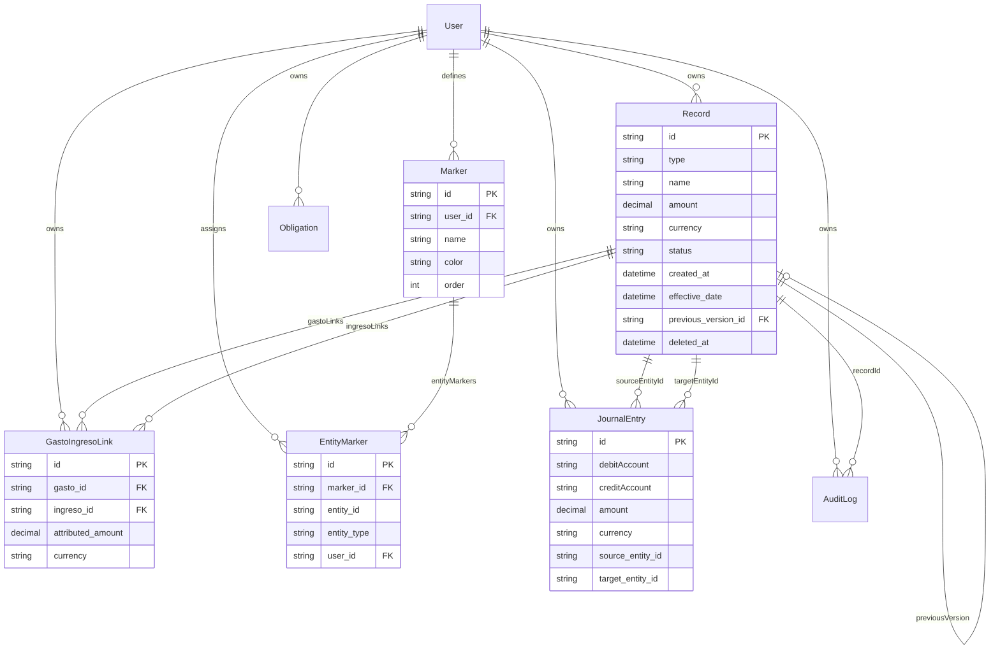

# Refactor: Ingresos, Gastos, Marcadores y Calculadora

> Documento de análisis, propuesta y arquitectura.  
> Fecha: 2026-06-29

---

## 1. Estado actual

### 1.1 Modelo de estados de Records

El campo `status` en la tabla `records` acepta actualmente tres valores:

| Status | Aplica a | Descripción |
|--------|----------|-------------|
| `ACTIVE` | Todos los tipos | Registro vigente y visible en el sistema |
| `PENDING` | `gasto` | Gastos vinculados a obligaciones aún no pagados |
| `CANCELLED` | `gasto` | Gastos de obligaciones que fueron canceladas |

Los tipos `ingreso` y `gasto` no tienen un modelo de ciclo de vida completo. No existe estado `HISTORICAL` ni `ARCHIVED`.

### 1.2 Eliminación de ingresos y gastos

`dbDeleteRecord()` en `lib/actions.ts` aplica el mismo tratamiento a todos los tipos de record:

```typescript
prisma.record.update({
  where: { id: record.id, userId },
  data: { deletedAt: new Date() },  // ← mismo para ingreso, gasto, activo, pasivo
})
```

Esto implica que al eliminar un ingreso desde el Dashboard, el registro queda con `deletedAt` seteado y pierde toda visibilidad en el sistema. No hay forma de recuperarlo desde la UI.

### 1.3 Filtro incorrecto en loadData()

`loadData()` en `lib/actions.ts` filtra correctamente gastos por `status: "ACTIVE"`, pero aplica un bug silencioso: **los ingresos no son filtrados por status**. Cualquier ingreso con `status != "ACTIVE"` seguirá apareciendo en el Dashboard.

```typescript
OR: [
  { type: { not: "gasto" } },          // ← ingresos siempre pasan sin filtrar status
  { type: "gasto", status: "ACTIVE" },
],
```

### 1.4 Ausencia de historial de versiones

Al editar un ingreso o gasto desde el Dashboard (`dbEditRecord()`), el registro existente se modifica in-place. No existe historial de valores anteriores. Si el salario mensual cambia de $1.900.000 a $2.000.000, el valor anterior se pierde permanentemente.

### 1.5 Ausencia de trazabilidad gasto↔ingreso

No existe ninguna estructura que vincule un gasto con los ingresos que lo financiaron. El campo `linkedTo` en `records` es un FK a otro record, pero no modela el concepto de "financiamiento parcial" (N:M, con montos atribuidos).

### 1.6 Ausencia de marcadores visuales

No existe ningún mecanismo para resaltar filas en el Dashboard, /activos, /gastos, /ingresos u /obligaciones.

### 1.7 Inputs numéricos sin soporte de expresiones

Todos los inputs numéricos del sistema (`amount`, `qty`, `price`, `rate`, etc.) usan `<input type="number">` estándar. No soportan expresiones matemáticas. Si el usuario quiere ingresar `2500 + 2000 + 500`, debe hacer el cálculo manualmente.

### 1.8 Records sin fecha de creación

El modelo `Record` en Prisma no tiene un campo `createdAt` explícito. La tabla `records` tampoco tiene esa columna. Solo existe `operationDate` (nullable), pensado para la fecha de la operación financiera (no la de creación del registro).

---

## 2. Problemas detectados

| ID | Problema | Impacto |
|----|----------|---------|
| P-01 | Eliminar ingreso/gasto desde Dashboard destruye información histórica | Alto — no hay recuperación posible |
| P-02 | Editar ingreso/gasto sobrescribe el valor anterior sin trazabilidad | Alto — pérdida de historial de períodos |
| P-03 | `loadData()` no filtra ingresos por `status` | Medio — ingresos no-ACTIVE aparecerán en Dashboard si se implementa el modelo de estados |
| P-04 | No hay forma de vincular un gasto con sus ingresos financiadores | Medio — pérdida de trazabilidad de flujo de caja |
| P-05 | No hay marcado visual de elementos relevantes | Bajo — funcionalidad de organización ausente |
| P-06 | Inputs numéricos requieren cálculo manual fuera del sistema | Bajo — experiencia de usuario degradada |

---

## 3. Propuesta de arquitectura

### 3.1 Modelo de estados extendido para ingresos y gastos

```
ACTIVE ──────────────────────────────────┐
  │ (editar con "nuevo período")         │ (archivar desde módulo)
  ▼                                      ▼
HISTORICAL ←── (eliminar desde Dashboard) ARCHIVED
  │ (restaurar)                │ (restaurar)
  └─────────────────────────►ACTIVE
```

**Reglas de transición:**

| Desde | Hacia | Acción |
|-------|-------|--------|
| `ACTIVE` | `HISTORICAL` | Eliminar desde Dashboard, o crear nueva versión |
| `ACTIVE` | `ARCHIVED` | Archivar manualmente desde /ingresos o /gastos |
| `HISTORICAL` | `ACTIVE` | Restaurar desde /ingresos o /gastos |
| `ARCHIVED` | `ACTIVE` | Restaurar desde /ingresos o /gastos |
| `HISTORICAL` | `ARCHIVED` | No permitido |
| `ACTIVE` | `CANCELLED` | Solo para gastos de obligaciones (sin cambio) |

**Para activos y pasivos**: Se mantiene el uso de `deletedAt` (sin cambio).

### 3.2 Patrón de versionado

Cuando el usuario elige "Crear nuevo período" al editar un ingreso o gasto:

```
[Old Record: id=A, status=ACTIVE]
   ↓ marcado como HISTORICAL
[Old Record: id=A, status=HISTORICAL]
   ←── previousVersionId
[New Record: id=B, status=ACTIVE, previousVersionId=A]
```

Ambos registros conservan sus relaciones: JournalEntries, AuditLog, links gasto↔ingreso, y EntityMarkers del registro anterior NO se copian al nuevo (el nuevo comienza sin marcador ni links).

### 3.3 Calculadora en inputs numéricos

Nuevo componente `NumericInput` que reemplaza `<Input type="number">` en todos los formularios. Al detectar el prefijo `=`, evalúa la expresión usando un parser seguro (recursive descent, sin `eval()`). El resultado numérico es lo único que se persiste.

Operaciones soportadas: `+`, `-`, `*`, `/`, `()`, `%` (como `/100` postfix).

### 3.4 Marcadores visuales con un marcador por entidad

El usuario crea marcadores globales (con nombre y color). Cada entidad puede tener **un marcador activo a la vez**. La restricción se enforce a nivel DB con `@@unique([entityId, entityType])` en la tabla `entity_markers`.

Efecto visual: borde izquierdo sólido (`4px`) en el color del marcador + fondo con ~12% de opacidad del mismo color.

---

## 4. Entidades involucradas

### 4.1 Record (modificada)

Campos nuevos:

| Campo DB | Tipo | Descripción |
|----------|------|-------------|
| `created_at` | `DateTime @default(now())` | Fecha de creación del registro en el sistema |
| `effective_date` | `DateTime?` | Fecha efectiva del período (ej: "Junio 2026") |
| `previous_version_id` | `String?` | FK a `records.id` de la versión anterior |

Nuevos valores de `status` para ingresos/gastos: `HISTORICAL`, `ARCHIVED`.

### 4.2 GastoIngresoLink (nueva)

Tabla de relación N:M entre gastos e ingresos, con monto atribuido.

| Campo | Tipo | Descripción |
|-------|------|-------------|
| `id` | UUID PK | |
| `user_id` | FK → users | |
| `gasto_id` | FK → records | El gasto financiado |
| `ingreso_id` | FK → records | El ingreso que financia |
| `attributed_amount` | Decimal(18,4) | Monto de ese ingreso atribuido al gasto |
| `currency` | String | Moneda del monto atribuido |
| `created_at` | DateTime | |

Restricción: `@@unique([gastoId, ingresoId])` — un par gasto/ingreso solo puede tener un link. Para ajustar el monto, se actualiza el `attributedAmount`.

### 4.3 Marker (nueva)

Marcador definido por el usuario.

| Campo | Tipo | Descripción |
|-------|------|-------------|
| `id` | UUID PK | |
| `user_id` | FK → users | |
| `name` | String | Nombre visible (ej: "Urgente") |
| `color` | String | Hex color (ej: "#EF4444") |
| `order` | Int default(0) | Orden en el listado del picker |
| `created_at` | DateTime | |

### 4.4 EntityMarker (nueva)

Asignación de un marcador a una entidad. Un marcador activo por entidad a la vez.

| Campo | Tipo | Descripción |
|-------|------|-------------|
| `id` | UUID PK | |
| `marker_id` | FK → markers | El marcador aplicado |
| `entity_id` | String | ID de la entidad (record.id o obligation.id) |
| `entity_type` | String | `"RECORD"` o `"OBLIGATION"` |
| `user_id` | FK → users | |
| `created_at` | DateTime | |

Restricción: `@@unique([entityId, entityType])` — garantiza exactamente un marcador por entidad.

---

## 5. Relaciones



---

## 6. Migraciones necesarias

### Migración única: `feat-versioning-markers-links`

Se ejecuta un solo `prisma migrate dev` que incluye:

1. **ALTER TABLE `records`**: Agregar columnas `created_at`, `effective_date`, `previous_version_id`.
   - `created_at`: `DEFAULT NOW()` — los registros existentes recibirán la fecha del deploy (aceptado).
   - `effective_date`: nullable — los registros existentes quedan con NULL (aceptado).
   - `previous_version_id`: nullable, FK self-referencial — los registros existentes quedan con NULL (aceptado).

2. **CREATE TABLE `gasto_ingreso_links`**: Nueva tabla con índices en `gasto_id`, `ingreso_id` y constraint `UNIQUE(gasto_id, ingreso_id)`.

3. **CREATE TABLE `markers`**: Nueva tabla con índice en `user_id`.

4. **CREATE TABLE `entity_markers`**: Nueva tabla con índice en `(entity_id, entity_type)` y constraint `UNIQUE(entity_id, entity_type)`.

### Impacto en datos existentes

| Dato existente | Impacto |
|----------------|---------|
| Records con `status = null` | No existen — todos tienen status desde la creación |
| Records sin `createdAt` | Recibirán `NOW()` del momento del deploy |
| Records de tipo ingreso/gasto con `deletedAt != null` | Quedan con `deletedAt` (no se migran a `status=HISTORICAL`) — comportamiento legacy, aceptado |
| Registros PENDING o CANCELLED de obligaciones | Sin cambio — esos estados siguen siendo válidos |

---

## 7. Nuevos archivos

| Archivo | Descripción |
|---------|-------------|
| `lib/marker-types.ts` | Tipos compartidos: `EntityType`, `MarkerDefinition`, `EntityMarkerEntry` |
| `lib/link-types.ts` | Tipo `GastoIngresoLink` |
| `lib/marker-actions.ts` | Server Actions: CRUD de marcadores + asignación a entidades |
| `lib/link-actions.ts` | Server Actions: CRUD de links gasto↔ingreso |
| `lib/versioning-actions.ts` | Server Action: `editOrVersionRecord()` |
| `components/ui/numeric-input.tsx` | Input numérico con parser matemático |
| `components/shared/edit-or-version-dialog.tsx` | Diálogo reutilizable para editar o crear nueva versión |
| `components/markers/markers-store.tsx` | Context provider para marcadores globales |
| `components/markers/marker-picker.tsx` | Popover de selección de marcador |
| `components/markers/marker-manager-dialog.tsx` | CRUD de marcadores en /configuracion |
| `components/gastos/gasto-ingreso-links-panel.tsx` | Panel de ingresos vinculados a un gasto |
| `components/ingresos/ingreso-gasto-links-panel.tsx` | Panel de gastos vinculados a un ingreso |

---

## 8. Archivos modificados

| Archivo | Cambio principal |
|---------|-----------------|
| `prisma/schema.prisma` | 3 nuevos campos en Record + 3 nuevos modelos |
| `lib/finance.ts` | Extender `RecordStatus`, extender `FinancialRecord` |
| `lib/actions.ts` | `loadData()` filtro ingresos; `dbDeleteRecord()` bifurcado por tipo |
| `lib/gasto-actions.ts` | `loadGastos(statuses[])`, `archiveGasto`, `restoreGasto`, `editGasto` |
| `lib/ingreso-actions.ts` | Espejo de gasto-actions |
| `components/ui/numeric-input.tsx` | Reemplaza `Input type="number"` en todos los formularios |
| `components/dashboard-sheet.tsx` | Interceptar edición de ingresos/gastos para mostrar diálogo versioning |
| `app/(dashboard)/gastos/page.tsx` | Filtros de estado, marcadores, links, edición con versionado |
| `app/(dashboard)/ingresos/page.tsx` | Ídem |
| `app/(dashboard)/activos/page.tsx` | Marcadores |
| `app/(dashboard)/obligaciones/page.tsx` | Marcadores |
| `app/(dashboard)/layout.tsx` | Montar `MarkersStoreProvider` |
| `app/(dashboard)/configuracion/page.tsx` | Sección de gestión de marcadores |
| `CLAUDE.md` | Nuevas reglas de status, versionado y marcadores |

---

## 9. Riesgos detectados

| ID | Riesgo | Severidad | Mitigación |
|----|--------|-----------|-----------|
| R-01 | Registros con `deletedAt` + status migrado inconsistente | Bajo | Los registros legacy con `deletedAt` se ignoran; el nuevo modelo aplica solo a registros creados/modificados post-deploy |
| R-02 | `@@unique([entityId, entityType])` en `entity_markers` puede causar error en `upsert` si Prisma no lo reconoce | Medio | Usar `deleteMany + create` en lugar de `upsert` como fallback |
| R-03 | Parser matemático con precedencia incorrecta | Medio | Implementar tests unitarios del parser antes de usarlo en producción |
| R-04 | Self-relation `previousVersion` en Prisma requiere nombrar ambos lados explícitamente | Medio | Declarar ambas relaciones `@relation("RecordVersions")` en el schema o Prisma falla |
| R-05 | Registros HISTORICAL con `previousVersionId = null` son indistinguibles de registros eliminados via nuevo modelo | Bajo | Documentado: ambos son HISTORICAL; la diferencia es que unos tienen `nextVersionId` (detectado en memoria) y otros no |
| R-06 | Los JournalEntries del registro anterior siguen en DB cuando se marca HISTORICAL | Aceptado | Los asientos representan transacciones pasadas reales — deben conservarse |
| R-07 | Marcadores en `entity_markers` con `entity_type="RECORD"` no tienen FK real a `records` | Bajo | `entity_id` es String no FK — extensible pero sin integridad referencial garantizada. Mitigación: limpieza al eliminar records (soft-delete no elimina el EntityMarker) |
| R-08 | `GastoIngresoLink` sobre un gasto HISTORICAL: el link sigue existiendo | Aceptado | La trazabilidad histórica requiere conservar los links |

---

## 10. Decisiones arquitectónicas documentadas

### D-01: Status vs deletedAt para ingresos y gastos

**Decisión**: Usar `status="HISTORICAL"` en lugar de `deletedAt` para eliminar ingresos/gastos desde el Dashboard.

**Razón**: `deletedAt` es un mecanismo de borrado sin recuperación visible. El modelo de estados es explícito, reversible, y extensible. Los activos siguen usando `deletedAt` porque su "eliminación" sigue siendo un concepto diferente (liquidación, no ciclo de vida de un período).

### D-02: Un marcador por entidad a la vez

**Decisión**: `@@unique([entityId, entityType])` enforce que solo puede haber un marcador activo por entidad.

**Razón**: La tabla `entity_markers` soporta múltiples marcadores por diseño, pero la UX actual es "highlighter": resaltar con un color. Acumular múltiples colores en una fila sería visualmente confuso. La restricción se puede relajar sin migración si se decide en el futuro.

### D-03: Links gasto↔ingreso como tabla N:M con `attributedAmount`

**Decisión**: Tabla `gasto_ingreso_links` con `attributed_amount` en lugar de un simple FK.

**Razón**: Un gasto puede ser financiado parcialmente por múltiples ingresos. El monto atribuido no necesariamente suma el total del gasto (el resto puede venir de ahorros, no registrados). La validación es "blanda" (alerta si se sobre-atribuye, pero no bloquea).

### D-04: Parser matemático sin `eval()`

**Decisión**: Implementar recursive descent parser en `numeric-input.tsx`.

**Razón**: `eval()` es un vector de XSS y ejecución de código arbitrario. Un parser custom es ~50 líneas de código simple y completamente seguro.
